# HOL-1: Exercise 1: Getting Started with Azure Arc

#### Secure and govern across environments 

As noted before, Contoso has Windows, Linux, SQL Servers, and Kubernetes clusters across multiple locations, including on-premises data centres, distribution centres and multiple public clouds. Imagine you are a member of Contoso’s Central IT team. You want to be able to have central visibility of all these resources and manage them in a consistent manner, so your business operations run smoothly.

In this exercise, you will learn how Arc can help Contoso onboard and organize servers and Kubernetes clusters in the Azure Portal, govern them using Azure Policy and enable central monitoring by integrating with Azure Monitor.

## **Accessing Your Lab Environment**
 
1. You can see a virtual machine desktop 💻 (LabVM/ARCHOST) is loaded on the left side of your browser. Use this virtual machine throughout the workshop to perform the lab.

    

### **Virtual Machine & Lab Guide**
 
Your virtual machine is your workhorse throughout the workshop. The lab guide is your roadmap to success.
 
## **Exploring Your Lab Resources**
 
To get a better understanding of your lab resources and credentials, navigate to the **Environment Details** tab.

   
 
## **Utilizing the Split Window Feature**
 
For convenience, you can open the lab guide in a separate window by selecting the **Split Window** button from the Top right corner.
 
   
 
## **Managing Your Virtual Machine**
 
Feel free to start, stop, or restart your virtual machine as needed from the **Resources** tab. Your experience is in your hands!
 
  .png)

## **Let's Get Started with Azure Portal**
 
1. In the **LabVM/ARCHost VM**, double-click on the Azure portal shortcut of the Microsoft Edge browser provided on the desktop.
 
    
 
2. You'll see the **Sign into Microsoft Azure** tab. Here, enter your credentials:
 
   - **Email/Username:** <inject key="AzureAdUserEmail"></inject>
 
      
 
3. Next, provide your password:
 
   - **Password:** <inject key="AzureAdUserPassword"></inject>
 
      
 
4. If you see the pop-up **Stay Signed in?**, click **No**.

   

5. If you see the pop-up **You have free Azure Advisor recommendations!**, close the window to continue the lab.

6. If a **Welcome to Microsoft Azure** popup window appears, click **Maybe Later** to skip the tour.
   
Now you're all set to explore the powerful world of technology. Feel free to reach out if you have any questions along the way. Enjoy your workshop! 

## Task 1: Getting Started with Hyper-V Infrastructure

Hyper-V is Microsoft's hardware virtualization product. It lets you create and run a software version of a computer, called a virtual machine. Each virtual machine acts like a complete computer, running an operating system and programs. When you need computing resources, virtual machines give you more flexibility, help save time and money, and are a more efficient way to use hardware than just running one operating system on physical hardware. In this task, you will walk through an on-prem environment that is hosted on Hyper-V. You will find three virtual machines hosted on the Hyper-V server, which you will onboard to Azure Arc and play around with.

1. Navigate to the **Resource Groups** in the Azure portal navigation section.

        
  
1. Click on the Azure-arc Resource group and confirm whether you have a total of 12 records to confirm all the below resources are deployed successfully.

   

   * In the Resource group we have one **Virtual Machine**, **Kubernetes Service**, **Storage account** and **Log Analytics workspace** deployed.

   * **Virtual Machine**: You will be using the Virtual Machine which is already open on the left side of the page to perform all the Lab exercises.

   * **Kubernetes Services**: We have already deployed the Azure Arc Data controller onto the Kubernetes Service and in later exercises we will be deploying Azure Arc-enabled data resources onto the Kubernetes cluster using Azure Arc data services.

   * **Storage Account**: You will use this storage account to backup and restore the database to SQL MI.
   
   * **Log Analytics workspace**: You will be using one of the Log Analytics workspaces to upload and view the logs generated from both Postgres Hyperscale and SQL MI servers.

1. Now, double-click on the **Hyper-V Manager** from the desktop of the provided Virtual Machine to start the Hyper-V Manager.

    

1. Then, you need to Select **ARCHOST- <inject key="DeploymentID/Suffix" />** to connect with the Local Hyper-V server.

    

1. You will find two guest virtual machines running on the Hyper-V manager. Find a list of guest virtual machines with private IP addresses.
     
     * **ubuntu-k8s** - ```192.168.0.8```
     
     * **sqlvm** - ```192.168.0.4```
     
        
    
        > **Note**: If you see VMs are in the stopped state, and when you click on the Start button, if VMs are not getting started or if it is throwing any error. Then, right-click on Virtual Machine in stopped state and then click on **Delete saved state..**. After that, you can start the VMs and proceed to the next task.

## Task 2: Onboard Linux Machine to Azure Arc

Now, let’s onboard the Linux Machine to Azure Arc as an Arc-enabled server. This VM also has the Kubernetes cluster that we will use in the subsequent labs. So, here we will onboard the ubuntu-k8s VM to Azure Arc

1. From the start menu of the ARCHOST VM, search for **putty** and open it.

    
     
1. In the Putty Configuration tool, enter the **ubuntu-k8s** VM private IP - ```192.168.0.8```, make sure the Port value is ```22```. Once you enter the private IP of the ubuntuk8s VM, click on the **Open** to launch the terminal.

    
    
1. Enter the **ubuntu-k8s** VM username - ```demouser``` in **login as** and then hit **Enter**. Now, enter the password - ```demo@pass123``` and press **Enter**. Remember the password will be hidden and not be visible in the terminal.

    - **Username** : Enter demouser
      ```BASH
      demouser
      ```
   
    - **Password** : Enter demo@pass123
      ```BASH
      demo@pass123
      ```

        
    
        > **Note**: To paste any value in the Putty terminal, just copy the values from anywhere and then right-click on the terminal to paste the copied value.
    
1. Login to the **Root user account** using sudo command; enter the following command and then provide **password** - ```demo@pass123``` when prompted for the password.

    - Command:
      ```BASH
      sudo su
      ```

    - Password:
      ```BASH
      demo@pass123
      ```
    
        
    
 1. Run the below commands to upgrade the az packages and az module. 
   
     ```
     curl https://bootstrap.pypa.io/get-pip.py > get-pip.py
     apt-get update
     apt install pip
     python3 get-pip.py
     python3 -m pip install -U pip
     python3 -m pip install --upgrade pip --target /opt/az/lib/python3.6/site-packages/
     pip install azure-common
     apt update
     az upgrade -y
     init 6
     ```
    > **Note**: If in case, the above commands fail then please run the below-mentioned command:
    
     ```
     sudo apt-get install python3-pip
     ```
 
1. Open a new Putty session, re-perform the steps from step 2 to step 4 of the same task to get the upgraded packages and then continue from  step 7.
    
1. Next, you have to navigate back to the Desktop of the provided virtual Machine ARCHOST VM 💻, and then click on the `installArcAgentLinux.txt` file to open it.

   

1. Then, select the first 7 lines and, then right click and copy. 

1. Then, go back to the putty session and paste it into the ubuntu-k8s VM by doing a right click and it will start executing. 

1. Once it is executed, you have declared the values of AppID, AppSecret, TenantID, SubscriptionID, ResourceGroup, and location, and then logged into Azure using the 7th line. You can also find the values of these variables in the **Environment Details** tab. These variables are required for the next steps.

    
    
1. Now, to download the Azure Arc installation package for Linux, run the below command:

   ```
   wget https://aka.ms/azcmagent -O ~/install_linux_azcmagent.sh
   ```
    
   
    
1. Then, to install Azure Arc agent on the VM, run the below command :

   ```
   bash ~/install_linux_azcmagent.sh
   ```

   
    
1. Once the installation is successful, you will see the following message in the terminal **Latest version of azcmagent is installed**.

       
    
1. Finally, connect the ubuntu-k8s machine to Azure Arc by running the connect command given below.  Once you run the command given below, it will take 1-2 minutes to onboard the machine to Azure Arc. 
    
   ```
   azcmagent connect --resource-group $ResourceGroup --tenant-id $TenantID --location $location --subscription-id $SubscriptionId -i $AppID -p $AppSecret
   ```

   > Remember, we are using variables declared earlier in step 8. If you have connected with a new putty session, you may have to run steps 4 to 9 again.
     
   

1. Let's verify the onboarding of **ubuntu-k8s** machine on Azure Arc from Azure portal. Switch to the browser tab where you have logged into the Azure portal already in step 1 and browse TO **azure-arc** resource group

1. Now click on Refresh from the azure-arc overview page.

1. Then search and verify if **ubuntu-k8s** resource of resource type: **Machine - Azure Arc** got created. Click on the resource to get more information.

   

1. On **ubuntu-k8s** Machine - Azure Arc **Overview** page, verify that the Status is **Connected**. You can also check other details from this tab like Computer name, Operating system, Operating system version and Agent version of the Ubuntu machine.
   
   > **Note**: The operating system and Agent version that you see may not match with the provided screenshot if there were any updates to the Agent/ OS Version.

   

## Task 3: Onboard Kubernetes Cluster to Azure Arc

We have onboarded the Linux VM to Azure Arc and verified it in task 2. Now, you will onboard the local Kubernetes cluster to Azure Arc. So, here we onboard **MicroK8s** Kubernetes cluster to Azure Arc which is hosted on **ubuntu-k8s** VM. We already have the Microk8s Kubernetes cluster ready and configured with the Arc-enabled CLI extensions.

   > **Note**: If you have closed the putty after completing **task 2**, then perform the first 8 steps of task 2 again and then return to perform this task. Make sure that you perform all steps with the root user in the ubuntu-k8s VM.

1. To install helm, you need to run the following commands within the terminal of the ubuntu-k8s VM that is opened in Putty:
            
     > **Info**: Helm is a Kubernetes deployment tool for automating the creation, packaging, configuration, and deployment of applications and services to Kubernetes clusters. The Kubernetes app's manifests are stored in helm charts.

   ```
   curl -fsSL -o get_helm.sh https://raw.githubusercontent.com/helm/helm/master/scripts/get-helm-3
   chmod 700 get_helm.sh
   ./get_helm.sh
   ```

   **Note**: In case you see `Could not find git. It is required  for plugin installation.` warning, please ignore it and continue with the lab.
    
   

1. Next, you have to run the below command to ensure the Azure CLI version and custom location extension for Az CLI are the latest.

    ```
    az upgrade -y
    az extension add --name customlocation
    ```
    
    >**Note**: If you face any exceptions while updating the CLI version, please rerun the command again.

1. Then, you will update the Arc-enabled Kubernetes CLI extension to ensure that we are always using the latest k8s extension for Azure CLI.

   ```
   az extension update --name connectedk8s
   ```
    
   
    
1. Now, you can check the status of the Kubernetes cluster by running ```microk8s.status``` in **ubuntu-k8s** VM. To check the status once the command is executed, you have to scroll up to the top of the output to view the status. If the status is **microk8s is running**, you can proceed to the next step. But, if it is in a stopped state, you have to run the ```microk8s start``` command to restart the Kubernetes cluster.

   - Command to check the status of the Kubernetes cluster
     ```
     microk8s.status
     ```
     
   - Command to start the Kubernetes cluster
     ```
     microk8s start
     ```
     
   >**Note**: In case you see any error,  Open a new Putty session, re-perform the steps from step 2 to step 4 of the same task 2, run the below command to refresh the certificates and retry the step.

   ```
   microk8s refresh-certs
   ```

   

1. Next, you will write the config file to the $HOME/.kube directory by executing the below command.

     > **Info**: A kubeconfig file is a file used to configure access to Kubernetes when used in conjunction with the kubectl commandline tool (or other clients).

   ```
   cd $HOME
   mkdir .kube
   cd .kube
   microk8s config > config
   cd ..
   ```

    

1. Now, you will Connect the Kubernetes cluster to Azure Arc by executing the below command. This command will take a few minutes to onboard the Kubernetes cluster to Azure Arc.

   ```
   az connectedk8s connect --name microk8s-cluster --resource-group $ResourceGroup -l $location
   ```
    
   
   
   > **Note**: While running the above command, if you face an error stating **Could not retrieve credential from local cache**, run the following command to log in to the azure portal again.

   ```
   az login -u $AppID --service-principal --tenant $TenantID -p $AppSecret
   ```
   
1. Once the previous command is executed successfully, the **provisioning state** in output will show as succeeded.

       

## Task 4: Verify if the Kubernetes cluster is connected to Azure Arc

Now let us verify if the Kubernetes cluster is connected to Azure Arc and is in a healthy state.

1. Verify whether the cluster is connected by running the following command:
   
   ```
   az connectedk8s list -g $ResourceGroup -o table
   ```
     
   
   
1. Navigate to the Resource Group from the Azure portal navigation pane and click on the Resource Group named **azure-arc**. 

1. Click on Refresh on the azure-arc overview page and then look for the resource named **microk8s-cluster** of resource type **Azure Arc enabled Kubernetes resource**.

   

1. Azure Arc enabled Kubernetes to deploy a few operators into the azure-arc namespace. You can view these deployments and pods by running the command in the terminal of the ubuntu-k8s VM:

   ```
   kubectl -n azure-arc get deployments,pods
   ```
   
   The output should be similar as shown below:
   
   
   
## Task 5: Create a policy assignment to identify compliant/non-compliant resources
Policies can be applied to Arc-enabled servers the same way they are applied to Microsoft Azure virtual machines. Policies are applied to ensure that the Azure resources are compliant with established practices such as ensuring that all resources are tagged with an owner. Initiatives can be applied to ensure the server operating systems are compliant such as ensuring the time zone is set correctly on a Microsoft Windows server or a software package is installed on a Linux server. The initiatives use a published policy to deploy a configuration requirement and an audit policy to check if the requirement has been met. In this task, let's deploy the **Log Analytics Workspace** using policy on the ubuntu-k8s machine, which was onboarded earlier to Azure Arc.

1. From the Azure Portal, search for ```Arc``` from the search box and then click on it. 

    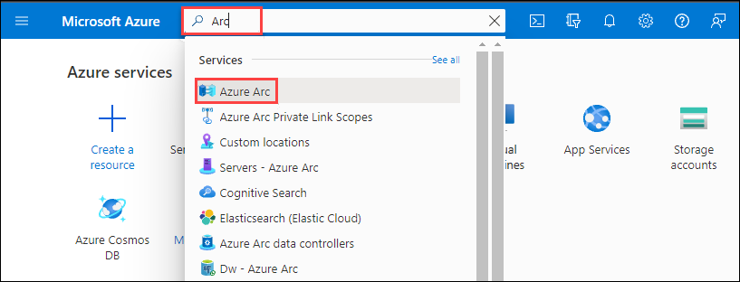
    
1. Select **Machines** from the options on the left side of the Azure Arc blade.

    
    
1. Click on the **ubuntu-k8s** server from connected machines. 

    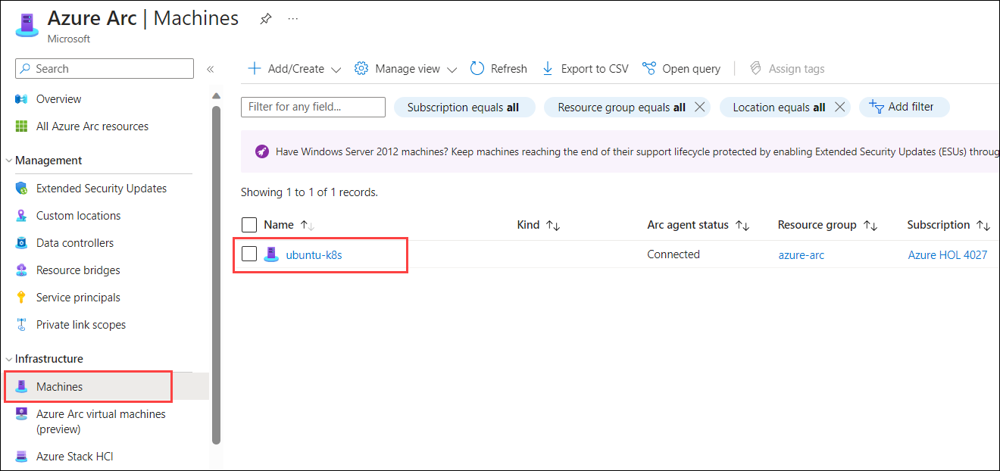
    
1. From **ubuntu-k8s** server blade, select **Policies** under **Operations** section on the left side.

    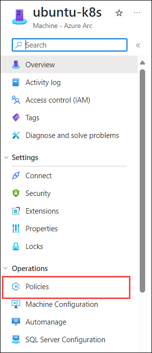
    
1. Click on **Assign policy** to assign a policy to the connected **ubuntu-k8s** machine.

    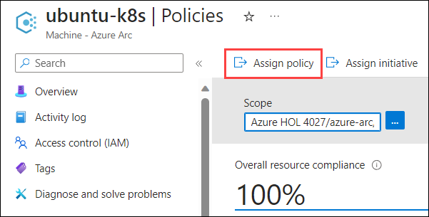
    
1. In **Assign policy** window, under **Basics** section, select **ellipse(...)**  from **Policy Definitions**.

    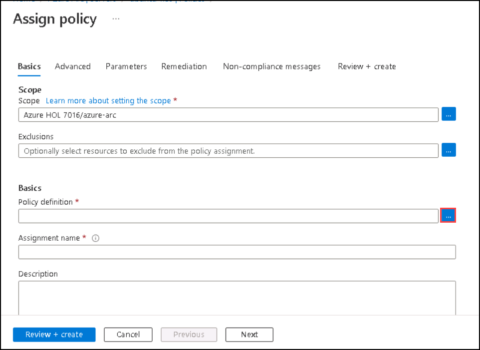
    
1. Search for ```Deploy Log Analytics``` in **Available Definitions** and then click on **Deploy Log Analytics extension for Linux VMs** and then click on **Add** button at the bottom.

    
    
    >**Note**: If you see multiple policies with the same name, select the Build-in policy when choosing the Deploy Log Analytics extension for Linux VMs.
    
1. After selecting the policy definition, update the Assignment name to **Deploy Log Analytics extension for Linux VMs (1)**. Then move to the **Parameters (2)** blade.

    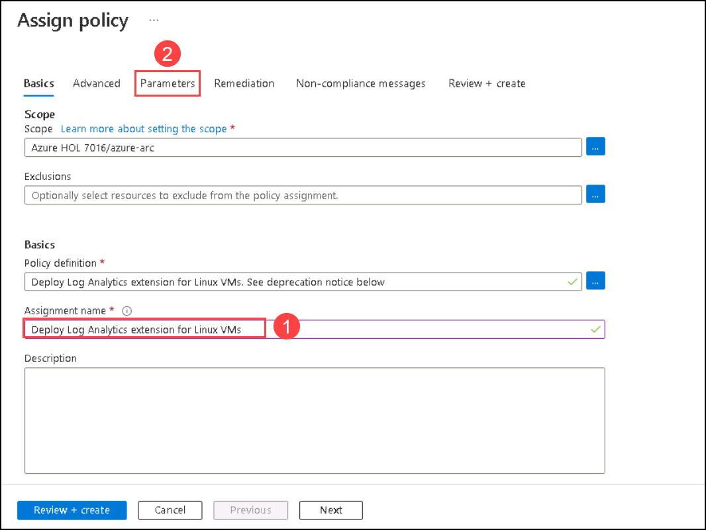

   > **Note:** Make sure to update the Assignment name the same as mentioned above in step 8. Different names will result in failure in the validation of this task.


1. Under the **Log Analytics Workspace**, select the existing workspace **LogAnalyticsWS-<inject key="DeploymentID/Suffix" />** from the available list and then click on **Next**.

    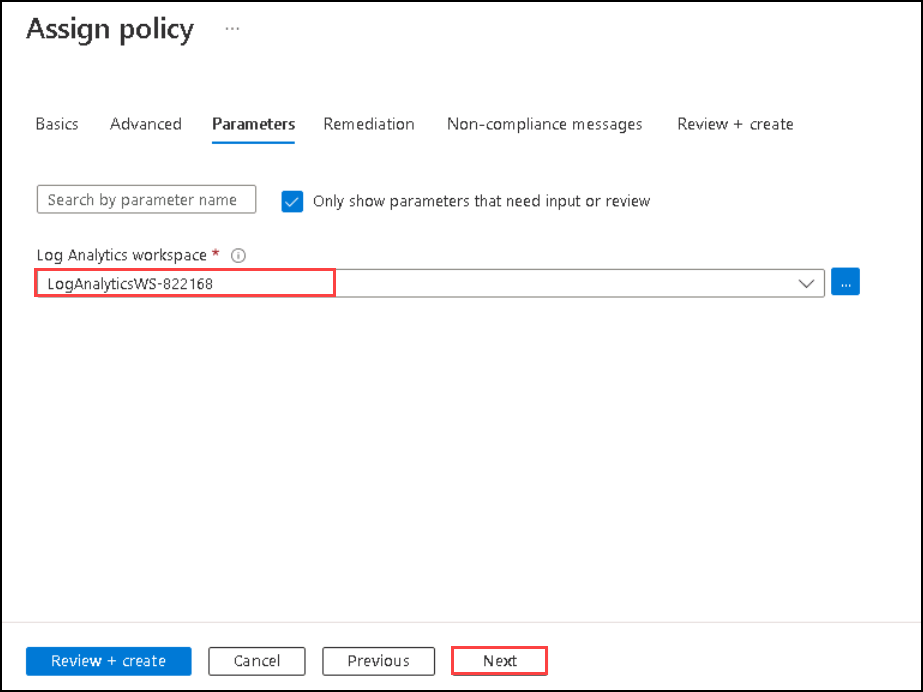

1. On the **Remediation** blade, enable the checkbox for **Create a remediation task** and then click on the **Next** button.

    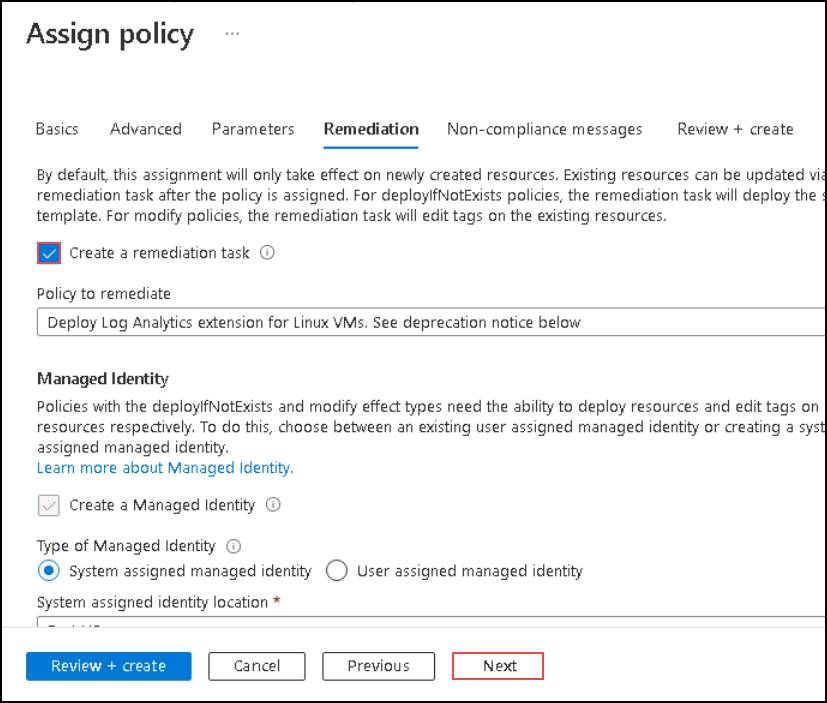
    
1. On **Non-compliance messages** blade, enter following message ```Log Analytics agent is not installed```. This message will be displayed when the Linux machine will be non-compliant. Now, click on the **Review + create**.

    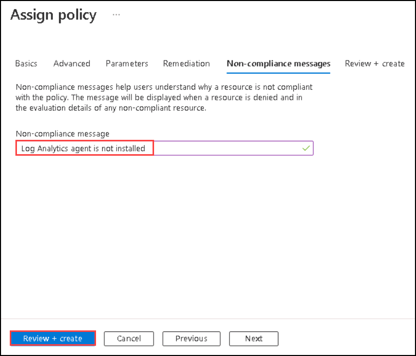
    
1. On **Review + create** blade, select **Create** to confirm.

    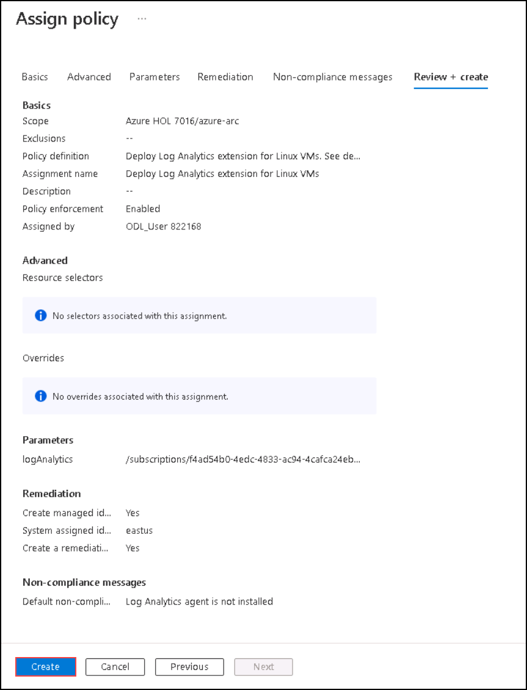
    
1. Now, once the policy assignment is created, you will see Deploy Log Analytics Workspace for Linux on the assigned policies list in the **Not started** state. It will start to deploy the Log Analytics Agent in **ubuntu-k8s** Hyper-V guest VM. Once Log Analytics Agent is deployed in the ubuntu-k8s VM, the compliance state will be updated to **Compliant**. It will take around 20-30 minutes for the process. You can move ahead to the next task and come back later to check the compliance state.

    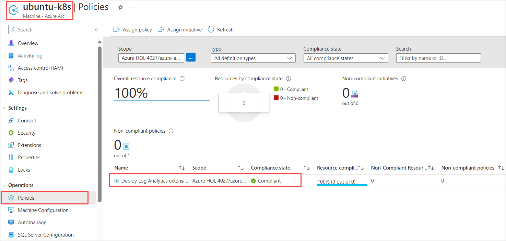    

## Task 6: Monitor Arc Enabled machines with Azure Monitor

Azure Monitor can collect data directly from your hybrid machines into a Log Analytics workspace for detailed analysis and correlation. Typically, this would entail installing the Log Analytics agent on the machine using a script, manually, or automatically following your configuration management standards. Arc-enabled servers recently introduced support to install the Log Analytics and Dependency agent VM extensions for Windows and Linux, enabling Azure Monitor to collect data from your non-Azure VMs.

In this task, let's configure and collect data from your Linux machine by enabling Azure Monitor for VMs following a simplified set of steps, which streamlines the experience and takes a shorter amount of time.

1. In the Azure Portal, from **ubuntu-k8s** Machine - Azure Arc blade, select **Insights** under **Monitoring** section on the left.

    
    
1. Click on the **Enable** on Insights blade. You may have to scroll down to see the **Enable** button.

    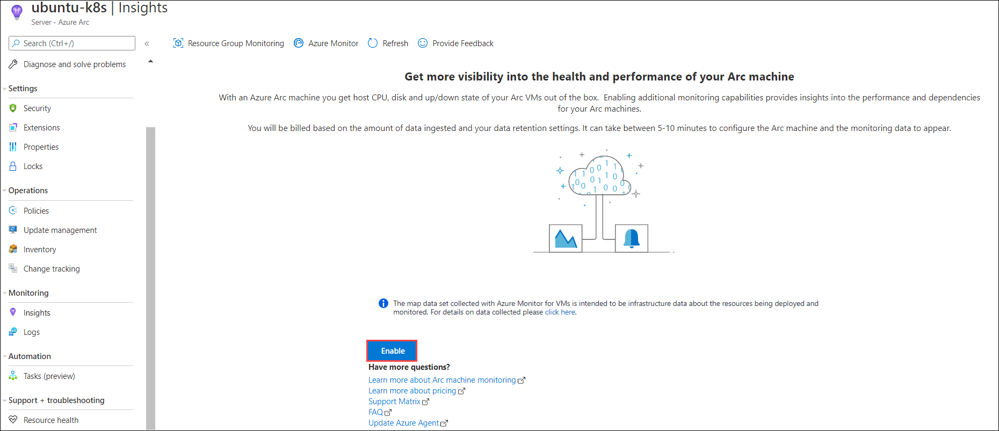

1. On the **Monitoring configuration** page, click on **Create New** button.

    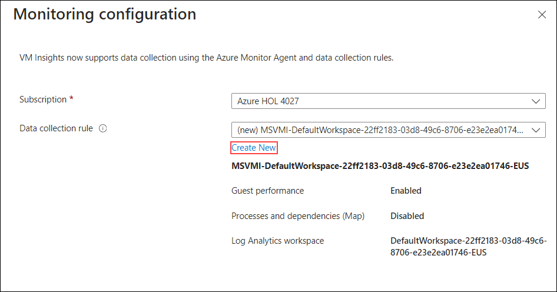

1. On the Create new rule Enter the following details:

    - Data collection rule name: Enter **data-<inject key="DeploymentID/Suffix" /> (1)**
    
    - Enable processes and dependencies (Map): Check the box **(2)**
    
    - Log Analytics workspaces: Choose the existing Log Analytics workspace **LogAnalyticsWS-<inject key="DeploymentID/Suffix" /> (3)**
    
    - Click on **Create (4)**

        

1. Review the configuration, and click on **Configure** button.

    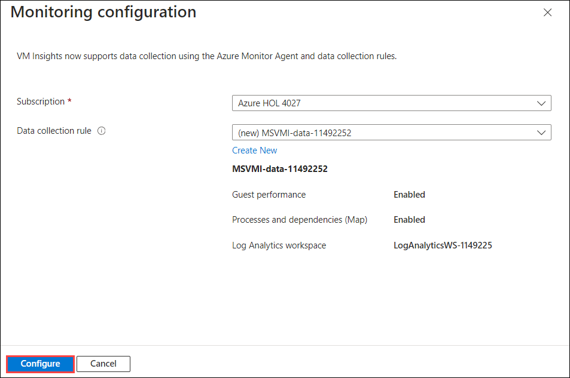

1. Once you click on the **Enable** button, you can see a notification on the bell icon(🔔) in the top right corner: which says **validating deployment** and then changes to **Submitting deployment** and finally **Deployment in progress**. The deployment will take approx 15-20 minutes to deploy the insights for Ubuntu-k8s VM as extensions are being installed on your connected machine (ubuntu-k8s).

    > Note: If you are still seeing Enable button even after clicking on Enable. Once the extensions are installed, it will automatically change. You can move on to the next task.

    
    
1. Once the deployment is completed, you will see a notification in the upper right corner that says **Deployment succeeded**.

    

    >**Note**: If the MMA installation deployment fails, follow the given workaround here: [Enabling insights workaround](https://github.com/CloudLabsAI-Azure/AIW-Hybrid-cloud-solutions/blob/FY-23/HOL-1-azure-arc-servers/Workaroun_MMA_Installation.md)

1. Once the deployment has succeeded, go back to the **Insights** blade for ubuntu-k8s VM and then refresh the page once, you may have to re-click on the **Enable** button and refresh the page again to see the Insights. Data will take around 10 minutes to be routed to the Insights from your Linux machine: ubuntu-k8s.

    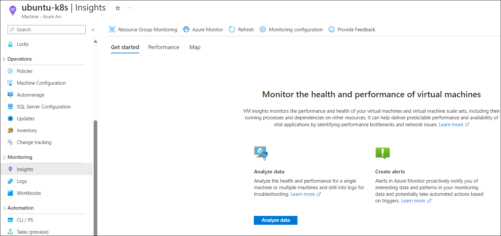

    > Note: By this time, the Compliance state of the policy also might have changed. While you wait for the insights to come up, you can check the compliance state in Policies under **Operations** section on the left or you can move on to the next page and come back later to view the insights.

1. Once the Insights are ready, click on the **Performance** blade to review Logical Disk Operations, CPU Utilization, Available Memory, Logical Disk IOPS, Logical Disk MB/s, and much more. It is exciting to see the **graphical representation** of VM performance, whether the VM is deployed on-prem, on other cloud provider platforms, or on any edge technologies.

    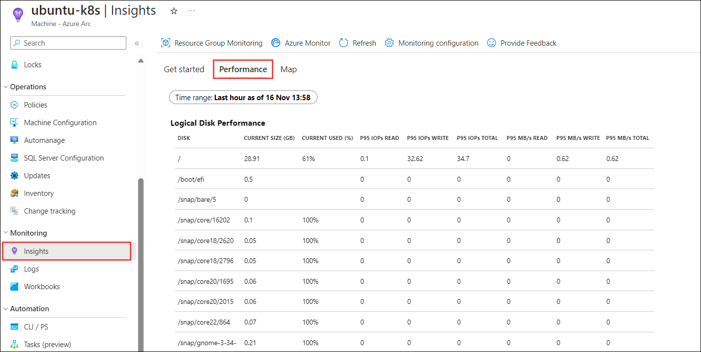
    
1. Click on **Map** and review the **ubuntu-k8s** with few running **Processes**. Also, you can explore machine properties from the right. If there will be any **Alerts** you can check it by clicking on **Alerts** on the right side 👉.

    


## In this exercise, you have covered the following:
 
   - Getting started with Hyper-V Infrastructure.
   - Onboarding Linux Machine to Azure Arc.
   - Onboarding Kubernetes Cluster to Azure Arc and verification.
   - Created a policy assignment to identify compliant/non-compliant resources.
   - Monitor Arc-enabled machines with Azure Monitor.
