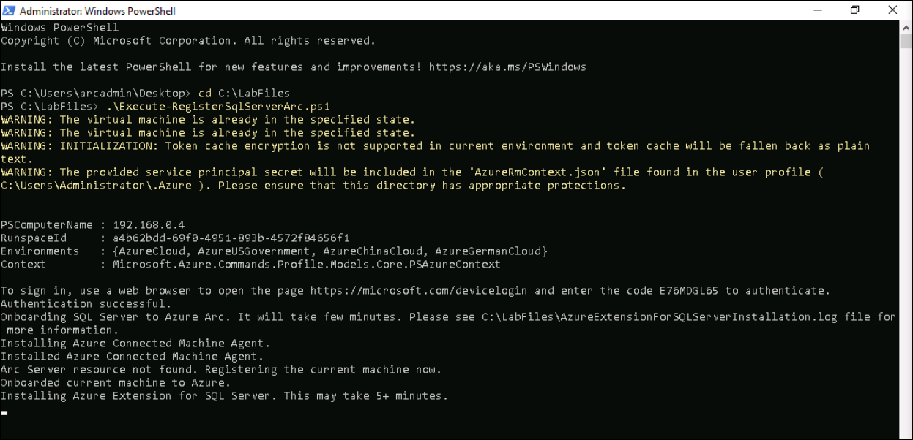
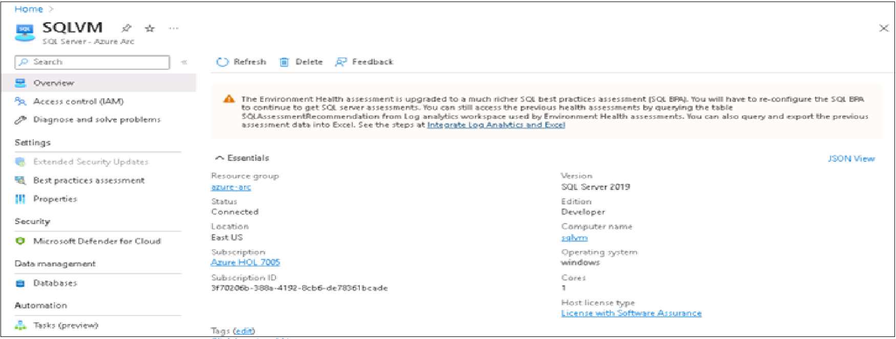
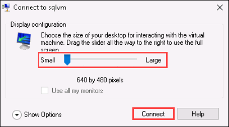
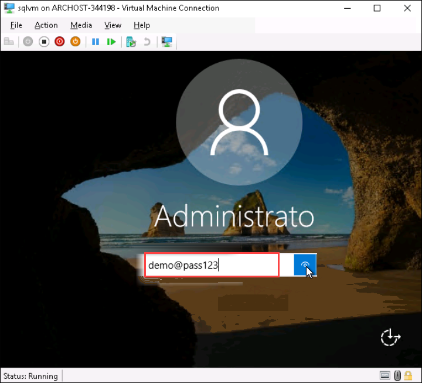
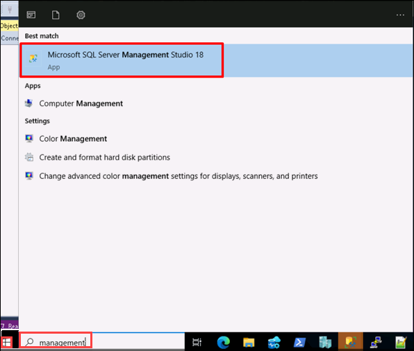
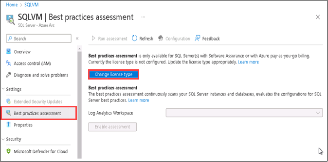
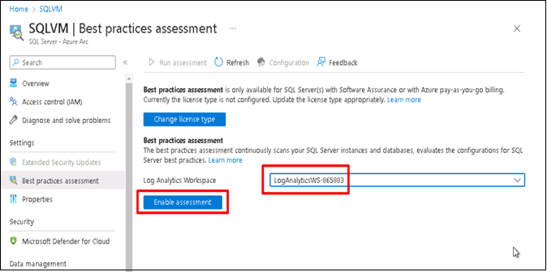
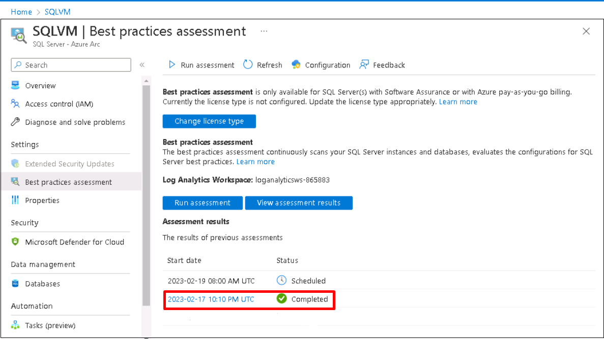

# HOL-1: Exercise 3: Onboard SQL Server to Arc
In the last excercise, you have seen how to enable security measures and monitoring for Arc enabled servers. In this exercise, you will onboard SQL Server to Azure Arc using Azure Portal and PowerShell commands.

## Task 1: Login To Azure Portal

1. Navigate back to Azure Portal which you have already opened in the previous exercises.
      
1. Click on the search blade at the top and search for ```SQL Server```, select **SQL Server - Azure Arc**.
 
   
   
1. Click on the **Add** button to create the **SQL Server- Azure Arc**. 
 
   
   
1. In Adding existing SQL Servers instances page, Click on **Connect Servers**.

   
   
1. You will now see the prerequisite page. You can explore the page and then click on the **Next: Server details** option.
    
   > **Note**: We have already completed the prerequisite part for you. 
    
   
   
1. On the **Server Details** blade, enter the below details.
 
   - Subscription: Leave default
   - Resource group: Select **azure-arc** from dropdown list.
   - Region: Select same region as the Resource group.
   - Operating Systems: Select **Windows**.
   - License Type: Select **Paid - Standard or Enterprise edition license with Software Assurance or SQL Subscription**.

     Now, click on the **Next:Tags** button.
   
   
   
1. Leave the default for tags blade and click on **Next: Run Script** button.
 
1. On the **Script** blade, explore the given script. We will be using this PowerShell script to **Register Azure Arc enabled SQL Server** later.
 
   > **Note** : Please **skip the script download** from here by clicking on ```X``` at the top right as we have **already downloaded** this script inside the Lab VM for you.
    
   
     
## Task 2: Register Azure Arc enabled SQL Server.

1. Minimize the Azure Portal Browser window. 

1. From the desktop of your **LabVM/ARCHost VM**, double click on **Windows PowerShell** icon to open it.
 
   
  
1. Then, run the below command to change the directory to where the script gets downloaded.
 
   ``` 
   cd C:\LabFiles
   ```

1. After changing the directory to **Lab files**, run the command given below:

   ```
   .\Execute-RegisterSqlServerArc.ps1
   ```
     
   > **Note** : This will initiate the execution of **RegisterSqlServerArc.ps1** script inside **sqlvm** that is deployed on Hyper-V.

1. After running the command, you will see some outputs which shows that the script started running.

   
  
1. In 5-10 minutes, you will see that the script execution is completed. Make sure that you see the following output: ```SQL Server - Azure Arc extension is successfully installed```

   
  
1. Bring back the browser window where you had opened Azure Potal and search for **SQL Server -Azure Arc**. If you are already in that page, you will need to click on Refresh button. In that page, you will see one resource **SQLVM** that we just created using the PowerShell script in the previous step.

   
  
1. Select the **SQLVM** resource and now you can see the dashboard of **SQLVM** SQL Server -Azure Arc from Azure Portal.

   

## Task 3: Run on-demand SQL Assessment.

1. Click on the search blade at the top and search for ```Log Analytics workspace```, then select **LogAnalyticsWS-<inject key="DeploymentID/Suffix" />**.

1. Then select **Agents management** from the left side menu. Click on **Log Analytics agent instructions** and copy the value of **Workspace ID** and **Primary Key** and save it into a notepad or Notepad++ for later use.
 
   

1. Now, search for **Servers - Azure Arc** from search box and click on **Servers - Azure Arc**.
 
    
   
1. Select **sqlvm** from the list of Azure Arc servers.

   
    
1. Click on the **Extension** button from the left side menu and click on **+ Add** button to add a new extension.
 
   
    
1. Select the **Log Analytics Agent - Azure Arc** extension.
 
   
    
1. Now click on the **Next** button to continue. 
   
1. At this step, you must enter Log analytics workspace ID and a key to install the MMA ( Microsoft Monitoring Agent ) in the **sqlvm**.
  
1. Now, enter the Workspace ID and Key that you copied from the previous step, and click on **Review + Create** button and then click on **Create** on next window.
 
   
  
   The deployment will take around 5 to 10 minutes to complete. You have to wait for this deployment to get successful to proceed to the next step.
   
1. Open **sqlvm** from the Hyper-V Manager by double clicking on **sqlvm**.

   

1. On Connect to sqlvm box, scroll the bar towards Small to open the vm in smallest window and then click on **Connect** button.

   

1. Type password **demo@pass123** and press **Enter** button to login. Then, you can resize the sqlvm window size as per your convenience.
   
   

1. Click on Start Menu and search for **Microsoft SQL Server Management Studio 18** and open it.
   
   
  
1. On **Connect to server** pop-up select SQLVM.

   
   
1. In the left pane, expand **Security** then **Logins**. In Logins, right click on **NT AUTHORITY\SYSTEM** and click on **Properties**.

   
  
1. In Login Properties pane, click on **Server Roles** then enable the **sysadmin** role and click on **Ok**.

   
 
1. Then, Go to **SQLVM** Azure Arc - SQL Server resource and select the **Best practices assessment** under settings from the left pane and click on **Change license type**.
      
   

1. Under **SQL Server management details**, select license type as **Paid** and click on **Save**.

   

1. Select the log Analytics Workspace as **LogAnalyticsWS-<inject key="DeploymentID/Suffix" />** from the drop-down and click on **Enable assessment**.

   
   
   > Note: After enabling the assessment, wait for few minutes to get it complete. 
 
1. Once the assessment is **completed**, click on it to see the results. 

   
   
1. The **Assessment results** will look like below:

    
      
   > Note: Now you can move to the next Exercise, you don't have to wait here to the Result appear.   

## In this exercise, you have covered the following:
 
   - Register Azure Arc enabled SQL Server.
   - Run on-demand SQL Assessment.
