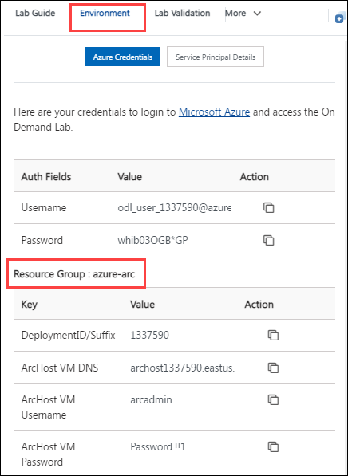

## Overall Estimated Duration: 8 Hours
 
Welcome to your Automate-document-processing-using-AzureOpenAI Workshop! We've prepared a seamless environment for you to explore and learn about Azure services. Let's begin by making the most of this experience:

## Objectives

1. Explore how Contoso can simplify managing distributed IT systems using Azure Arc.
   
1. Onboard on-premises virtual machines, Kubernetes clusters, and SQL servers to Azure Arc.
   
1. Apply Azure governance policies, enable monitoring, and integrate Microsoft Defender for Cloud and Microsoft Sentinel.
   
1. Deploy GitOps configurations and use Azure Policy for Kubernetes cluster management.
   
1. Enable large-scale observability with Azure Monitor for Containers.
   
1. Deploy cloud-native SQL Managed Instances and PostgreSQL Hyperscale using the Azure Arc data controller on Kubernetes clusters.

## Prerequisites

Participants should have: Basic knowledge and understanding of the following

- Familiarity with AI concepts.
- Experience with Azure cloud services, including how to navigate the Azure portal.
- Basic knowledge of programming languages commonly used with AI models, such as Python.
  
## Architecture Diagram

**Azure Document Intelligence** processes and extracts data from documents. **Azure Functions** trigger the document processing based on blob changes. **Azure Storage Account** stores the documents to be processed. **Azure AI Search** indexes and searches the extracted data. **Azure OpenAI Service** provides AI capabilities for natural language processing and generation. **Web Application** facilitates user interaction and displays the results of the AI processing. A storage mechanism stores chat history for viewing and analysis.

## Explanation of Components

- **Azure Document Intelligence:** Document Intelligence in Azure is a service that uses AI to extract structured data from unstructured documents.
- **Azure Functions:** is a serverless compute service that allows you to run code without having to provision or manage infrastructure. You can write code in various languages and trigger it based on events like HTTP requests, timers, or messages from queues or topics
- **Azure AI Search:** is a cloud-based search service that allows you to add search capabilities to your applications. It provides features like autocomplete, faceted search, and spell correction, making it easy for users to find relevant information.
- **Azure Function app:** is a collection of Azure Functions that are grouped together and share the same configuration settings. It provides a way to manage and deploy multiple functions as a single unit.
- **Azure OpenAI:** is a service that provides access to OpenAI's powerful language models, such as GPT-3 and GPT-4, through Azure's cloud platform. This allows developers to build applications that can generate human-quality text, translate languages, write different kinds of creative content, and answer your questions in an informative way.
- **Azure Web App:** is a fully managed platform for building, deploying, and scaling web applications. It supports various programming languages and frameworks,and offers features like continuous deployment, scaling, and integration with other Azure services.

# **Getting Started with Your Automate-document-processing-using-AzureOpenAI Workshop**
 
Welcome to your Automate-document-processing-using-AzureOpenAI Workshop! We've prepared a seamless environment for you to explore and learn about Azure services. Let's begin by making the most of this experience:

## **Accessing Your Lab Environment**
 
1. You can see a virtual machine desktop 💻 (LabVM/ARCHOST) is loaded on the left side of your browser. Use this virtual machine throughout the workshop to perform the lab.

    

### **Virtual Machine & Lab Guide**
 
Your virtual machine is your workhorse throughout the workshop. The lab guide is your roadmap to success.
 
## **Exploring Your Lab Resources**
 
To get a better understanding of your lab resources and credentials, navigate to the **Environment Details** tab.

   
 
## **Utilizing the Split Window Feature**
 
For convenience, you can open the lab guide in a separate window by selecting the **Split Window** button from the Top right corner.
 
   
 
## **Managing Your Virtual Machine**
 
Feel free to start, stop, or restart your virtual machine as needed from the **Resources** tab. Your experience is in your hands!
 
  .png)

## **Let's Get Started with Azure Portal**
 
1. In the **LabVM/ARCHost VM**, double-click on the Azure portal shortcut of the Microsoft Edge browser provided on the desktop.
 
    
 
2. You'll see the **Sign into Microsoft Azure** tab. Here, enter your credentials:
 
   - **Email/Username:** <inject key="AzureAdUserEmail"></inject>
 
      
 
3. Next, provide your password:
 
   - **Password:** <inject key="AzureAdUserPassword"></inject>
 
      
 
4. If you see the pop-up **Stay Signed in?**, click **No**.

   

5. If you see the pop-up **You have free Azure Advisor recommendations!**, close the window to continue the lab.

6. If a **Welcome to Microsoft Azure** popup window appears, click **Maybe Later** to skip the tour.
   
Now you're all set to explore the powerful world of technology. Feel free to reach out if you have any questions along the way. Enjoy your workshop! 
