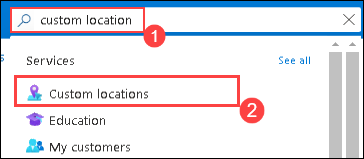
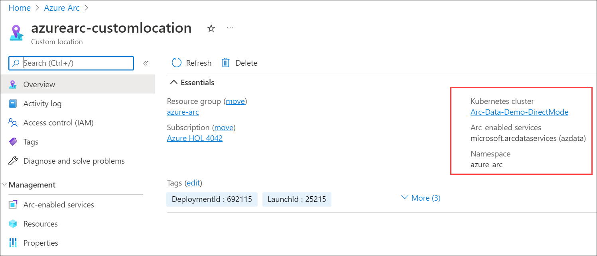
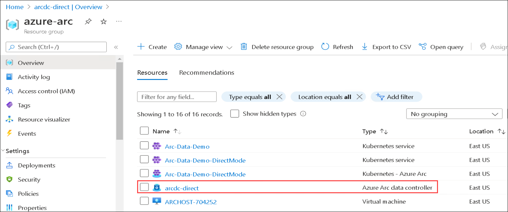
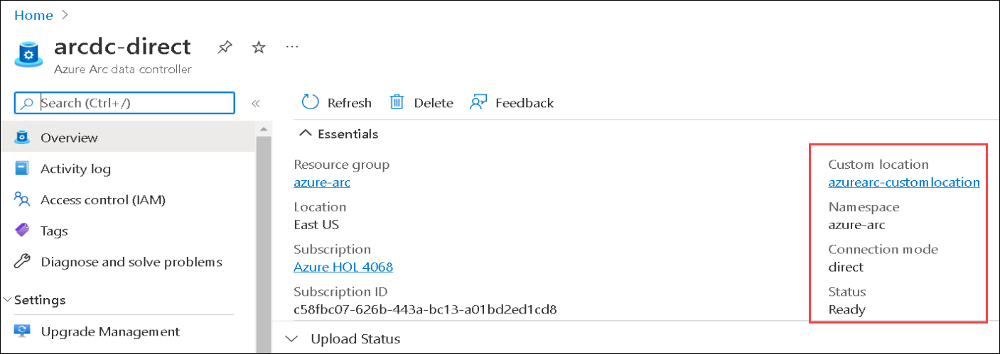

# Exercise 1: Deploying Azure Arc Data Controller with direct connectivity mode and Azure Arc-enabled SQLMI business critical 
  Duration: 45 Minutes
  
In this exercise you will be connecting to an existing Kubernetes cluster to Azure using Azure Arc-enabled Kubernetes. You will also deploy an Azure data controller in direct connectivity mode to a custom location using Azure portal and Azure CLI, and later you will be creating the Azure Arc-enabled SQLMI business critical
 
 
# Connect an existing Kubernetes cluster to Azure using Azure Arc-enabled Kubernetes
 
## Task 1: Login to Azure and install Azure CLI extensions
 
1. Open **Windows PowerShell** from the desktop of your ARCHOST VM and run the below command to login to Azure.
    ```
    az login
    ```
1. After running the above command a browser tab will open to login to the Azure portal.
 
1. On the **Sign into Microsoft Azure** tab you will see the login screen. Enter following **Email/Username** and then click on **Next**. 
   * Email/Username: <inject key="AzureAdUserEmail"></inject>

1. Now enter the following **Password** and click on **Sign in**.
   * Password: <inject key="AzureAdUserPassword"></inject>

1. After adding the credentials you will see that you have logged into Microsoft Azure.

    

1. Now switch back to Windows PowerShell and you will be able to see that you have logged in to Azure.

1. Run the below commands to install required Azure CLI extensions.
   
   ```
   az extension add --name k8s-extension
   az extension add --name connectedk8s
   az extension add --name k8s-configuration
   az extension add --name customlocation   
   ```
   
   
   
1. You can validate that you have all the required extensions with the latest versions by running the below command: 
   
   ```
   az version
   ```   
   
   
   
1. After confirming that the required tools are installed, the next step is to register your subscription with Arc for Kubernetes.

1. Run the below commands to register the required resource providers if not already registered. 

   ```
   az provider register --namespace Microsoft.Kubernetes
   az provider register --namespace Microsoft.KubernetesConfiguration
   az provider register --namespace Microsoft.ExtendedLocation
   ```
   
   
   
## Task 2: Onboard an existing Kubernetes cluster to Azure using Azure Arc-enabled Kubernetes

In this task you will be connecting an existing Kubernetes cluster to Azure using Azure Arc-enabled Kubernetes and will be enabling custom features by adding an Azure Arc data services extension and a custom location on the Azure Arc-enabled Kubernetes cluster. 

1. Run the below command to connect the existing Kubernetes to your Azure subscription using Azure Arc-enabled Kubernetes. Once you've run the command, it will take a few minutes to onboard the cluster to Azure Arc. 

   ```
   az connectedk8s connect --name Arc-Data-Demo-DirectMode --resource-group azure-arc
   ```
  
   > **Note:** We have already defined your Cluster name and Azure resource group name in the above commands. If you are trying this in your own subscription, please make sure that you have entered the correct details.
 
1. Once the previous command is executed successfully, the provisioning state in output will show as succeeded.

     
 
1. Verify whether the Azure Arc-enabled Kubernetes cluster is onboarded and connected to the resource group in the Azure subscription by running the following command:

   ```
   az connectedk8s list -g azure-arc -o table 
   ``` 
   
   
   
1. Azure Arc-enabled Kubernetes deploys a few operators into the azure-arc namespace. You can view these deployments and pods by running the command in the command prompt:  

   ```
   kubectl -n azure-arc get deployments,pods
   ```
   
   The output should be similar to as shown below:
    
   

1. Navigate to the Resource Group from the Azure portal navigation pane and click on the Resource Group named azure-arc. Look for the resource named **Arc-Data-Demo-DirectMode** of resource type Azure Arc-enabled Kubernetes resource.

   

## Create a custom location on the Azure Arc-enabled Kubernetes cluster

   Custom Locations provides administrators a way to deploy Azure Arc data services and other Azure Arc-enabled services to their own locations, similar to Azure locations. 
 
1. Now run the below command to enable features to create the custom location:

     ```
     az connectedk8s enable-features -n Arc-Data-Demo-DirectMode -g azure-arc --features cluster-connect custom-locations
    
     ```
    The output should be similar to as shown below:
    
    **"Successfully enabled features: ['cluster-connect', 'custom-locations'] for the Connected Cluster Arc-Data-Demo-DirectMode"**
        
      > **Note:** The Custom Locations feature is dependent on the Cluster Connect feature. So, both the features have to be enabled for custom locations to work. Also, az connectedk8s enable-features needs to be run on a machine where the kubeconfig file is pointing to the cluster on which the features are to be enabled.
    
1. Run the below command to deploy the extension of Azure Arc-enabled Data Services on Azure Arc Kubernetes cluster.
  
     ```
    az k8s-extension create --name azdata --extension-type microsoft.arcdataservices --cluster-type connectedClusters -c Arc-Data-Demo-DirectMode -g azure-arc --scope cluster --release-namespace azure-arc --config Microsoft.CustomLocation.ServiceAccount=sa-bootstrapper
     ```

1. After running the above command you will notice that the **Provisioning State** is **Succeeded**. If it is pending, it is because the extension may take a few minutes to complete the installation.

    

1. To verify the extension installation, switch back to the Azure Portal in the browser and search for **Kubernetes - Azure Arc** and select your cluster.

1. Now select **Extension** from left side menu and check if the Install status is **Installed** or not. If it is not, please refresh after some time and then check.

    

1. Now run the below command to get the Azure Resource Manager identifier of the Azure Arc-enabled Kubernetes cluster, you will be using the cluster ID in the later steps while creating the custom location.

    ```  
    $clusterID = az connectedk8s show -n Arc-Data-Demo-DirectMode -g azure-arc  --query id -o tsv
    $clusterID
    ```
     > **Note:** The clusterID is stored in $clusterID parameter and you will be using this parameter only in the later steps. 
    
    
    
1. Now run the below command to get the Azure Resource Manager identifier of the cluster extension deployed on top of Azure Arc-enabled Kubernetes cluster, referenced in the later steps as extensionId:

    ```
    $extensionID = az k8s-extension show --name azdata --cluster-type connectedClusters -c Arc-Data-Demo-DirectMode -g azure-arc  --query id -o tsv
    $extensionID
    ```
      > **Note:** The extension resource ID is stored in $extensionID parameter and you will be using this parameter only in the later steps.
    
    
    
1. Now run the below command to create a custom location by referencing the Azure Arc-enabled Kubernetes cluster ID and the extension ID.

    ```  
    az customlocation create -n azurearc-customlocation -g azure-arc --namespace azure-arc --host-resource-id $clusterID --cluster-extension-ids $extensionID
    ```
    
    The output should be as shown below:
    
     
     
1. To verify the custom location deployment, switch back to the browser and login to [Azure Portal](https://portal.azure.com) if not already done.

1. Search for custom location in the search bar and select custom locations. 

    
      
1. After selecting the custom locations from search bar, select your **azurearc-customlocation**.

    
     
1. Explore the overview section. You can see the namespace and Kubernetes cluster details on the overview page.

   

1. Now search for the log analytics workspace in azure portal.
   
   

1. Navigate to **LoganalyticsWS-Direct** workspace. 

   

1. Select **Agent management** from the left side menu. Copy the value of **Workspace ID** and **Primary key** and save the values in a notepad for use later while creating the Azure arc data controller.

    
    
## Task 3: Deploy Azure Arc Data Controller in directly connected mode using Azure Portal

1. From the Azure Portal, search for **Azure arc data controllers** from the search box and then click on it.  

    
 
1. After selecting the Azure Arc data controller click on **+ Create** button to deploy ```Azure arc data controller```.

    
     
1. Now, on ```Create Azure Arc data controller``` blade select **Azure Arc-enabled Kubernetes (Direct connectivity mode)**. and click on **Next: Data Controller details**.

    
   
1. On **Data controller details** blade enter the following details:

   * Select the available subscription from dropdown.
   * Resource Group: Select **azure-arc** **(1)** from dropdown.
   * Data Controller Name: **arcdc-direct** **(2)**
   * Custom location: Select the available custom location from dropdown **(3)**.

   
      
1. Now scroll down and enter the below details in the remaining sections.
   
   Under Kubernetes configuration enter the details below:
   
   * Kubernetes configuration template: Select **azure-arc-aks-default-storage** **(1)** from drop down.
   * Data Storage class: Leave default
   * Log Storage class: Leave default 
   * Service type: **Load balancer** **(2)** 
   
   Under Administrator account enter the below details.
   * Data controller login: **arcuser** **(3)**
   * Password: **Password.1!!** **(4)**
   * Confirm password: **Password.1!!** **(5)**

   After entering all the required details click on **Next: Additional settings** **(6)**

   

1. In the Additional settings blade, select the **LoganalyticsWS-Direct** **(1)** from the dropdown for Log Analytics workspace. You will see that the Log Analytics workspace ID occurs by default. Enter the Log Analytics primary key which is given here: **<inject key="loganalyticsWorkspacePrimaryKey" enableCopy="true"/>** **(2)** and click on **Next: Tags** **(3)** button.

    
    
1. Leave default on **Tags** blade and click on **Next: Review + Create** button. to start the Azure Arc data controller deployment.

   

1. On Review + Create blade, you can check all the given details and click on **Create** button to start the Azure Arc data controller deployment. 

   
   
1. Once the deployment is completed, click on **Go to resource group** button.

   
   
1. From the **azure-arc** resource group, select **arcdc-direct** Azure Arc Data Controller from the resources.

     
   
  # Monitor the creation of Azure Arc data controller on cluster.
   
1. When the Azure portal deployment status shows the deployment was successful, you can check the status of the Arc data controller deployment on the cluster by running the below command on PowerShell window:

   ```
   kubectl get datacontrollers -n azure-arc
   ```
   
   
   
 1. Once the data controller state is changed to ready, proceed to the next steps. Please note that the data controller deployment can take 5-to-10 minutes to change it to ready.

1. On the Azure Ac data controller resource overview blade, explore the given information about the Namespace and Connection mode.

   

## Task 4: Deploy Azure Arc-enabled SQL Managed Instance with Direct Connected Mode.

In this exercise, let's create an **Azure Arc-enabled SQL Managed Instance** using Azure Portal on a directly connected Azure Arc data controller in a custom location. 

Also, we will be exploring the Kibana and Grafana Dashboards and upload the logs and metrics to the Azure portal and view the logs.

1. Open your browser and login to the Azure portal if not already logged in.

1. Now search for **SQL Managed Instance - Azure Arc** and select it.

    
   
1. Click on create **+ Create** button to create the SQL Managed instance - Azure Arc.

    
 
1. Now on the **Basics** tab enter the below details:
 
   - **Under Project details**
    
     - **Subscription**: Leave ```default```.
    
     - **Resource Group**: Select **azure-arc** **(1)** from drop down     
   
   - **Under Managed Instance details**
   
     - **Instance name**: Enter **arcsql-direct** **(2)**
  
     - **Custom location**: Select available custom location from dropdown **(3)**.
   
     - **Service type**: Select **Load balancer** from drop down **(4)**
    
     - **Compute+ Storage**: Click on **Configure compute + storage** **(5)**
      
       
      
1. Now on **Compute+ Storage** blade enter the following details:
    
     - Service Tier: **Business Critical** **(1)**
     - High availability: Select **1 replica** **(2)**
     - Instance Compute
       - Memory Limit (in Gi): Enter ```4``` **(3)**
       - CPU vCores Limit: Enter ```2``` **(4)**
     
     
     
     - Instance Storage
       - Data storage class: leave default
       - Data volume size (in Gi): ```2```
       - Data-logs storage class: leave ```default```
       - Data-logs volume size (in Gi): ```1```
       - Logs storage class: Leave ```default```
       - Logs storage class: Enter ```1```
       - Backup Storage class: leave ```default```
       - Backups volume size (in Gi): ```1```
      
    After adding all the above details click on the **Apply** button.  
      
      
   
1. Under Administrator account, enter the below details:

     - **Managed Instance admin login**:  Enter **arcsqluser**
   
     - **Password**: Enter **Password.1!!**
     
     - **Confirm Password**: Enter **Password.1!!**

   After adding all the required details, click on the **Review + Create button** to review all details.
    
    
    
1. Now Click on the **Create** button to start the deployment.  
 
    
 
1. After some time you will see that the deployment of **SQL Managed Instance - Azure Arc** is completed. Now click on the **Go to resource** button to navigate to the resource.

   

1. Now we have successfully deployed the Azure Arc-enabled SQLMI on top of the Directly connected mode Azure Arc data controller, you can explore more on metric and logs on the same page from the left side menu. Please note that Azure Arc-enabled SQLMI deployment can take 5-to-10 minutes to change it to ready.

   

## Task 5: Connecting Azure Arc Data Controller using Azure Data Studio

Now let us connect to the data controller using Azure Data Studio.

1. Open **Azure Data studio** **(1)** from the desktop shortcut, select **Connections** **(2)** and click on **Connect to Existing Azure Arc Controller** **(3)**.

   
   
2. In Connect to Existing Controller page, provide the following details and click on **Connect**.

   - **Namespace**:
     ```BASH
     azure-arc
     ```
     
   - **Cluster Context**:
     ```BASH
     Arc-Data-Demo-DirectMode
     ```
     
   - **Name** : Enter arcdc
     ```BASH
     arcdc-direct
     ```

   

3. Once the connection is successful, you can see the Azure Arc data controller listed under Azure Arc Controllers on the bottom left of the Azure Data Studio.

    
    
4. Right-click on the **arcdc-direct** Azure Arc Controller and select **Manage**.

   

5. Once you are in the Azure Arc Data Controller dashboard, you can see the following details about the data controller 
   - Name of the Arc Data Controller
   - Region where it is deployed
   - Connection mode
   - Resource Group
   - Subscription ID of the Azure Subscription
   - Controller Endpoint
   - Namespace
   
   You will also see that we have deployed using the Direct connection mode of the Azure Arc Data controller.

   

## Task 6: Connect to Azure Arc-enabled SQL Managed Instance using Azure Data Studio.

In this task, let us learn how to connect to Azure Arc-enabled SQL Managed instance using Azure Data Studio.

1. You can see the Azure Arc-enabled SQL Managed Instance named **arcsql-direct** listed under Azure Arc Data Controller named **arcdc-direct** at the bottom left of the Azure Data Studio. Right-click on the **arcsql-direct** and select **Manage**.

   

1. Once you are in the SQL managed instance - Azure Arc dashboard, you can see following details about the data controller:

   - Name of the Resource Group
   - Name of the Arc Data Controller
   - Subscription ID of the Azure Subscription
   - External Endpoint
   - Status of SQLMI
   - Region where it is deployed
   - Compute: Number of vCores

   Make sure you copy the **External Endpoint with port number** and save it in a notepad for use later in the task.
   
   

1. In the Connections tab of Azure Data Studio, within the servers click on **Add Connection**.

   

1. Enter the following in the connection details page:

   - **Connection type** : Select **Microsoft SQL Server** **(1)**
   
   - **Sever**: Paste the External Endpoint value of SQL Managed Instance which you copied earlier **(2)**

     >**Note**: Make sure you have entered **IP Address** with **port number**.
   
   - **Authentication type** : Select **SQL Login** from the drop down options **(3)**
   
   - **User name** : Enter arcsqluser **(4)**
     ```BASH
     arcsqluser
     ```
   
   - **Password** : Enter Password.1!! **(5)**
     ```BASH
     Password.1!!
     ```
   
   Then click on **Connect** **(6)**
   
   
   
1. Now you can see that you are successfully connected with your Azure Arc-enabled SQL MI Server. You can see that under Servers. You can explore the SQL Managed Instance - Azure Arc Dashboard to view the databases and run a query.

   

In this exercise, we connected our cluster to Azure Arc-enabled cluster and deployed custom location and data controller with direct connected mode with the help of Azure portal and Azure CLI and created an Azure Arc-enabled SQLMI server on directly connected mode of Azure Arc data controller. Also, we have connected the Azure Arc Data Controller and Azure Arc-enabled SQLMI business critical using Azure Data Studio.
