HOL-4: Exercise 1: Integrate Azure Stack HCI 22H2 with Azure
==============

Contents
-----------
- [HOL-4: Exercise 1: Integrate Azure Stack HCI 22H2 with Azure](#hol-4-exercise-1-integrate-azure-stack-hci-22h2-with-azure)
  - [Contents](#contents)
  - [Overview](#overview)
  - [Task 1: Add the existing Cluster to Windows Admin Center](#task-1-add-the-existing-cluster-to-windows-admin-center)
  - [Task 2: Verify your Azure Stack HCI 22H2 Cluster is registered with Azure](#task-2-verify-your-azure-stack-hci-22h2-cluster-is-registered-with-azure)
  - [Task 3: Register Windows Admin Center in Azure](#task-3-register-windows-admin-center-in-azure)
  - [Task 4: Validate Azure integration](#task-4-validate-azure-integration)
  - [Summary](#summary)
  - [Product improvements](#product-improvements)

Overview
-----------

   As part of the lab environment, we have already deployed the Azure Stack HCI 22H2 Cluster, so you don't have to deploy it and you can continue adding it to Windows Admin Center and verify the registration of the cluster within Azure to unlock the full functionality.

   Azure Stack HCI 22H2 is delivered as an Azure service and needs to register within 30 days of installation per the Azure Online Services Terms.  With our cluster configured, we'll now register your Azure Stack HCI 22H2 cluster with **Azure Arc** for monitoring, support, billing, and hybrid services. Upon registration, an Azure Resource Manager resource is created to represent each on-premises Azure Stack HCI 22H2 cluster, effectively extending the Azure management plane to Azure Stack HCI 22H2. Information is periodically synced between the Azure resource and the on-premises cluster.  One great aspect of Azure Stack HCI 22H2, is that the Azure Arc registration is a native capability of Azure Stack HCI 22H2, so there is no agent required.


## Task 1: Add the existing Cluster to Windows Admin Center

This Lab also includes a dedicated Windows Admin Center (WAC) gateway server. The WAC gateway server can be accessed by connecting to it from RDP. A shortcut is available on the HCIBox-Client desktop.

1. If you are not into Windows Admin Center yet, open the Windows Admin Center shortcut present in the desktop as shown in the below screenshot.

   
   
1. Use the domain credential (arcedemo@jumpstart.local) to start an RDP session to the Windows Admin Center VM. Enter the below credentials to login to **Admin Center** and click on **OK**.

   * Username: **arcdemo@jumpstart.local**
   * Password: **ArcPassword123!!**  

   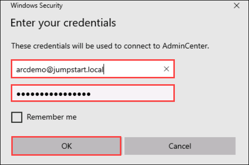
   
1. Open the Windows Admin Center shortcut on the WAC server desktop. Once again you will use your domain account to access WAC. 

   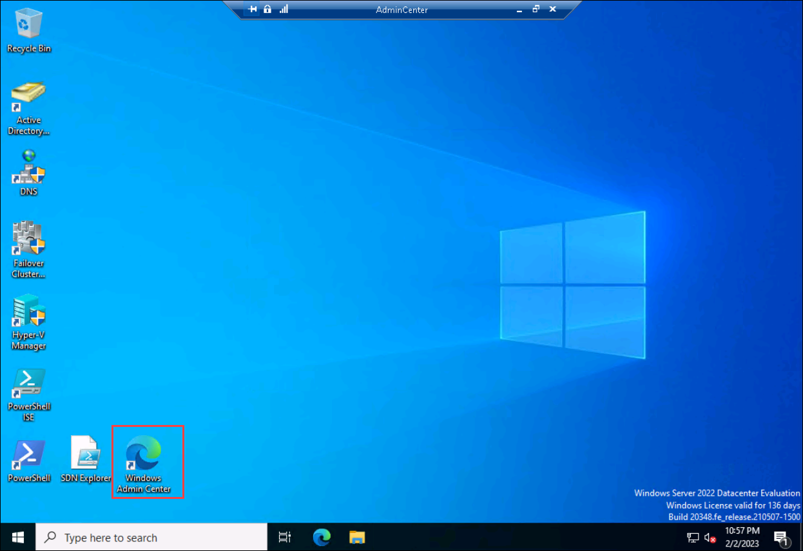

1. Enter the below credentials to login to **Windows Admin Center** and click on **OK**.

   * Username: **jumpstart\arcdemo**
   * Password: **ArcPassword123!!**
   
   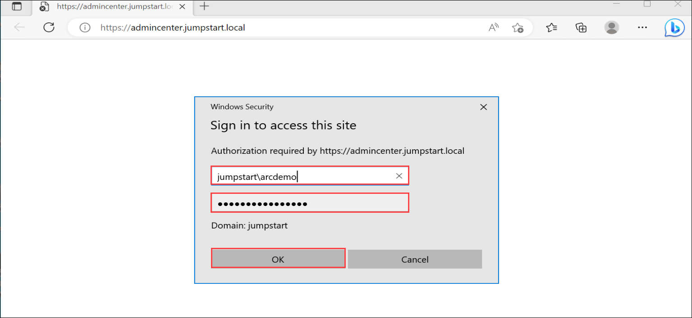

   >**Note**: The first time you access the Windows Admin Center you will get a Welcome screen. Just close it and now wait until all WAC extensions are installed and you get a popup window telling you "Successfully updated your extensions". Just click [OK]. Windows Admin Center will automatically refresh.

1. Once you are logged into Windows Admin Center, click on **Add** **(1)** button to add a connection to HCI cluster and then click on **Add** **(2)** under **Server clusters**. 

   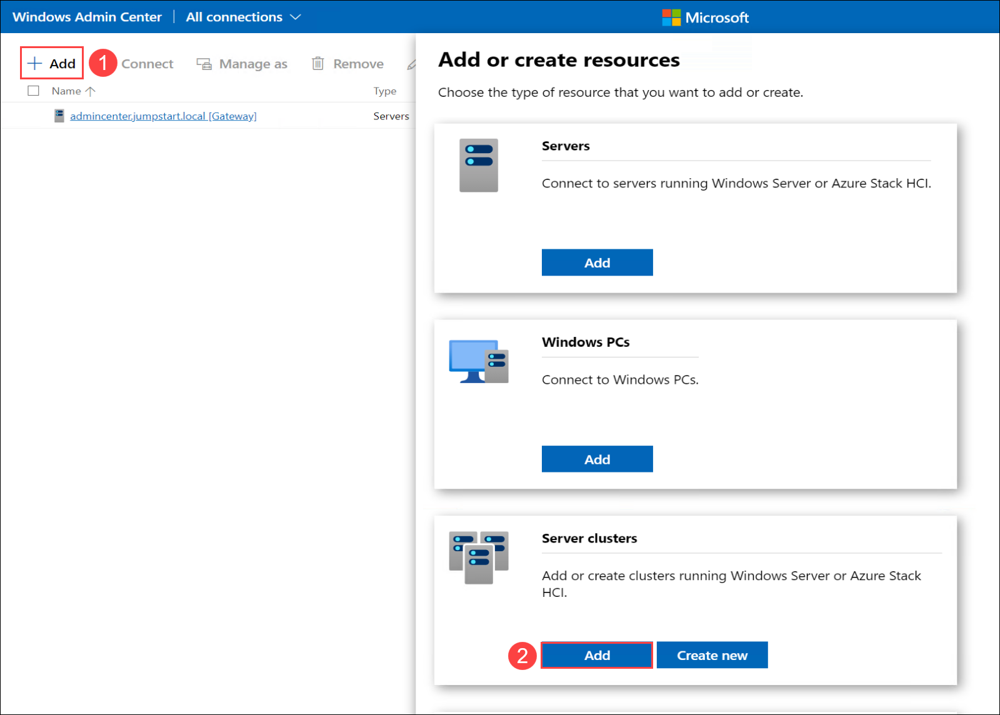

1. Enter the cluster name as **hciboxcluster** **(1)**, choose the **Use another account for this connection** **(2)** option. You can use the below domain account credentials to connect to the cluster and click on **Connect with account** **(5)**.

   * Username **(3)**: **jumpstart\arcdemo**
   * Password **(4)**: **ArcPassword123!!**

   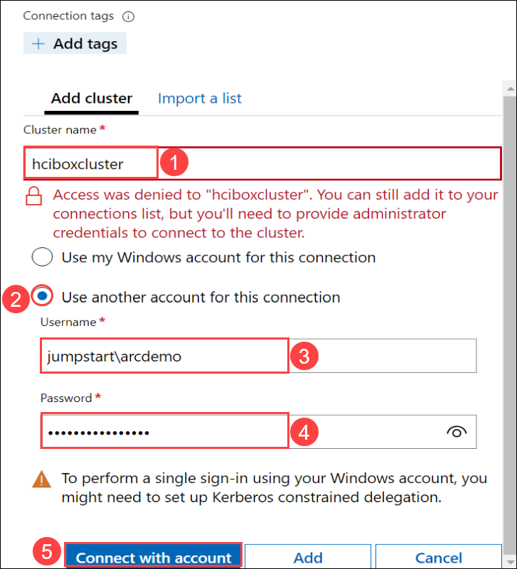
   
1. In the **Add cluster** tab, click on **Add**.
   
   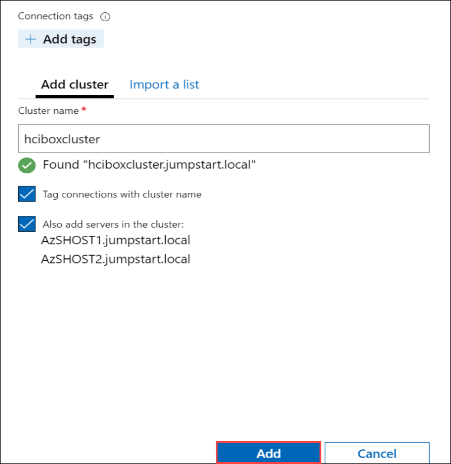

1. Now the cluster is added, you can explore management capabilities for the cluster inside of Windows Admin Center. Click on the **hciboxcluster.jumpstart.local** cluster to drill into its details.

   
   
   

You just successfully added the existing Azure Stack HCI 22H2 Cluster **"hciboxcluster"** to Windows Admin Center. You will explore the Cluster capabilities leveraging Windows Admin Center in upcoming tasks.

## Task 2: Verify your Azure Stack HCI 22H2 Cluster is registered with Azure

In this lab the Azure Stack HCI 22H2 cluster is already registered within Azure. To verify the registration let's now use **PowerShell**.

You're going to perform the registration verification from the **Admin Center** machine, which you have been using to access Windows Admin Center

1. In the **Admin Center** machine, select **PowerShell ISE** **(1)** shortcut from the desktop and then right-click on it to select **Run as administrator** **(2)**.

   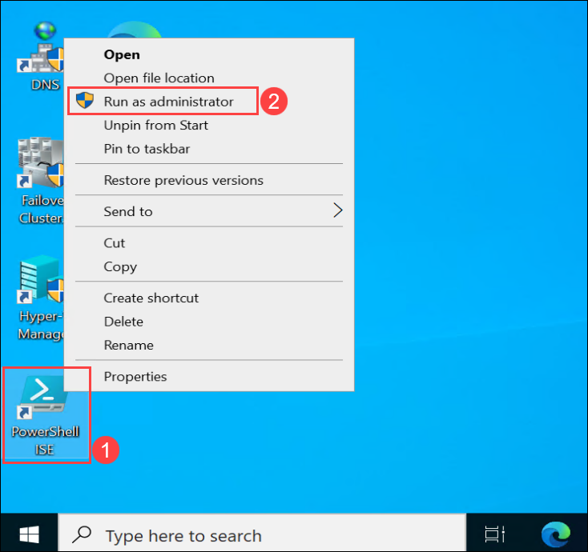
    
1. Copy and paste the below PowerShell commands **(1)** and to execute them click on **Run script** **(2)**. 

   ```powershell
   Invoke-Command -ComputerName AzSHOST1 -ScriptBlock {
   Get-AzureStackHCI
   } 
   ```
    
   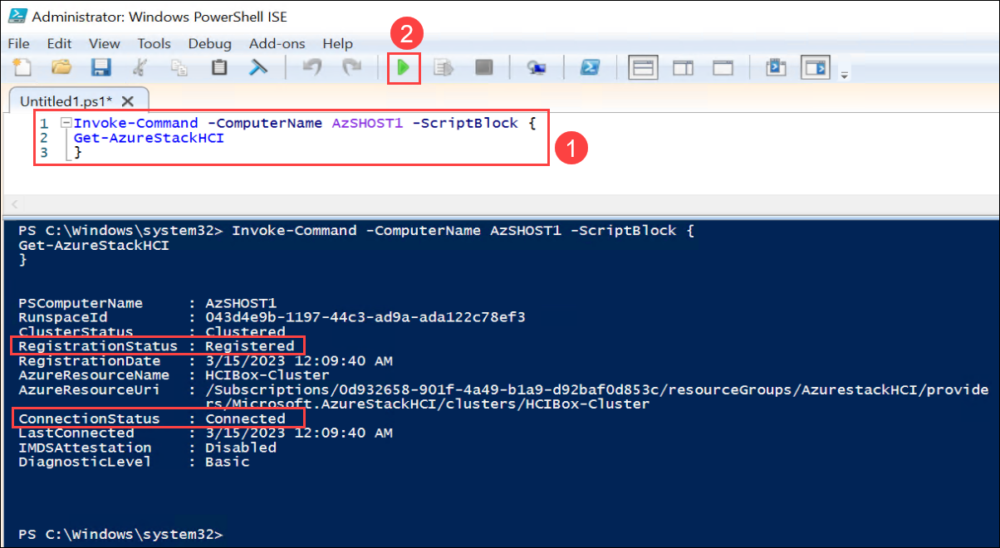

You can see the **RegistrationStatus**, the **ConnectionStatus** and **LastConnected** time, which is usually within the last day unless the cluster is temporarily disconnected from the Internet. An Azure Stack HCI 22H2 cluster can operate fully offline for up to 30 consecutive days.

You can close the Windows PowerShell ISE. No need to save the PowerShell script.

## Task 3: Register Windows Admin Center in Azure

To use Azure services with Windows Admin Center, you must register your Windows Admin Center instance with Azure. This is a prerequisite if you use Windows Admin Center to [register Azure Stack HCI with Azure](https://learn.microsoft.com/en-us/azure-stack/hci/deploy/register-with-azure).

1. In Windows Admin Center, select the **Settings** gear icon from the top right corner of the page.

   

1. From the Settings menu in the left pane, select **Register** **(1)** under Gateway and click on **Register** **(2)** to Register with Azure. The registration pane appears on the right side of the page.

   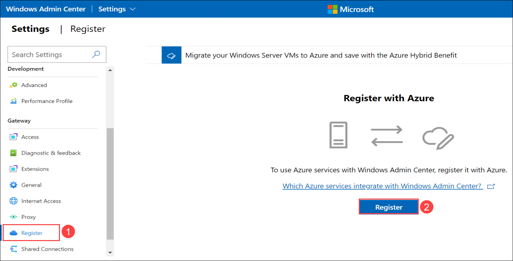

1. In the **Get started with Azure in Windows Admin Center** blade, follow the instructions to **Copy the code** by click on **Copy** **(1)** and then click on the **Enter the Code** **(2)** hyperlink to configure device login.
   
   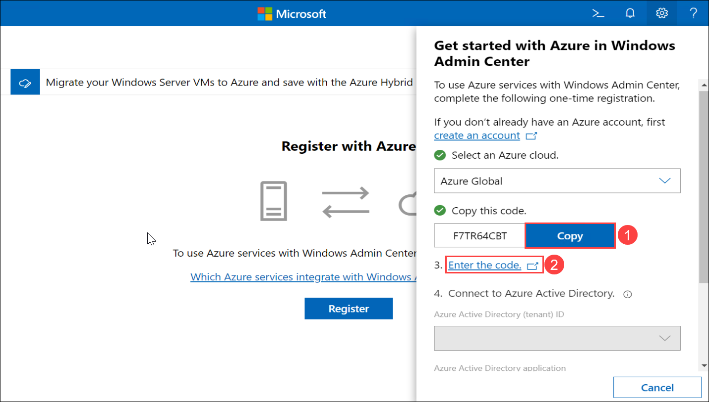

1. You will see the new tab opened in the browser for device login. Now, Paste the code **(1)** that you have copied in previous step and click on **Next** **(2)** button.

   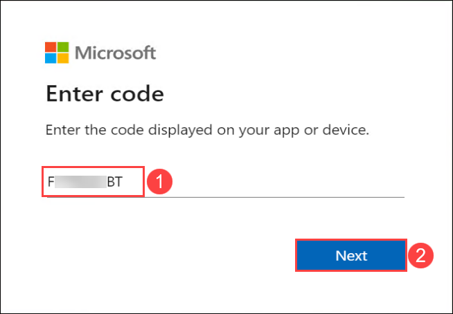
     
1. When prompted for credentials, **enter the below Azure credentials** for a tenant that you will use to register the Windows Admin Center and click on **Continue** button if you get any popup saying **Are you trying to sign in to Windows Admin Center?**.

   * Email/Username: **<inject key="AzureAdUserEmail"></inject>**
   * Password: **<inject key="AzureAdUserPassword"></inject>**

1. Now, navigate back in **Windows Admin Center** tab, you'll notice your tenant information **(1)** has been added. You can click on **Connect** **(2)** to connect Windows Admin Center to Azure.

   

1. Click on **Sign in** and you may get prompt to enter credentials, **enter your Azure credentials** given below.

   * Email/Username: **<inject key="AzureAdUserEmail"></inject>**
   * Password: **<inject key="AzureAdUserPassword"></inject>**
 
   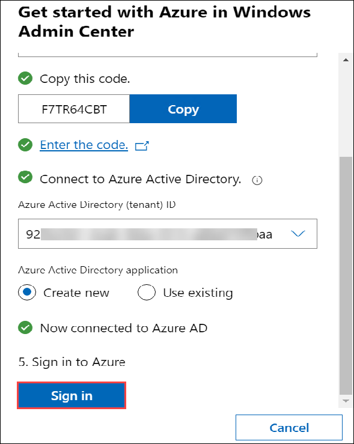
 
1. You will see a pop-up **Permissions requested**. Check the box next to the **Consent on behalf of your organization** and then click on **Accept**.

   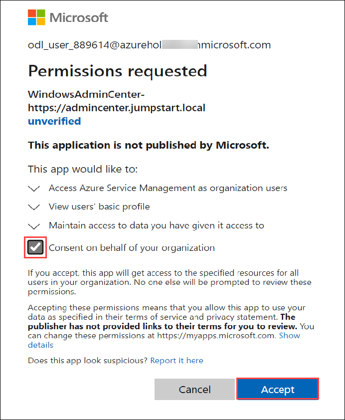
   
1. Once you are connected Windows Admin Center to Azure, you will see the details as shown in the below screenshot in Register under Gateway.

   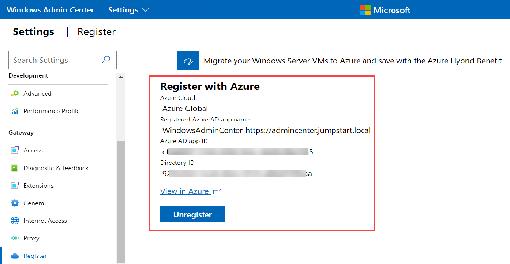

>**Note**: If you receive an error when signing in, still in **Settings**, under **User**, click on **Account** and click **Sign-in**. You should then be prompted for Azure credentials and permissions, to which you can then click **Accept**. Sometimes it just takes a few moments from Windows Admin Center creating the Azure AD application and being able to sign in. Retry the sign-in until you've successfully signed in.

>**Note**: Sometime even after cluster is registered it may show an error with SignIn with following error, you can ignore that and close the popup:
   ```AADSTS700016: Application with identifier '******************' was not found in the directory 'Azure HOL ****'. This can happen if the application has not been installed by the administrator of the tenant or consented to by any user in the tenant. You may have sent your authentication request to the wrong tenant.```

## Task 4: Validate Azure integration

Additional permissions were applied on the Windows Admin Center Azure AD application that was created when you connected Windows Admin Center to Azure, earlier. In this step, you will quickly validate those permissions.

1. Still in Windows Admin Center, click on the **Settings** gear in the top-right corner

2. Under **Gateway**, click **Register**. You should see your previously registered Azure AD app:

    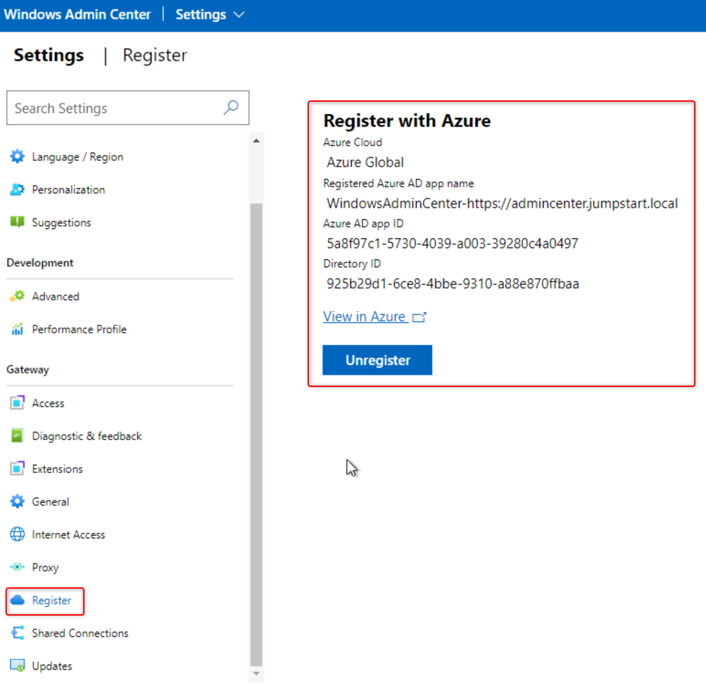

3. Click on **View in Azure** to be taken to the Azure AD app portal, where you should see information about this app, including permissions required. If you're prompted to log in, provide appropriate credentials.
4. Once logged in, under **Configured permissions**, you should see a few permissions listed with the status **Granted for...** and the name of your tenant. The **Microsoft Graph (5)** API permissions will show as **not granted** but this will be updated upon deployment

5. Under **Configured permissions**, click on **Grant Admin Consent for Azure HOL** button.

    
    
6.  Now select **Yes** on the **Grant admin consent confirmation** pop-up to give your app the permissions.

    

*******************************************************************************************************

**NOTE** - If you don't see Microsoft Graph listed in the API permissions, you can either [re-register Windows Admin Center using steps here](#configure-windows-admin-center "re-register Windows Admin Center using steps here") for the permissions to appear correctly, or manually add the **Microsoft Graph Appliation.ReadWrite.All** permission. To manually add the permission:

- Click **+ Add a permission**
- Select **Microsoft Graph**, then **Delegated permissions**
- Search for **Application.ReadWrite.All**, then if required, expand the **Application** dropdown
- Select the **checkbox** and click **Add permissions**

*******************************************************************************************************

6. Switch back to the **Windows Admin Center tab** and click on **Windows Admin Center** in the top-left corner to return to the home page. 

    
    You'll notice that multiple servers are already under management of Windows Admin Center.

Summary
-----------
In this exercise, you've successfully added the existing Azure Stack HCI cluster to your Windows Admin Center, checked the registration status of the Cluster via PowerShell, registered the Windows Admin Center in Azure and Verified this integration. 

With this completed, you can now move on to the next exercise.

Product improvements
-----------
If, while you work through this guide, you have an idea to make the product better, whether it's something in Azure Stack HCI, AKS on Azure Stack HCI, Windows Admin Center, or the Azure Arc integration and experience, let us know! We want to hear from you!

For **Azure Stack HCI**, [Head on over to the Azure Stack HCI Q&A forum](https://learn.microsoft.com/en-us/answers/tags/6/azure-stack-hci "Azure Stack HCI Q&A"), where you can share your thoughts and ideas about making the technologies better and raise an issue if you're having trouble with the technology.

For **AKS on Azure Stack HCI**, [Head on over to our AKS on Azure Stack HCI GitHub page](https://github.com/Azure/aks-hci/issues "AKS on Azure Stack HCI GitHub"), where you can share your thoughts and ideas about making the technologies better. If however, you have an issue that you'd like some help with, read on... 
