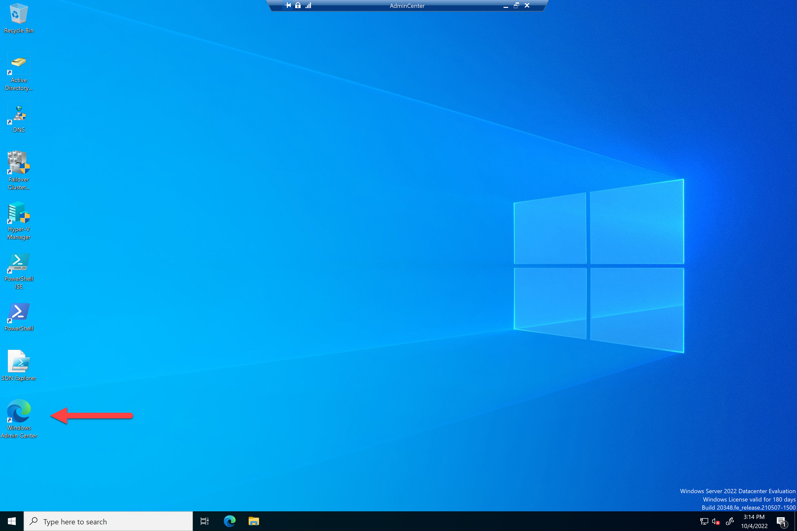
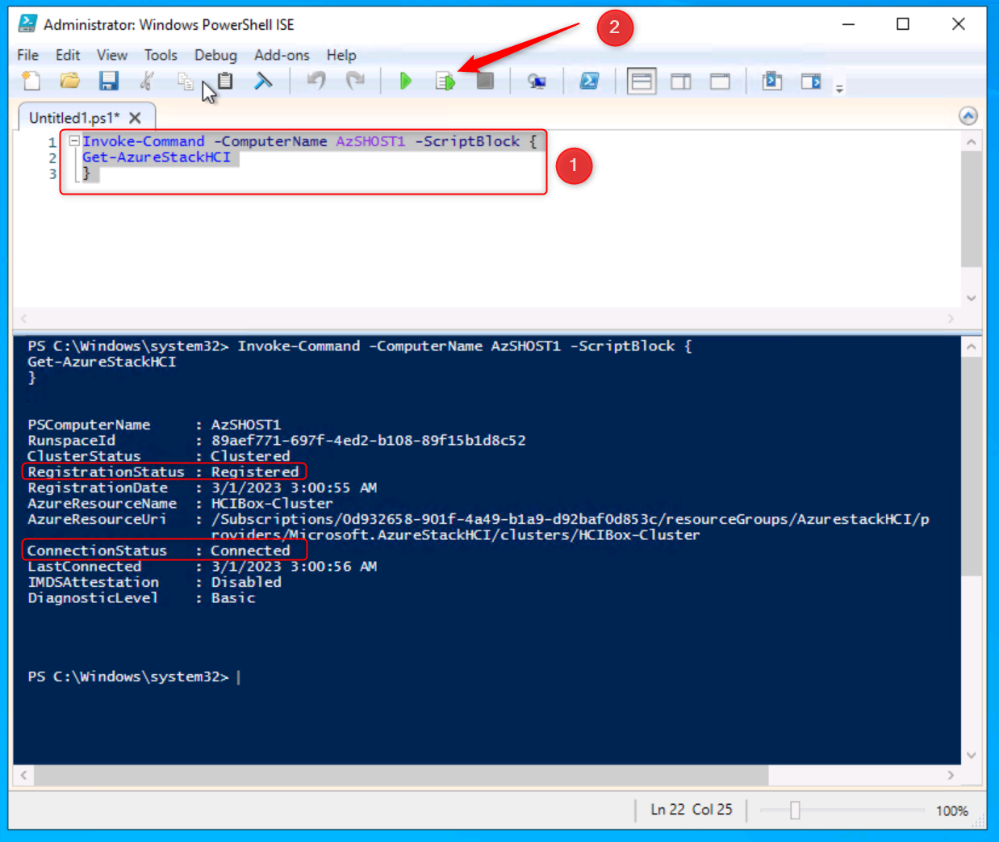
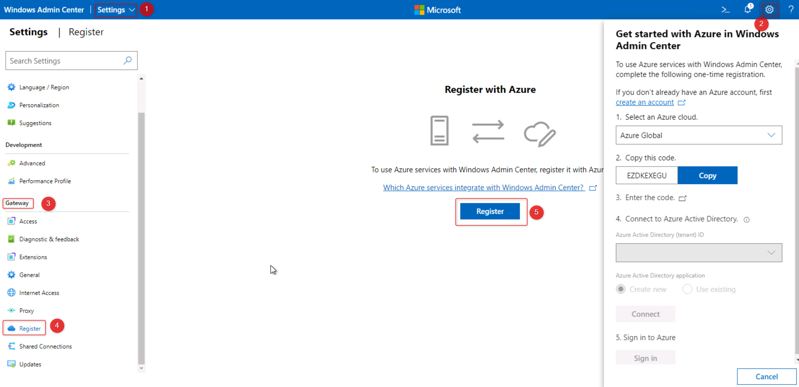

HOL-4: Exercise 1: Integrate Azure Stack HCI 22H2 with Azure
==============


Contents
-----------
- [HOL-4: Exercise 1: Integrate Azure Stack HCI 22H2 with Azure](#hol-4-exercise-1-integrate-azure-stack-hci-22h2-with-azure)
  - [Contents](#contents)
  - [Overview](#overview)
  - [Task 1: Add the existing Cluster to Windows Admin Center](#task-1-add-the-existing-cluster-to-windows-admin-center)
  - [Task 2: Verify your Azure Stack HCI 22H2 Cluster is registered with Azure](#task-2-verify-your-azure-stack-hci-22h2-cluster-is-registered-with-azure)
  - [Task 3: Register Windows Admin Center in Azure](#task-3-register-windows-admin-center-in-azure)
  - [Task 4\[Error Happened\](http://In order to deploy AKS-HCI with Windows Admin Center, you need to connect your Windows Admin Center instance to Azure.](#task-4error-happenedhttpin-order-to-deploy-aks-hci-with-windows-admin-center-you-need-to-connect-your-windows-admin-center-instance-to-azure)
  - [\*\*\*\*\*\*\*\*\*\*\*\*\*\*\*\*\*\*\*\*\*\*\*\*\*\*\*\*\*\*\*\*\*\*\*\*\*\*\*\*\*\*\*\*\*\*\*\*\*\*\*\*\*\*\*\*\*\*\*\*\*\*\*\*\*\*\*\*\*\*\*\*\*\*\*\*\*\*\*\*\*\*\*\*\*\*\*\*\*\*\*\*\*\*\*\*\*\*\*\*\*\*\*): Validate Azure integration](#-validate-azure-integration)
  - [Summary](#summary)
  - [Product improvements](#product-improvements)

Overview
-----------

   As part of the lab environment, we have already deployed the Azure Stack HCI 22H2 Cluster, so you don't have to deploy it and you can continue adding it to Windows Admin Center and verify the registration of the cluster within Azure to unlock the full functionality.

   Azure Stack HCI 22H2 is delivered as an Azure service and needs to register within 30 days of installation per the Azure Online Services Terms.  With our cluster configured, we'll now register your Azure Stack HCI 22H2 cluster with **Azure Arc** for monitoring, support, billing, and hybrid services. Upon registration, an Azure Resource Manager resource is created to represent each on-premises Azure Stack HCI 22H2 cluster, effectively extending the Azure management plane to Azure Stack HCI 22H2. Information is periodically synced between the Azure resource and the on-premises cluster.  One great aspect of Azure Stack HCI 22H2, is that the Azure Arc registration is a native capability of Azure Stack HCI 22H2, so there is no agent required.


## Task 1: Add the existing Cluster to Windows Admin Center

This Lab also includes a dedicated Windows Admin Center (WAC) gateway server. The WAC gateway server can be accessed by connecting to it from RDP. A shortcut is available on the HCIBox-Client desktop.

1. Open this shortcut and use the domain credential (arcedemo@jumpstart.local) to start an RDP session to the Windows Admin Center VM.


2. Log in to the WAC gateway server using the domain credential.


3. Now you can open the Windows Admin Center shortcut on the WAC server desktop. Once again you will use your domain account to access WAC.




4. Now that we are logged in, our first step is to add a connection to our HCI cluster. Click on the “Add” button, and then click on “Add” under “Server clusters”.


5. Enter “hciboxcluster” for the cluster name, and use the domain account credential to connect to the cluster.


6. Now that the cluster is added, we can explore management capabilities for the cluster inside of WAC. Click on the cluster to drill into its details.


You just successfully added the existing Azure Stack HCI 22H2 Cluster "hciboxcluster" to you Windows Admin Center. We will explore the Cluster capabilities leveraging WAC in upcoming tasks.

## Task 2: Verify your Azure Stack HCI 22H2 Cluster is registered with Azure

**Within this lab the Azure Stack HCI 22H2 cluster is already registered within Azure.**

To verify the registration let's now use **PowerShell**.

We're going to perform the registration verification from the **AdminCenter** machine, which we've been using to access Windows Admin Center.

1. After logging in to the **AdminCenter** VM, click on the windows button and search for **PowerShell ISE** then right-click on it to select **Run as administrator**.


    
2. Copy and paste the below PowerShell commands and execute them, you will now see 

     ```powershell
     Invoke-Command -ComputerName AzSHOST1 -ScriptBlock {
     Get-AzureStackHCI
     } 
     ```
    
    

You can see the **RegistrationStatus**, the **ConnectionStatus** and **LastConnected** time, which is usually within the last day unless the cluster is temporarily disconnected from the Internet. An Azure Stack HCI 22H2 cluster can operate fully offline for up to 30 consecutive days.

## Task 3: Register Windows Admin Center in Azure

To use Azure services with Windows Admin Center, you must register your Windows Admin Center instance with Azure. This is a prerequisite if you use Windows Admin Center to [register Azure Stack HCI with Azure](https://learn.microsoft.com/en-us/azure-stack/hci/deploy/register-with-azure).

1. In Windows Admin Center, select the Settings gear icon from the top right corner of the page.

2. From the Settings menu in the left pane, go to Gateway > Register.

3. Select the Register button on the center of the page. The registration pane appears on the right of the page.
   


4. Iin the **Get started with Azure in Windows Admin Center** blade, follow the instructions to **Copy the code**(2) and then click on the link **Enter the Code**(3) to configure device login.

   
    
5. Now, Paste the code you copied in previous step and click on **Next** button.

   
     
6. When prompted for credentials, **enter your Azure credentials** for a tenant you'd like to use to register the Windows Admin Center and click on **Continue** button if you get any popup saying **Are you trying to sign in to Windows Admin Center?**.

7. Now, navigate back in **Windows Admin Center** tab, you'll notice your tenant information has been added.  You can click on **Connect** to connect Windows Admin Center to Azure.

    

8. Click on **Sign in** and when prompted for credentials, **enter your Azure credentials** and you will see a popup **Permissions requested**. Check the box next to the **Consent on behalf of your organization** then click **Accept**. *Ignore the Hybridhost001 referral in the screenshot*

    

*******************************************************************************************************

**NOTE** - If you receive an error when signing in, still in **Settings**, under **User**, click on **Account** and click **Sign-in**. You should then be prompted for Azure credentials and permissions, to which you can then click **Accept**. Sometimes it just takes a few moments from Windows Admin Center creating the Azure AD application and being able to sign in. Retry the sign-in until you've successfully signed in.
**NOTE** - Sometime even after cluster is regitered it may show an error with Signin with following error, you can ignore that and close the popup:
   ```AADSTS700016: Application with identifier '******************' was not found in the directory 'Azure HOL ****'. This can happen if the application has not been installed by the administrator of the tenant or consented to by any user in the tenant. You may have sent your authentication request to the wrong tenant.```

*******************************************************************************************************

## Task 4[Error Happened](http://In order to deploy AKS-HCI with Windows Admin Center, you need to connect your Windows Admin Center instance to Azure.

6. Now, in **Settings**, under **Gateway** click on **Register**.

   
    
7. Click **Register**(1), and in the **Get started with Azure in Windows Admin Center** blade, follow the instructions to **Copy the code**(2) and then click on the link **Enter the Code**(3) to configure device login.

   
    
8. Now, Paste the code you copied in previous step and click on **Next** button.

   
     
9. When prompted for credentials, **enter your Azure credentials** for a tenant you'd like to use to register the Windows Admin Center and click on **Continue** button if you get any popup saying **Are you trying to sign in to Windows Admin Center?**.

10. Now, navigate back in **Windows Admin Center** tab, you'll notice your tenant information has been added.  You can click on **Connect** to connect Windows Admin Center to Azure.

    

11. Click on **Sign in** and when prompted for credentials, **enter your Azure credentials** and you will see a popup **Permissions requested**. Check the box next to the **Consent on behalf of your organization** then click **Accept**.

    

*******************************************************************************************************

**NOTE** - If you receive an error when signing in, still in **Settings**, under **User**, click on **Account** and click **Sign-in**. You should then be prompted for Azure credentials and permissions, to which you can then click **Accept**. Sometimes it just takes a few moments from Windows Admin Center creating the Azure AD application and being able to sign in. Retry the sign-in until you've successfully signed in.
**NOTE** - Sometime even after cluster is regitered it may show an error with Signin with following error, you can ignore that and close the popup:
   ```AADSTS700016: Application with identifier '******************' was not found in the directory 'Azure HOL ****'. This can happen if the application has not been installed by the administrator of the tenant or consented to by any user in the tenant. You may have sent your authentication request to the wrong tenant.```

*******************************************************************************************************)[Error Happened](http://In order to deploy AKS-HCI with Windows Admin Center, you need to connect your Windows Admin Center instance to Azure.

6. Now, in **Settings**, under **Gateway** click on **Register**.

   
    
7. Click **Register**(1), and in the **Get started with Azure in Windows Admin Center** blade, follow the instructions to **Copy the code**(2) and then click on the link **Enter the Code**(3) to configure device login.

   
    
8. Now, Paste the code you copied in previous step and click on **Next** button.

   
     
9. When prompted for credentials, **enter your Azure credentials** for a tenant you'd like to use to register the Windows Admin Center and click on **Continue** button if you get any popup saying **Are you trying to sign in to Windows Admin Center?**.

10. Now, navigate back in **Windows Admin Center** tab, you'll notice your tenant information has been added.  You can click on **Connect** to connect Windows Admin Center to Azure.

    

11. Click on **Sign in** and when prompted for credentials, **enter your Azure credentials** and you will see a popup **Permissions requested**. Check the box next to the **Consent on behalf of your organization** then click **Accept**.

    

*******************************************************************************************************

**NOTE** - If you receive an error when signing in, still in **Settings**, under **User**, click on **Account** and click **Sign-in**. You should then be prompted for Azure credentials and permissions, to which you can then click **Accept**. Sometimes it just takes a few moments from Windows Admin Center creating the Azure AD application and being able to sign in. Retry the sign-in until you've successfully signed in.
**NOTE** - Sometime even after cluster is regitered it may show an error with Signin with following error, you can ignore that and close the popup:
   ```AADSTS700016: Application with identifier '******************' was not found in the directory 'Azure HOL ****'. This can happen if the application has not been installed by the administrator of the tenant or consented to by any user in the tenant. You may have sent your authentication request to the wrong tenant.```

*******************************************************************************************************): Validate Azure integration
-----------
In order to successfully deploy AKS on Azure Stack HCI with Windows Admin Center, additional permissions were applied on the Windows Admin Center Azure AD application that was created when you connected Windows Admin Center to Azure, earlier. In this step, we'll quickly validate those permissions.

1. Still in Windows Admin Center, click on the **Settings** gear in the top-right corner
2. Under **Gateway**, click **Register**. You should see your previously registered Azure AD app:

    

3. Click on **View in Azure** to be taken to the Azure AD app portal, where you should see information about this app, including permissions required. If you're prompted to log in, provide appropriate credentials.
4. Once logged in, under **Configured permissions**, you should see a few permissions listed with the status **Granted for...** and the name of your tenant. The **Microsoft Graph (5)** API permissions will show as **not granted** but this will be updated upon deployment

5. Under **Configured permissions**, click on **Grant Admin Consent for Azure HOL** button.

    
    
6.  Now select **Yes** on the **Grant admin consent confirmation** pop-up to give your app the permissions.

    

*******************************************************************************************************

**NOTE** - If you don't see Microsoft Graph listed in the API permissions, you can either [re-register Windows Admin Center using steps here](#configure-windows-admin-center "re-register Windows Admin Center using steps here") for the permissions to appear correctly, or manually add the **Microsoft Graph Appliation.ReadWrite.All** permission. To manually add the permission:

- Click **+ Add a permission**
- Select **Microsoft Graph**, then **Delegated permissions**
- Search for **Application.ReadWrite.All**, then if required, expand the **Application** dropdown
- Select the **checkbox** and click **Add permissions**

*******************************************************************************************************

6. Switch back to the **Windows Admin Center tab** and click on **Windows Admin Center** in the top-left corner to return to the home page. 

    
    
    
   You'll notice that your HybridHost001 is already under management, so at this stage, you're ready to proceed to deploy the AKS on Azure Stack HCI management cluster onto your Windows Server 2019 Hyper-V host.

    


Summary
-----------
In this exercise, you've successfully added the existing Azure Stack HCI cluster to your Windows Admin Center, checked the registerion status of the Cluster via PowerShell and registered the Windows Admin Center in Azure. 

With this completed, you can now move on to the next exercise.

Product improvements
-----------
If, while you work through this guide, you have an idea to make the product better, whether it's something in Azure Stack HCI, AKS on Azure Stack HCI, Windows Admin Center, or the Azure Arc integration and experience, let us know! We want to hear from you!

For **Azure Stack HCI**, [Head on over to the Azure Stack HCI Q&A forum](https://learn.microsoft.com/en-us/answers/tags/6/azure-stack-hci "Azure Stack HCI Q&A"), where you can share your thoughts and ideas about making the technologies better and raise an issue if you're having trouble with the technology.

For **AKS on Azure Stack HCI**, [Head on over to our AKS on Azure Stack HCI GitHub page](https://github.com/Azure/aks-hci/issues "AKS on Azure Stack HCI GitHub"), where you can share your thoughts and ideas about making the technologies better. If however, you have an issue that you'd like some help with, read on... 
