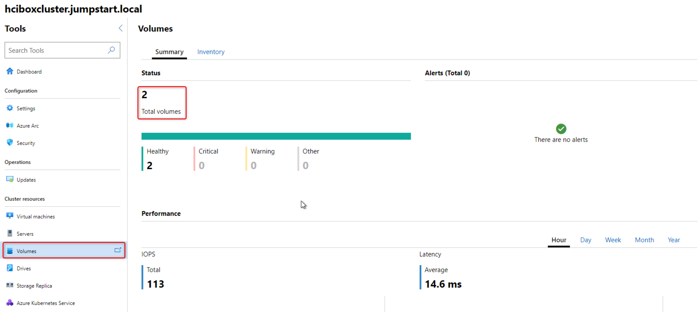
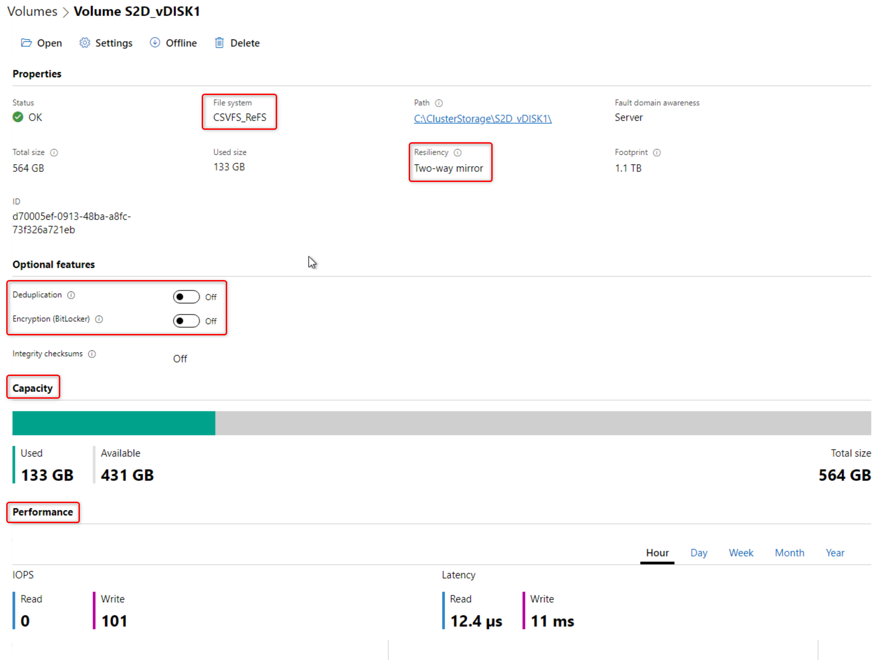
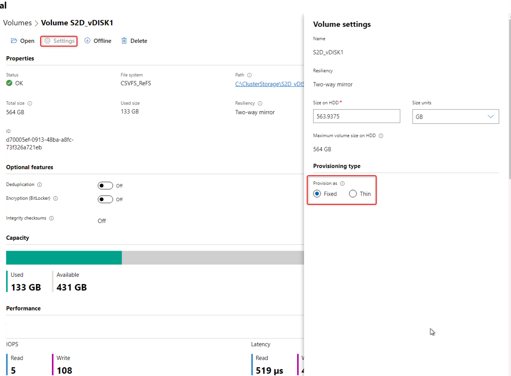
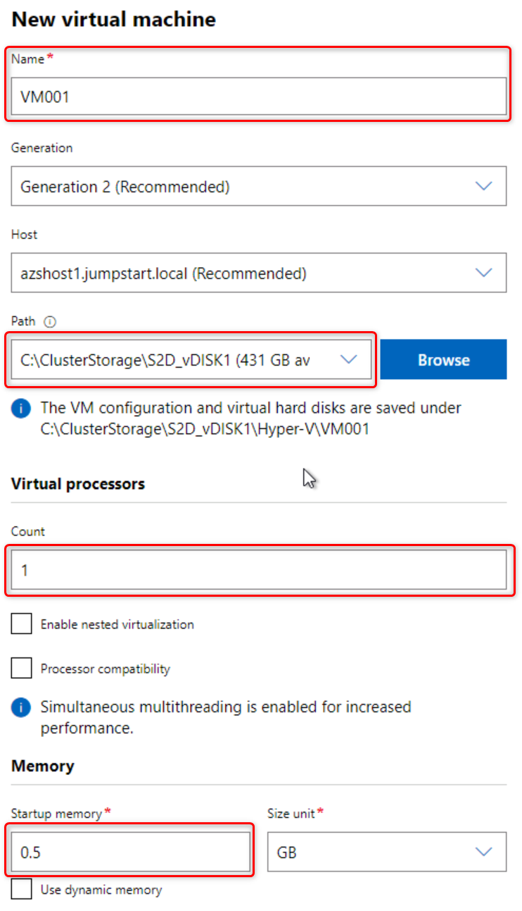
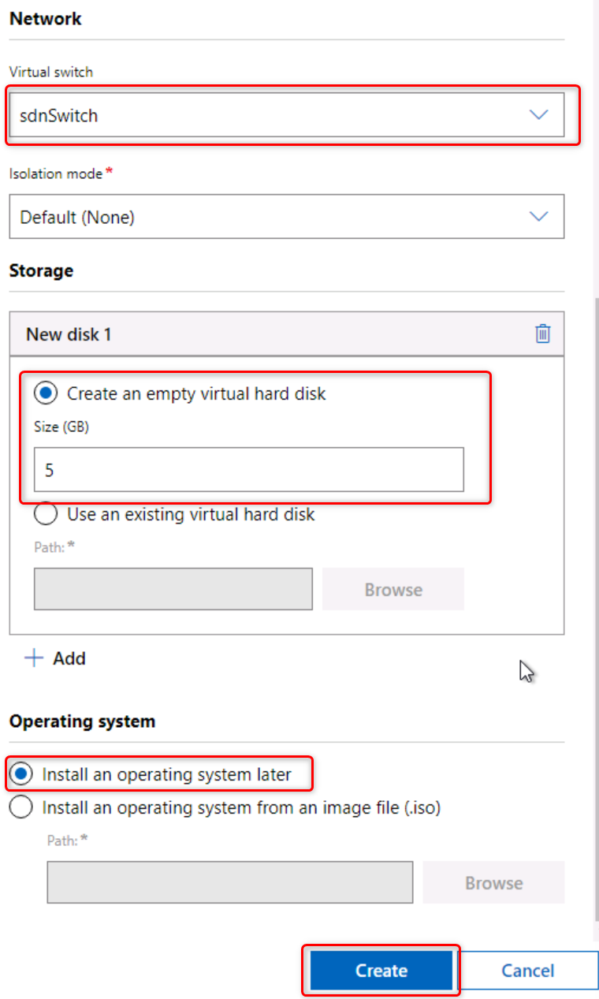
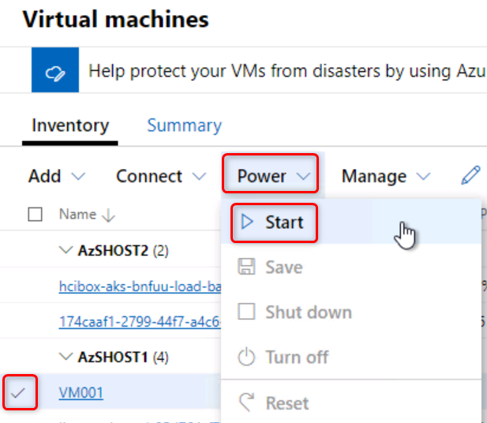

HOL-4: Exercise 2: Explore the management of your Azure Stack HCI 22H2 environment
==============
Overview
-----------
With the Azure Stack HCI cluster deployed, you can now begin to explore some of the additional capabilities within Azure Stack HCI 22H2 and Windows Admin Center. We'll cover a few recommended activities below, to expose you to some of the key elements of the Windows Admin Center, but for the rest, we'll [direct you over to the official documentation](https://learn.microsoft.com/en-us/azure-stack/hci/ "Azure Stack HCI 22H2 documentation").

Contents
-----------
- [HOL-4: Exercise 2: Explore the management of your Azure Stack HCI 22H2 environment](#hol-4-exercise-2-explore-the-management-of-your-azure-stack-hci-22h2-environment)
  - [Overview](#overview)
  - [Contents](#contents)
  - [Task 1: Explore the existing volumes created on the **hciboxcluster**](#task-1-explore-the-existing-volumes-created-on-the-hciboxcluster)
    - [Review a two-way mirror volume created to run VMs](#review-a-two-way-mirror-volume-created-to-run-vms)
  - [Task 2: Download .Iso files](#task-2-download-iso-files)
    - [Download a Windows Server 2022 .Iso](#download-a-windows-server-2022-iso)
    - [Download an Ubuntu Server 22.04 .Iso](#download-an-ubuntu-server-2204-iso)
    - [Upload the .Iso files to your CSV](#upload-the-iso-files-to-your-csv)
  - [Task 3: Deploy a Windows Server 2019 virtual machine](#task-3-deploy-a-windows-server-2019-virtual-machine)
  - [Task 4: Deploy an Ubuntu Server 20.04 virtual machine](#task-4-deploy-an-ubuntu-server-2004-virtual-machine)
  - [Task 5: Live migrate a virtual machine to another node](#task-5-live-migrate-a-virtual-machine-to-another-node)
  - [Task 2: Deploy a virtual machine](#task-2-deploy-a-virtual-machine)
    - [Create the virtual machine](#create-the-virtual-machine)
  - [Congratulations!](#congratulations)
  - [Setup the lab in your own Azure Subscription.](#setup-the-lab-in-your-own-azure-subscription)

Task 1: Explore the existing volumes created on the **hciboxcluster**
-----------
In this step, you'll review a volume on the Azure Stack HCI 22H2 cluster by using Windows Admin Center, and enable data deduplication and compression.

### Review a two-way mirror volume created to run VMs ###

1. Open **Windows Admin Center** on the **AdminCenter** VM. On the top left click on **All connections** and click on your previously deployed cluster, **hciboxcluster.jumpstart.local**

    
    
        
2. On the left hand navigation, under **Cluster resources** select **Volumes**.  The central **Volumes** page shows you should have two volume currently

    
    
4. On the Volumes page, select the **Inventory** tab, and then select **Create**

    
    
6. Open the volume **S2D_vDISK1**, by clicking on the name of the volume. We see a couple of things now:
   - The Volume File system is a **Cluster Shared Volume** of type **ReFS**
     - *Please read more:* 
       - https://learn.microsoft.com/en-us/azure-stack/hci/concepts/plan-volume
       - https://learn.microsoft.com/en-us/azure-stack/hci/concepts/storage-spaces-direct-overview)
   - The Resiliency was set to **Two-way mirror**
     - *Please read more:*
       - https://learn.microsoft.com/en-us/azure-stack/hci/concepts/fault-tolerance)
   - Deduplication and Encryption is **Off**
     - *Please read more:*
       - https://learn.microsoft.com/en-us/azure-stack/hci/manage/volume-encryption-deduplication
   - Also have a look at the Capacity and Performance indicators

    
  
7. On the volume S2D_vDISK1 page click on **Settings**. You will notice that the volume S2D_vDISK1 has been provisioned as a type Fixed, but Thin provisioning of volumes is also available.
   - *Please read more:*
     - https://learn.microsoft.com/en-us/azure-stack/hci/manage/thin-provisioning

    

You now have reviewed and learned more about Azure Stack HCI volumes which are ready to accept workloads. 
Here is the official documentation on how to create volumes on Azure Stack HCI, leveraging Windows Admin Center or PowerShell: https://learn.microsoft.com/en-us/azure-stack/hci/manage/create-volumes

Task 2: Download .Iso files
-----------
In this step, you will download a Windows Server 2022 and Ubuntu Server 22.04 .Iso file and upload the .Iso to your Clustered Shared Volume you explored in Task 1. 

**_NOTE:_**  Make sure to use the Edge browser on the **AdminCenter** VM to execute the following steps.

### Download a Windows Server 2022 .Iso ###

1. Please download Windows Server 2022 image file from [here](https://www.microsoft.com/en-us/evalcenter/download-windows-server-2022)
 
1. In the English (United States) row select the Click **64-bit edition** in the ISO downloads row. Download the .iso which will be by saved in the Downloads folder.

### Download an Ubuntu Server 22.04 .Iso ### 
 
1. Please download Ubuntu Server 22.04 image file from [here](https://releases.ubuntu.com/jammy/ubuntu-22.04.2-live-server-amd64.iso)
 
1. The download of the ISO file should automatically start. Once completed you should find it in your Downloads folder.

### Upload the .Iso files to your CSV ###
 
1. Open **Windows Admin Center** on **AdminCenter** VM from the desktop if it is not already opened, click on your previously deployed cluster, **hciboxcluster.jumpstart.local**
 
    
 
1. On the left hand navigation, under **Cluster Resources** select Servers and then Inventory.
 
    

1. Click on node AzSHOST1 and then click in Manage
 
    
 
1. On the left, select Files & file sharing
  
    
  
1. Open the folder C:\ClusterStorage\Volume01
 
    
  
 
1. Click in the "…" and then Upload
 
    
  
1. Click in Select Files, search for both (Windows Server 2019 and Ubuntu Server 20.04) .iso files in Downloads and click in Open, and then Submit. 
 
    
 
1. It takes around 5-10 minutes to get successfully uploaded. After that, please move on to the next task.

Task 3: Deploy a Windows Server 2019 virtual machine
----- 
In this step, you will deploy a Windows Server 2019 virtual machine via Windows Admin Center.

1. Once logged into the **Windows Admin Center** on **HybridHost001**, click on your previously deployed cluster, **azshciclus.hybrid.local**

1. On the left hand navigation, under **Compute** select **Virtual machines**.  The central **Virtual machines** page shows you no virtual machines deployed currently
    
    

1. On the **Virtual machines** page, select the **Inventory** tab, and then click on **Add** and select **New**.

    
 
1. In the New virtual machine pane, enter VM001 for the name, and enter the following pieces of information, then click Create
 
     * Generation: Generation 2 (Recommended)
 
     * Host: Leave as recommended
 
     * Path: C:\ClusterStorage\Volume01
 
     * Virtual processors: 2
 
     * Startup memory (GB): 4
 
     * Use dynamic memory: Min 2, Max 6
 
     * Network: ComputeSwitch
 
     * Storage: Add, then Create an empty virtual hard disk and set size to 30GB
 
     * Operating System: Install an operating system from an image file (.iso). Select the Windows Server 2019 Iso file!
 
      
      
        
 
1. The creation process will take a few moments, and once complete, VM001 should show within the Virtual machines view

1. Click on the checkbox before the VM and then click click on Power button and select Start - within moments, the VM should be running.

    
     
    
  
1. Click on VM001 to view the properties and status for this running VM.
 
    

1. Click on Connect and select connect button from the drop down- you may get a VM Connect prompt:
 
    
 
1. Click on Go to Settings and in the Remote Desktop pane, click on Allow remote connections to this computer, then Save
 
    
              
1. Click the Back button in your browser to return to the VM001 view, then click Connect, and when prompted with the certificate prompt, click Connect and enter Password as `demo!pass123`.
  
    
 
 
1. The VM will be in the UEFI boot summary as below
 
    
 
1. Click in "Send Ctrl + Alt + Del" at the top of the page now and press any key when you see the message "Press any key at boot from CD or DVD…"
 
    
 
1. Click Enter when you see the following interface
 
    
 
1. From there you'll start the OOBE experience. Select the following settings according to your preferences: Language, Time currency and Keyboard

1. Click Install Now, and select the version Windows Server 2019 Standard Evaluation (Desktop Experience):
 
     
 
1. Accept the license terms and select "Custom: Install Windows only (advanced)" and then Next. It will take around 10 minutes for the VM to boot. After that, please insert the lab credentials demo!pass123 and your VM is ready to go!

Task 4: Deploy an Ubuntu Server 20.04 virtual machine
----- 
In this step, you will deploy an Ubuntu Server 20.04 virtual machine via Windows Admin Center.

1. Once logged into the **Windows Admin Center** on **HybridHost001**, click on your previously deployed cluster, **azshciclus.hybrid.local**

1. On the left hand navigation, under **Compute** select **Virtual machines**.  The central **Virtual machines** page shows one virtual machines deployed currently.
    
    

1. On the **Virtual machines** page, select the **Inventory** tab, and then click on **Add** and select **New**.

    
 
1. In the New virtual machine pane, enter VM002 for the name, and enter the following pieces of information, then click Create
 
     * Generation: Generation 2 (Recommended)
 
     * Host: Leave as recommended
 
     * Path: C:\ClusterStorage\Volume01
 
     * Virtual processors: 2
 
     * Startup memory (GB): 2
 
        * Use dynamic memory: -
 
     * Network: ComputeSwitch
 
     * Storage: Add, then Create an empty virtual hard disk and set size to 30GB
 
     * Operating System: Install an operating system from an image file (.iso). Select the Ubuntu Server 20.04 Iso file!
 
      
      
        
 
1. The creation process will take a few moments, and once complete, VM002 should show within the Virtual machines view

1. Click on the VM name VM002 and then Click on Settings to view all VM properties. Click on Security
 
      

1. Make sure to change the Secure Boot template to "Microsoft UEFI Certificate Authority" in the Template drop down box, and click save security settings. Click Close.

      

1. Click on Power button and select Start - within moments, the VM should be in a running state soon.

      

1. Click on Connect and select connect button from the drop down- you may get a VM Connect prompt.
 
      

1. When prompted with the certificate prompt, click Connect and enter Password as `demo!pass123`.
  
    

1. Once the integrity check is done you will be able to select your language. Select English.

    

1. On the Installer update available screen, select "Continue without updating"

    

1. On the Keyboard configuration screen, select "Done"

    

1. On the Network connections screen, remember the assigned IP address and select "Done"

    

1. On the Configure proxy screen, select "Done"

    

1. On the Configure Ubuntu archive mirror screen, select "Done"

    

1. On the Guided storage configuration screen, select "Done"

    

1. On the storage configuration screen, select "Done" and then Select "Continue" to confirm the destructive action popup screen.

    
    

1. On the Profile setup screen complete the fields a below and then select "Done"
     * Your name: demouser
 
     * Your server's name: vm002
 
     * Pick a username: demouser
 
     * Choose a password: demo!pass123

     * Confirm your password: demo!pass123

    

1. On the Enable Ubunutu Advantage screen, select "Done"

    

1. On the SSH setup screen, select "Install openSSH server" and select "Done"

    

1. On the Featured Server snaps screen, select "Done"

    

1. Now wait until you get the Install complete! screen and select "Reboot Now"

    

1. On the following screen press "ENTER", now the virtual machine will reboot.

    

1. Once the virtual machine is up and running try to login!

    

Task 5: Live migrate a virtual machine to another node
----- 

The final step we'll cover is using Windows Admin Center to live migrate VM001 from it's current node, to an alternate node in the cluster.

1. Still within the **Windows Admin Center** on **HybridHost001**, under **Compute**, click on **Virtual machines**

2. On the **Virtual machines** page, select the **Inventory** tab

3. Under **Host server**, make a note of the node that VM001 is currently running on.  You may need to expand the column width to see the name

4. Next to **VM001**, click the tick box next to VM001, then click **More**.  You'll notice you can Clone, Domain Join and also Move the VM. Click **Move**

Task 2: Deploy a virtual machine
-----------
In this step, you'll deploy a VM onto your Azure Stack HCI, using Windows Admin Center.

### Create the virtual machine ###
You should still be over on the **AdminCenter** VM, but if you're not, log into AdminCenter VM, and open the **Windows Admin Center**.

1. Once logged into the **Windows Admin Center** on the **AdminCenter** VM, click on your previously deployed cluster, **hciboxcluster.jumpstart.local**

3. On the left hand navigation, under **Cluster Resources** select **Virtual machines**.  The central **Virtual machines** page shows that there are some virtual machines deployed currently
    
    

4. On the **Virtual machines** page, select the **Inventory** tab, and then click on **Add** and select **New**.

    

6. In the **New virtual machine** pane, enter **VM001** for the name, and enter the following pieces of information, then click **Create**

    * Generation: **Generation 2 (Recommended)**
    * Host: **Leave as recommended**
    * Path: **C:\ClusterStorage\S2D_vDISK1**
    * Virtual processors: **1**
    * Startup memory (GB): **0.5**
    * Network: **sdnSwitch**
    * Storage: **Add, then Create an empty virtual hard disk** and set size to **5GB**
    * Operating System: **Install an operating system later**

    
      
    

5. The creation process will take a few moments, and once complete, **VM001** should show within the **Virtual machines view**

6. Click on the checkbox before the **VM** and then click click on **Power** button and select **Start** - within moments, the VM should be running.

    
    
    

7. Click on **VM001** to view the properties and status for this running VM.

    

8. Click on **Connect (1)** and select **Connect (2)** button from the drop down.

    
    
1. If you get a prompt stating **VM Connect**, then click on **Go to Settings**.

    

9. On the **Settings** tab, Select **Remote Desktop** pane and click on **Allow remote connections to this computer**, then **Save**.

     
     
10. Click the **Back** button in your browser to return to the VM001 view, then click **Connect**, and when prompted with the certificate prompt, click **Connect** and enter Password as **demo!pass123**

      
      
12. There's no operating system installed here, so it should show a UEFI boot summary, but the VM is running successfully

12. Click **Disconnect**

You've successfully create a VM using the Windows Admin Center!

Congratulations!
-----------
You've reached the end of the evaluation guide.  In this guide you have:

* Deployed/Configured a Windows Server 2019 Hyper-V host in Azure to run your nested sandbox environment
* Deployed the AKS on Azure Stack HCI management cluster on your Windows Server 2019 Hyper-V environment
* Deployed a target cluster to run applications and services
* Optionally integrated with Azure Arc and deployed a sample application
* Set the foundation for further learning!

Great work!

Setup the lab in your own Azure Subscription.
-------------

This lab is based on the the following work by Matt McSpirit: https://github.com/mattmcspirit/hybridworkshop

If you want to setup the lab within your own Azure subscription and run through additional scenarios as well, you can go to the above GitHub repo and perform as mentioned.
