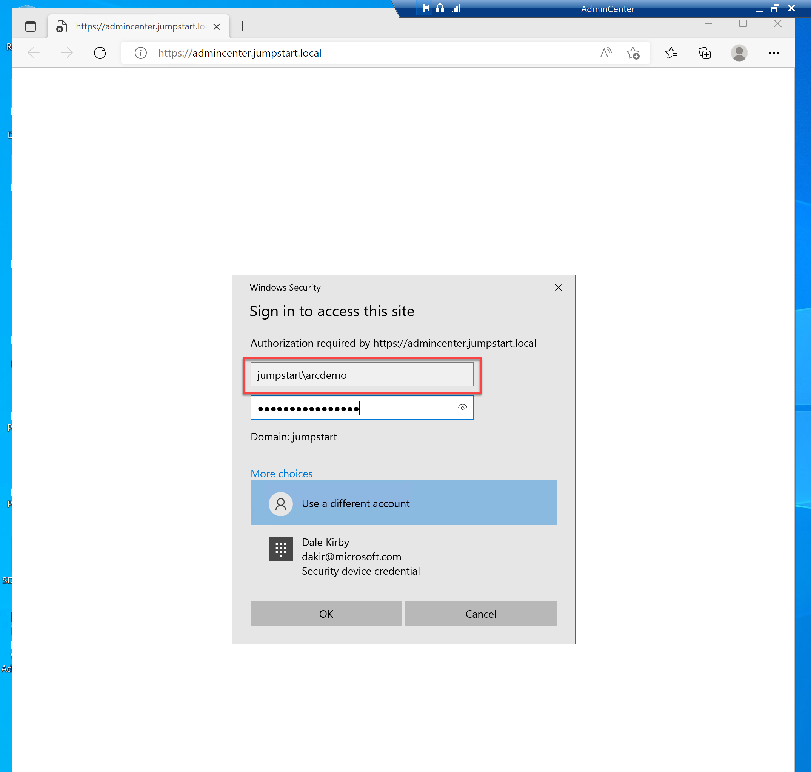
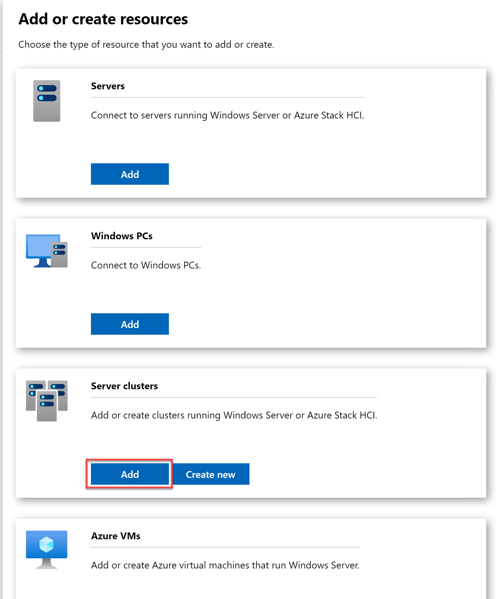
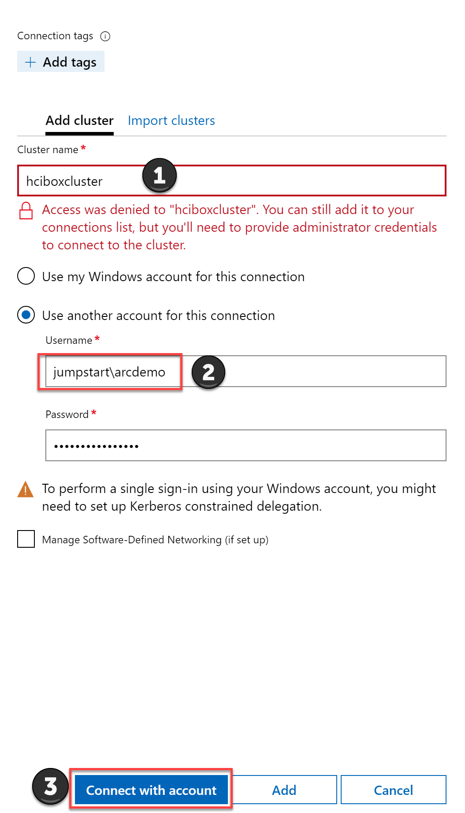
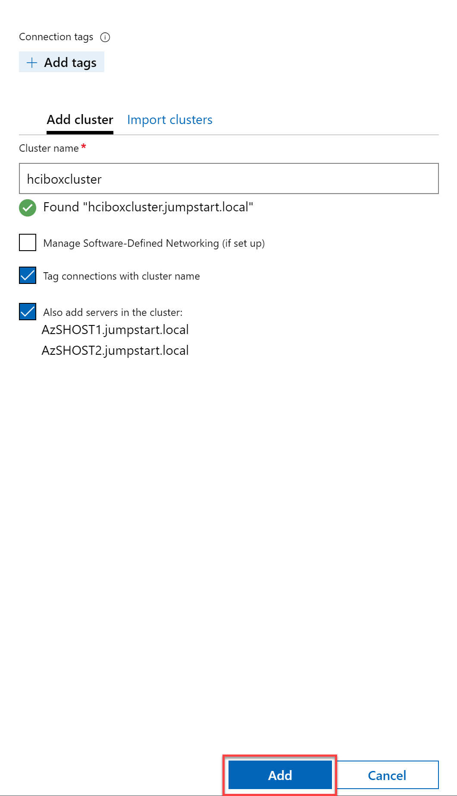
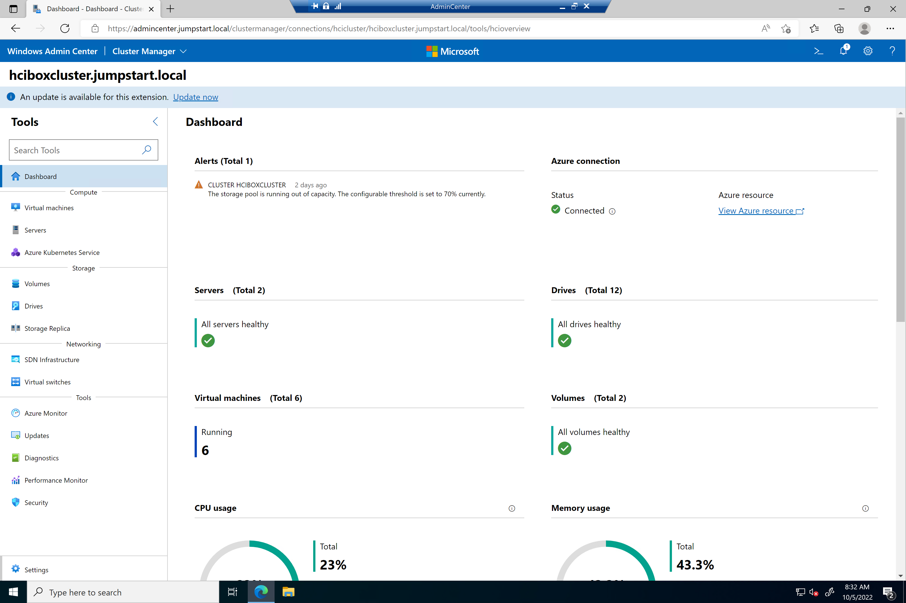
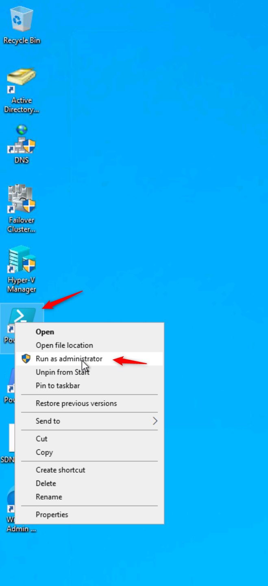

HOL-4: Exercise 1: Integrate Azure Stack HCI 22H2 with Azure
==============
Overview
-----------

   As part of the lab environment, we have already deployed the Azure Stack HCI 22H2 Cluster, so you don't have to deploy it and you can continue adding it to Windows Admin Center and verify the registration of the cluster within Azure to unlock the full functionality.

   Azure Stack HCI 22H2 is delivered as an Azure service and needs to register within 30 days of installation per the Azure Online Services Terms.  With our cluster configured, we'll now register your Azure Stack HCI 22H2 cluster with **Azure Arc** for monitoring, support, billing, and hybrid services. Upon registration, an Azure Resource Manager resource is created to represent each on-premises Azure Stack HCI 22H2 cluster, effectively extending the Azure management plane to Azure Stack HCI 22H2. Information is periodically synced between the Azure resource and the on-premises cluster.  One great aspect of Azure Stack HCI 22H2, is that the Azure Arc registration is a native capability of Azure Stack HCI 22H2, so there is no agent required.

Contents
-----------
- [Overview](#overview)
- [Contents](#contents)
- [Add the existing Cluster to Windows Admin Center](#task-0-add-the-existing-cluster-to-windows-admin-center)
- [Verify Cluster Registration](#task-1-verify-your-azure-stack-hci-22h2-cluster-is-registered-with-azure)

## Task 0: Add the existing Cluster to Windows Admin Center

This Lab also includes a dedicated Windows Admin Center (WAC) gateway server. The WAC gateway server can be accessed by connecting to it from RDP. A shortcut is available on the HCIBox-Client desktop.

1. Open this shortcut and use the domain credential (arcedemo@jumpstart.local) to start an RDP session to the Windows Admin Center VM.


2. Log in to the WAC gateway server using the domain credential.


3. Now you can open the Windows Admin Center shortcut on the WAC server desktop. Once again you will use your domain account to access WAC.




4. Now that we are logged in, our first step is to add a connection to our HCI cluster. Click on the “Add” button, and then click on “Add” under “Server clusters”.




5. Enter “hciboxcluster” for the cluster name, and use the domain account credential to connect to the cluster.




6. Now that the cluster is added, we can explore management capabilities for the cluster inside of WAC. Click on the cluster to drill into its details.




You just succesfully added the existing Azure Stack HCI 22H2 Cluster "hciboxcluster" to you Windows Admin Center. We will explore the Cluster capabilities leveraging WAC in upcoming tasks.

## Task 1: Verify your Azure Stack HCI 22H2 Cluster is registered with Azure

Normally registering your cluster can be done in 2 ways. You can use **Windows Admin Center**, or you can use **PowerShell**. **Within this lab the Azure Stack HCI 22H2 cluster is already registered.**

To verify the registration let's now use PoweShell.

We're going to perform the registration verification from the **AdminCenter** machine, which we've been using to access Windows Admin Center.

1. After logging in to the **AdminCenter** VM, click on the windows button and search for **PowerShell ISE** then right-click on it to select **Run as administrator**.


    
2. Copy and paste the below PowerShell commands and execute them, you will now see 

     ```powershell
     Invoke-Command -ComputerName AzSHOST1 -ScriptBlock {
     Get-AzureStackHCI
     } 
     ```
    
    

You can see the **RegistrationStatus**, the **ConnectionStatus** and **LastConnected** time, which is usually within the last day unless the cluster is temporarily disconnected from the Internet. An Azure Stack HCI 22H2 cluster can operate fully offline for up to 30 consecutive days.

## Task 2: View registration details in the Azure portal ###

Once the registration is complete, you should take some time to explore the artifacts that are created in Azure.

1. In the virtual machine (VM) on the left, click on the Azure portal desktop icon as shown below.

    
    
1. On the **Sign in to Microsoft Azure** window, you will see the login screen, enter the following username and click on **Next**.

   * Email/Username: <inject key="AzureAdUserEmail"></inject>

   

1. Now enter the following password and click on **Sign in**. 

   * Password: <inject key="AzureAdUserPassword"></inject>
   
   

1. First time users are often prompted to **Stay Signed In**, if you see any such message, click on **No**

   

1. If you see the pop-up **You have free Azure Advisor recommendations!**, close the window to continue the lab.

1. If a **Welcome to Microsoft Azure** popup window appears, click **Maybe Later** to skip the tour.

1. You should see a new **Resource group** listed, with the name you specified earlier, which in our case, is **HybridHost** and click on it.

    

1. Under **HybridHost** resource group page, you'll see a resource **Azure Stack HCI** with the name **azshciclus** has been created.

    
    
   >**Note**: If you are not able to view the **Azure Stack HCI** resource with the name **azshciclus** in the HybridHost resource group. Please follow from step 9 - step 12 else skip to step 13.

1. In the virtual machine (VM) on the left, double-click on the **Windows Admin Center** .

    
    
1. On Windows Admin Center page, Select the **azshciclus.hybrid.local** cluster to open it.

    
    
1. Select **Settings** from the Tools side blade.

    
    
1. Select **Azure Stack HCI registration** under Azure Stack HCI and click on **View Azure resource**.

    

1. Click on the **azshciclus**, then you'll be taken to the new Azure Stack HCI Resource Provider, which shows information about all of your clusters, including details on the currently selected cluster.

    


### Congratulations! ###
You've now successfully registered your Azure Stack HCI 20H2 cluster!

Summary
-----------
In this exercise, you've successfully registered your Azure Stack HCI 20H2 cluster. With this completed, you can now move on to the next exercise.

Product improvements
-----------
If, while you work through this guide, you have an idea to make the product better, whether it's something in Azure Stack HCI, AKS on Azure Stack HCI, Windows Admin Center, or the Azure Arc integration and experience, let us know! We want to hear from you!

For **Azure Stack HCI**, [Head on over to the Azure Stack HCI 20H2 Q&A forum](https://docs.microsoft.com/en-us/answers/topics/azure-stack-hci.html "Azure Stack HCI 20H2 Q&A"), where you can share your thoughts and ideas about making the technologies better and raise an issue if you're having trouble with the technology.

For **AKS on Azure Stack HCI**, [Head on over to our AKS on Azure Stack HCI 20H2 GitHub page](https://github.com/Azure/aks-hci/issues "AKS on Azure Stack HCI GitHub"), where you can share your thoughts and ideas about making the technologies better. If however, you have an issue that you'd like some help with, read on... 
