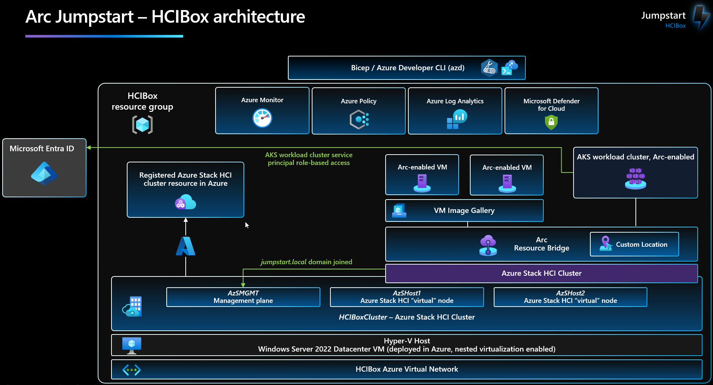
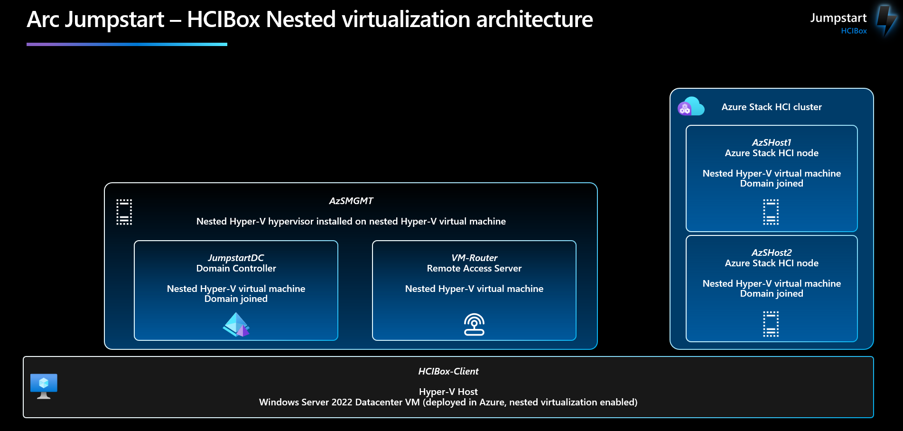

## Overview of Azure Stack HCI JumpBox

HCIBox is a turnkey solution that provides a complete sandbox for exploring [Azure Stack HCI](https://learn.microsoft.com/azure-stack/hci/whats-new) capabilities and hybrid cloud integration in a virtualized environment. HCIBox is designed to be completely self-contained within a single Azure subscription and resource group, which will make it easy for a user to get hands-on with Azure Stack HCI and [Azure Arc](https://learn.microsoft.com/azure/azure-arc/overview) technology without the need for physical hardware.

  > **Note:** [Azure Stack HCI 23H2](https://learn.microsoft.com/azure-stack/hci/whats-new) is now generally available. 23H2 simplifies configuration and deployment of HCI clusters and related workloads like [VM management](https://learn.microsoft.com/azure-stack/hci/manage/azure-arc-vm-management-overview) for VM self-service management in Azure portal. HCIBox has also been updated and now offers clusters built on the new 23H2 OS, and prior Azure Stack HCI releases are no longer part of HCIBox or supported by the Jumpstart team. If you've used earlier versions of HCIBox you should read this guide thoroughly to understand the new HCIBox deployment process.

## Use cases

- Sandbox environment for getting hands-on with Azure Stack HCI and Azure Arc technologies
- Accelerator for Proof-of-concepts or pilots
- Training tool for skills development
- Demo environment for customer presentations or events
- Rapid integration testing platform

## Azure Stack HCI capabilities available in HCIBox

### 2-node Azure Stack HCI cluster

HCIBox automatically creates and configures a two-node Azure Stack HCI cluster using nested virtualization with Hyper-V running on an Azure Virtual Machine. This Hyper-V host creates three guest virtual machines: two Azure Stack HCI nodes (_AzSHost1_, _AzSHost2_), and one nested Hyper-V host (_AzSMGMT_). _AzSMGMT_ itself hosts two guest VMs: an [Active Directory domain controller](https://learn.microsoft.com/windows-server/identity/ad-ds/get-started/virtual-dc/active-directory-domain-services-overview), and a [Routing and Remote Access Server](https://learn.microsoft.com/windows-server/remote/remote-access/remote-access) acting as a virtual router.

### Virtual machine management

HCIBox comes with [guest VM management in Azure portal](https://learn.microsoft.com/azure-stack/hci/manage/azure-arc-vm-management-overview). The HCIBox documentation will walk you through how to use this feature, including configuring VM images from Azure marketplace and creating VMs on your cluster.

### Azure Kubernetes Service on Azure Stack HCI

Azure Stack HCI includes [Azure Kubernetes Services on Azure Stack HCI (AKS hybrid)](https://learn.microsoft.com/azure/aks/hybrid/) as part of the default configuration. A user script is provided that can be used to create a workload cluster.

## HCIBox Azure Consumption Costs

HCIBox resources generate Azure Consumption charges from the underlying Azure resources including core compute, storage, networking and auxiliary services. Note that Azure consumption costs may vary depending the region where HCIBox is deployed. Be mindful of your HCIBox deployments and ensure that you disable or delete HCIBox resources when not in use to avoid unwanted charges. Please see the [Jumpstart HCIBox FAQ](../faq/) for more information on consumption costs.

## Using HCIBox

HCIBox has many features that can be explored through the Azure portal or from inside the _HCIBox-Client_ virtual machine. To help you navigate all the features included, read through the following sections to understand the general architecture and how to use various features.

### Nested virtualization

HCIBox simulates a 2-node physical deployment of Azure Stack HCI by using [nested virtualization on Hyper-V](https://learn.microsoft.com/virtualization/hyper-v-on-windows/user-guide/nested-virtualization). To ensure you have the best experience with HCIBox, take a moment to review the details below to help you understand the various nested VMs that make up the solution.

  

| Computer Name    | Role                                | Domain Joined | Parent Host     | OS                  |
| ---------------- | ----------------------------------- | ------------- | --------------- | ------------------- |
| _HCIBox-Client_  | Primary host                        | No            | Azure           | Windows Server 2022 |
| _AzSHOST1_       | HCI node                            | Yes           | _HCIBox-Client_ | Azure Stack HCI     |
| _AzSHOST2_       | HCI node                            | Yes           | _HCIBox-Client_ | Azure Stack HCI     |
| _AzSMGMT_        | Nested hypervisor                   | No            | _HCIBox-Client_ | Windows Server 2022 |
| _JumpstartDC_    | Domain controller                   | Yes (DC)      | _AzSMGMT_       | Windows Server 2022 |
| _Vm-Router_      | Remote Access Server                | No            | _AzSMGMT_       | Windows Server 2022 |

### Active Directory domain user credentials

Once you are logged into the _HCIBox-Client_ VM using the local admin credentials you supplied in your template parameters during deployment you will need to switch to using a domain account to access most other functions, such as logging into the HCI nodes. The default domain account is _administrator@jumpstart.local_.

  > **Note:** The password for this account is set as the same password you supplied during deployment for the local account. Many HCIBox operations will use the domain account wherever credentials are required.
