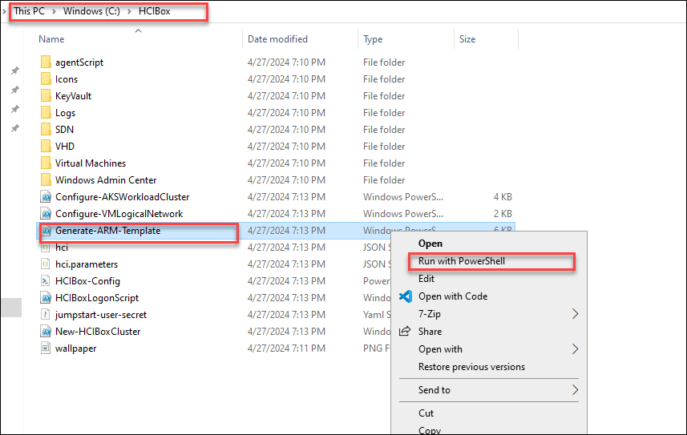
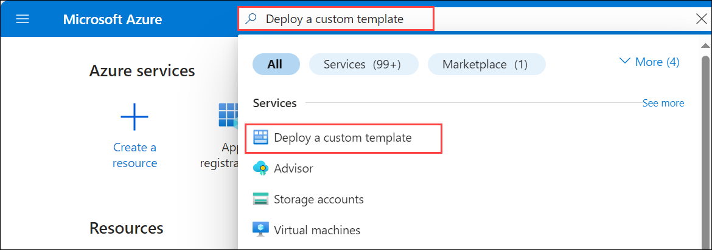
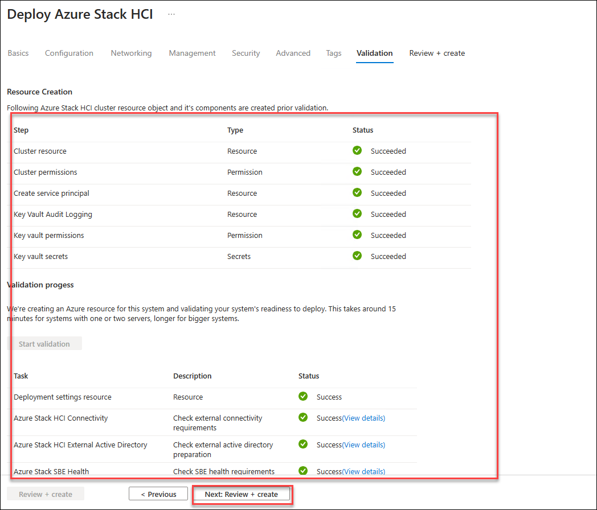
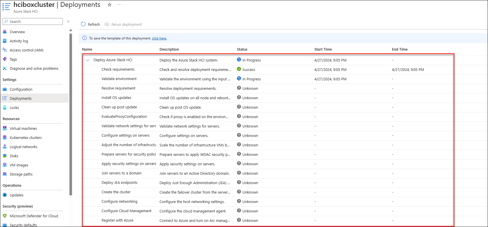

# Exercise 2: Deploying JumpStart-HCIBox in Azure Portal

In this exercise, you will be deploying an Azure Stack HCI solution using a generated ARM template. You can deploy it either through the Azure portal by uploading the template and specifying deployment parameters or using PowerShell for automated deployment, offering flexibility and control over the deployment process. Here, you will be deploying Azure Stack HCI using a custom template in the Azure portal.

### Task 1: Assign Azure Arc permission to the Azure Stack HCI resource provider 

1. Navigate to your Azure Stack HCI Resource group and click on **Access Control**.

    

2. Click on **Add** > **Add Role Assignment**, select **Azure Connected Machine Resource Manager**, and click on the **Next** button.

    

3. Now, under the **Members** page, click on **Select Member**, select **Microsoft.AzureStackHCI resource provider**, and click on **Select**. Later, click on **Review + Assign** to complete the assignment.

    

### Task 2: Create and review the generated ARM template
   
1. Navigate to the **C:\HCIBox directory**, right-click on the file name **Generate-ARM-Template.ps1**, and select **Run with PowerShell**. A PowerShell window will start and close automatically after the execution and creation of the **Azure Stack HCI ARM template** are complete. 

    
    
2. Now you will use the generated ARM template to validate the HCI cluster in the Azure portal. Open **File Explorer** on HCIBox-Client and navigate to the **C:\HCIBox** folder. Right-click on the **folder** and open it in **VSCode**.

3. Open and review the **hci.json** and **hci.parameters.json files** in **VSCode**. Verify that the **hci.parameters.json file** looks correct without **"-staging"** placeholder parameter values.

    

### Task 3: Validate and deploy the Azure Stack HCI cluster using the Azure portal

1. Navigate back to the **Azure portal**, search for **Deploy a custom template** in the **search box**, and select it.

    

2. From the **Custom deployment** page, click on **Build your own template in the editor**.

    

3. Copy the content of the **ARM file** named **hci.json**, replace it in the **Edit template**, and click **Save**.
      
    

5. From the **Custom deployment** page, click on **Edit parameters**. Replace the content with the **hci.parameters.json** file and click **Save**.

6. Select the available **subscription** and **AzureStackHCI Resource group**, review the values passed in parameters, and then click **Review + Create**.

   > Note: You do not need to make any changes in the parameters section, as these values are already update with the PowerShell script executed in previous tasks.
   
    

   > Note: If the **Azure StackHCI validation** failed, on the **deployment page**, navigate back to the **configuration section** and update the local and domain **username** and **password** with the below values and retry the validation. It will take about 15 minutes to successfully validate the cluster deployment.

        * LCN User: HCIBoxDeployUser
        * LCN Password: ArcPassword123!!
        * Domain User: jumpstart
        * Domain Password: ArcPassword123!!

8. Once custom deployment validation is passed, click on **Create**. Wait for the deployment to be completed, then navigate to the **Azure Stack HCI resource**. You will see a warning on top of the resource. Click on the **Click Here** button to deploy your cluster.

    

9. After clicking on the button, it will redirect you to the **Deploy Azure Stack HCI** window, and you should be able to see all the validation steps marked as **Succeeded**. Now click on **Next: Review + Create** button to deploy the **Azure Stack HCI cluster**.

    
   
11. Once the deployment starts, you will be redirected to the **Deployment** tab on the Azure Stack HCI resource.

     
   
12. The cluster may take 3 to 5 hours to get deployed. If you navigate elsewhere in the Azure Portal, you can return to monitor progress on the Deployments tab of the cluster resource. Click **Refresh** to get the latest status on deployment.

     
