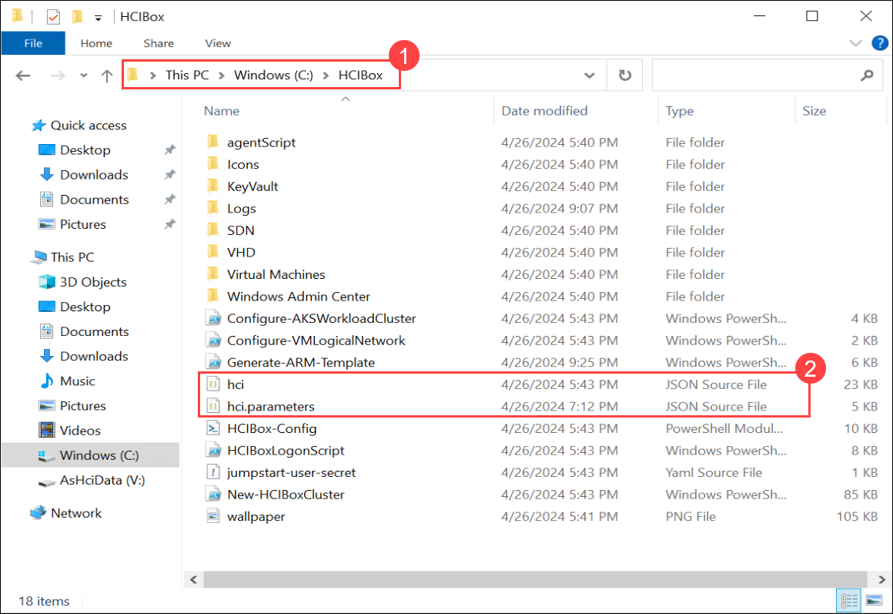

# Exercise 2: Deploying JumpStart-HCIBox in Azure Portal

In this exercise, you will be deploying an Azure Stack HCI solution using a pre-created ARM template from the previous exercise. You can deploy it either through the Azure portal by uploading the template and specifying deployment parameters, or using PowerShell for automated deployment, offering flexibility and control over the deployment process. Here, you will be deploying Azure Stack HCI using Deploy a custom template in Azure Portal.

### Task 1: Review the pre-created ARM template

1. Open the **File Explorer** in LabVM and navigate to the `C:\HCIBox` directory. 

2. Review the ARM template file **hci.json** and parameter file **hci.parameters.json**.

   

### Task 2: Deploy the Azure Stack HCI using Azure portal

1. Navigate back to Azure Portal, search for **Deploy a custom template** in search box and select it.

   

2. From Custom deployment page, click on **Build your own template in the editor**.

   

3. Copy the content of ARM file named **hci.json**, replace it in Edit template and click on **Save**.

4. From Custom deployment page, click on Edit parameters. Replace the content from **hci.parameters.json** and click on **Save**.

5. Select the available Subscription and Resource Group, review the values passed in Parameters and then click **Review + Create**.

6. Once Custom deployment Validation is passed, click on **Create**. Wait for the deployment to get completed and review Azure Stack HCI reesource.
