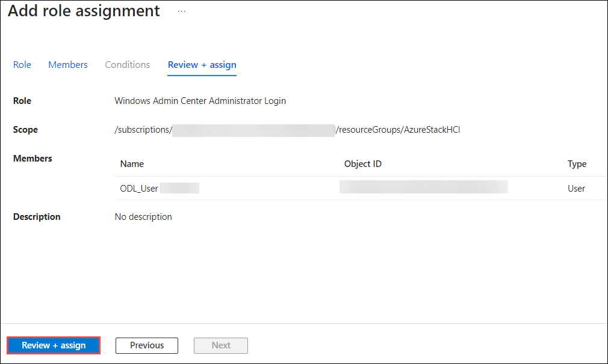
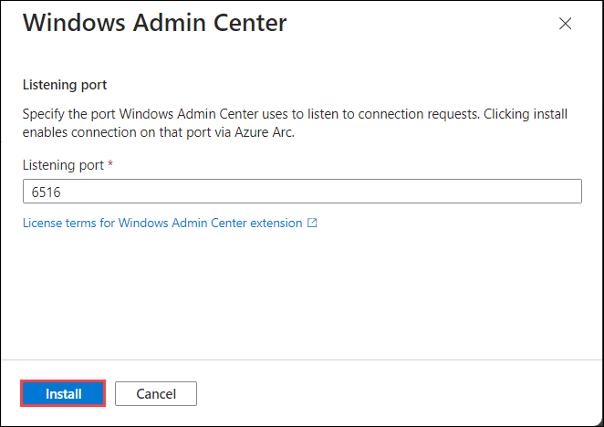

# Azure HCI Eternal Training Hands-on Lab: 2

## Exercise 1: Configure and Monitor cluster performance from the Windows Admin Center dashboard

In this hands-on lab exercise, you will learn how to configure and monitor cluster performance using the Windows Admin Center dashboard. This involves setting up and managing cluster resources, optimizing performance settings, and utilizing real-time monitoring tools within the dashboard to track cluster health and performance metrics. This exercise aims to provide practical experience in effectively managing cluster environments using Windows Admin Center.

### Task 1: Assign Windows Admin Center Administrator Login role to User 

1. Navigate to your Azure Stack HCI Resource Group and Click on **Access Control**.

    

2. Click on **Add** -> **Add Role Assignment** and select **Windows Admin Center Administrator Login** and click on Next button.

    

3. Now under Members page click on **User, group, or service principle** and select **<inject key="AzureAdUserEmail"></inject>** and click on Select, later click on **Review + Assign** to complete the asssignment.

   

4. In the **Review + assign** tab, click on **Review + assign** button.

   

### Task 2: Monitor Cluster in Windows Admin Center

1. Once the deployment got succedded, navigate back to **hciboxcluster** Azure Stack HCI, from the left menu select **Windows Admin Center (preview)** **(1)** under setting and click on **SetUp** **(2)**.

   

2. In the **Windows Admin Center** pop-up leave Listening port to **6516**, click on **Install**. 

   

    >**Note**: This may take 5 minutes to get ready please wait.

