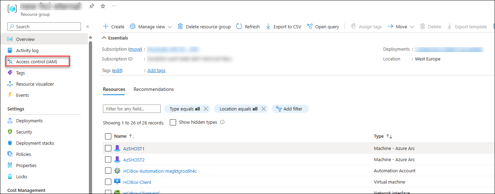
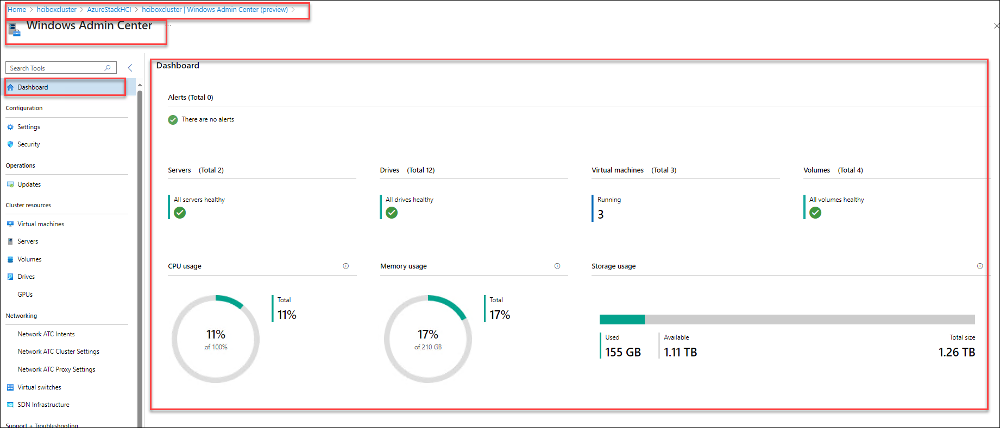
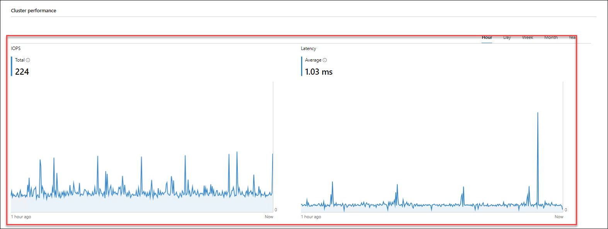
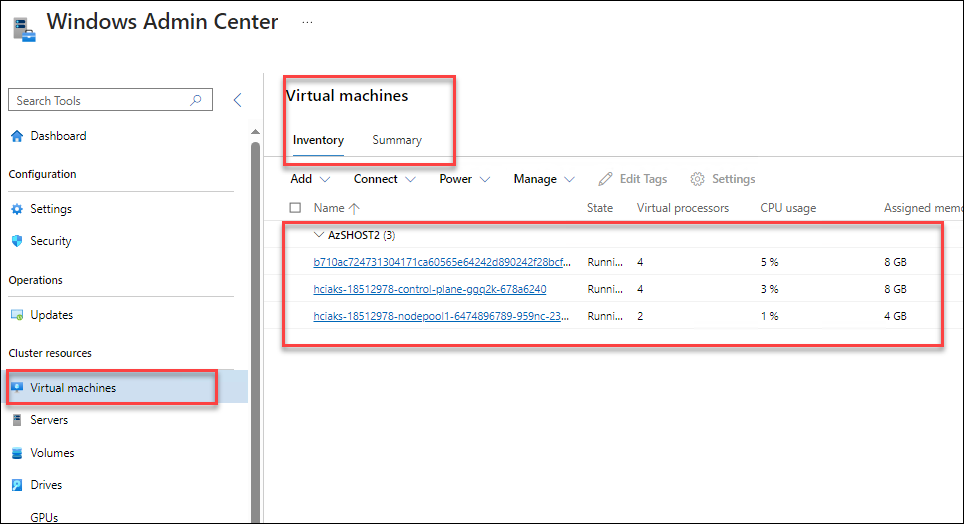
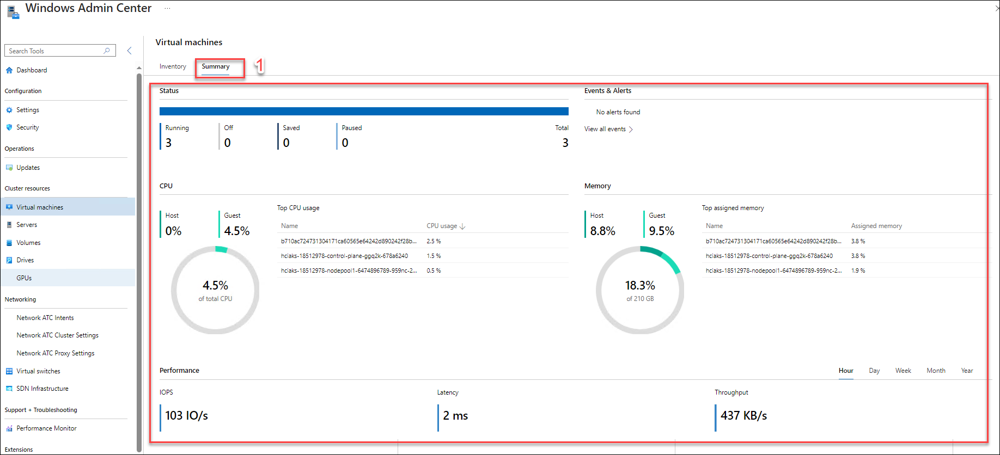
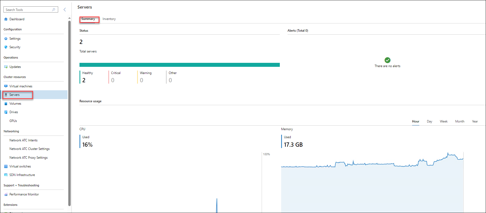
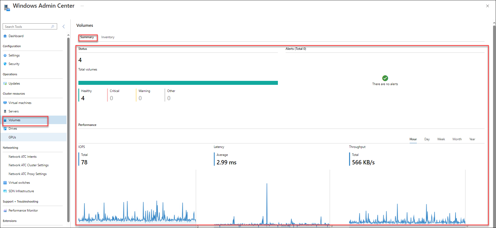

# Azure HCI Eternal Training Hands-on Lab: 2

## Exercise 1: Configure and Monitor cluster performance from the Windows Admin Center dashboard

In this exercise, you will learn how to configure and monitor cluster performance using the Windows Admin Center dashboard. This involves setting up and managing cluster resources, optimizing performance settings, and utilizing real-time monitoring tools within the dashboard to track cluster health and performance metrics. This exercise aims to provide practical experience in effectively managing cluster environments using Windows Admin Center.

### Task 1: Assign Windows Admin Center Administrator Login role to User 

1. Navigate to your Azure Stack HCI Resource Group and Click on **Access Control**.

    

2. Click on **Add** -> **Add Role Assignment** and select **Windows Admin Center Administrator Login** and click on Next button.

    

3. Now under Members page click on **User, group, or service principle** and select **<inject key="AzureAdUserEmail"></inject>** and click on Select, later click on **Review + Assign** to complete the asssignment.

   

4. In the **Review + assign** tab, click on **Review + assign** button.

   

### Task 2: Configure Windows Admin Center for Azure Stack HCI using Azure Portal.

1. Once the deployment got succedded, navigate back to **hciboxcluster** Azure Stack HCI, from the left menu select **Windows Admin Center (preview)** **(1)** under setting and click on **SetUp** **(2)**.

   

2. In the **Windows Admin Center** pop-up leave Listening port to **6516**, click on **Install**. 

   

    >**Note**: This may take 5 minutes to get ready please wait.

### Task 3: Monitor using Windows Admin Center dashboard

1. From the left side menu, Click on Window Admin Center (Preview) and click on **Connect** button to connect to WAC.

     

2. The Windows Admin Center dashboard provides alerts and health information about servers, drives, and volumes, as well as details about CPU, memory, and storage usage. The top of the Windows Admin Center dashboard prominently displays critical alerts as soon as you connects to it. The bottom of the dashboard displays cluster performance information, such as input/output operations/second (IOPS) and latency by hour, day, week, month, or year.

    

    

### Task 3: Monitor virtual machines

1. Within the WAC window, select **Virtual Machines** from the left side.

2.  To view a complete inventory of VMs running on the cluster, select **Inventory** at the top of the page. You'll see a table with information about each VM, including:

    - **Name:** The name of the VM.
    - **State:** Indicates if the VM is running or stopped.
    - **Host server:** Indicates which server in the cluster the VM is running on.
    - **CPU usage:** The percentage of the cluster's total CPU resources that the VM is consuming.
    - **Memory pressure:** The percentage of available memory resources that the VM is consuming.
    - **Memory demand:** The amount of assigned memory (GB or MB) that the VM is consuming.
    - **Assigned memory:** The total amount of memory assigned to the VM.
    - **Uptime:** How long the VM has been running in days:hours:minutes:seconds.
    - **Heartbeat:** Indicates whether the cluster can communicate with the VM.
    - **Disaster recovery status:** Shows whether the VM is signed into Azure Site Recovery.

    
    
3. It's important to understand the health of the virtual machines (VMs) on which your applications and databases run. If a VM is not assigned enough CPU or memory for the workloads running on it, performance could slow, or the application could become unavailable. If a VM responds to less than three heartbeats for a period of five minutes or longer, there may be a problem. To monitor VMs in Windows Admin Center, Select **Summary** from the top menu.
   
    

### Task 4: Monitor servers

 You can monitor the host servers that comprise an Azure Stack HCI cluster directly from Windows Admin Center. If host servers are not configured with sufficient CPU or memory to provide the resources VMs require, they can be a performance bottleneck.

1. To monitor servers in Windows Admin Center, select **Servers** from the **Tools** menu on the left.

   

2. To view a complete inventory of servers in the cluster, select **Inventory** at the top of the page. You'll see a table with information about each server, including:

    - **Name:** The name of the host server in the cluster.
    - **Status:** Indicates if the server is up or down.
    - **Uptime:** How long the server has been up.
    - **Manufacturer:** The hardware manufacturer of the server.
    - **Model:** The model of the server.
    - **Serial number:** The serial number of the server.
    - **CPU usage:** The percentage of the host server's CPU that is being utilized. No server in the cluster should use more than 85 percent of its CPU for longer than 10 minutes. 
    - **Memory usage:** The percentage of the host server's memory that is being utilized. If a server has less than 100MB of memory available for 10 minutes or longer, consider adding memory.
  
      

### Task5: Monitor volumes

Storage volumes can fill up quickly, making it important to monitor them on a regular basis to avoid any application impact. 

1. To monitor volumes in Windows Admin Center, select **Volumes** from the **Tools** menu on  the left.
   
    
   
3. To view a complete inventory of storage volumes on the cluster, select **Inventory** at the top of the page. You'll see a table with information about each volume, including:

    - **Name:** The name of the volume.
    - **Status:** "OK" indicates that the volume is healthy; otherwise, a warning or error is reported.
    - **File system:** File system on the volume (ReFS, CSVFS).
    - **Resiliency:** Indicates whether the volume is a two-way mirror, three-way mirror, or mirror-accelerated parity.
    - **Size:** Size of the volume (TB/GB)
    - **Storage pool:** The storage pool the volume belongs to.
    - **Storage usage:** The percentage of the volume's storage capacity that is being used.
    - **IOPS:** Number of input/output operations per second.
  
   

## Query and process performance history with PowerShell

You can also monitor Azure Stack HCI clusters using PowerShell cmdlets that return information about the cluster and its components. See [Performance history for Storage Spaces Direct](/windows-server/storage/storage-spaces/performance-history).

## Use the Health Service feature

Any Health Service fault on the cluster should be investigated. See [Health Service in Windows Server](/windows-server/failover-clustering/health-service-overview) to learn how to run reports and identify faults.

## Troubleshoot health and operational states

To understand the health and operational states of storage pools, virtual disks, and drives, see [Troubleshoot Storage Spaces and Storage Spaces Direct health and operational states](/windows-server/storage/storage-spaces/storage-spaces-states).
