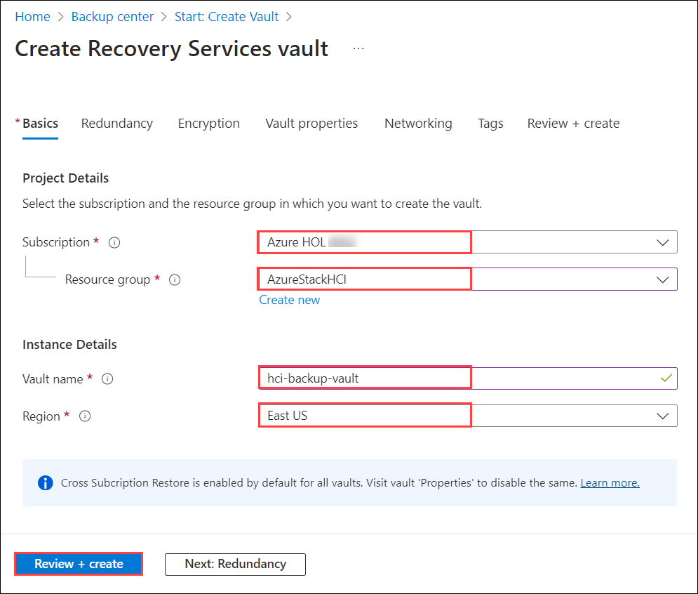
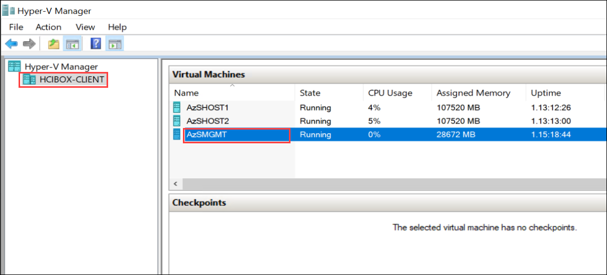
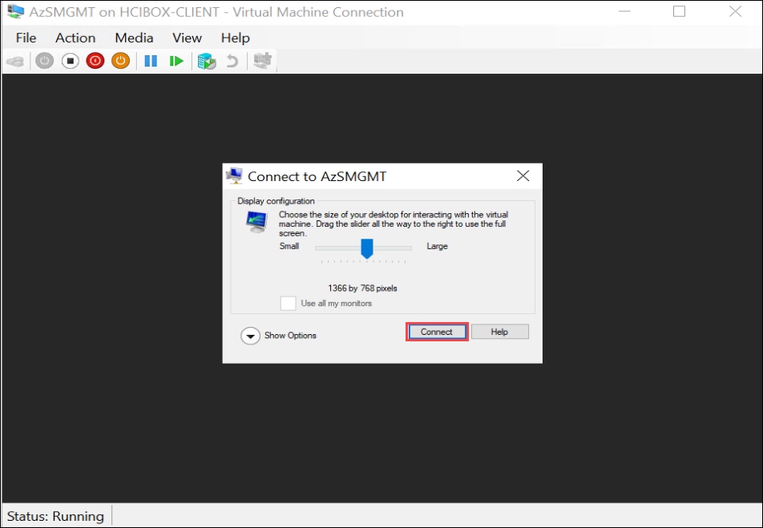
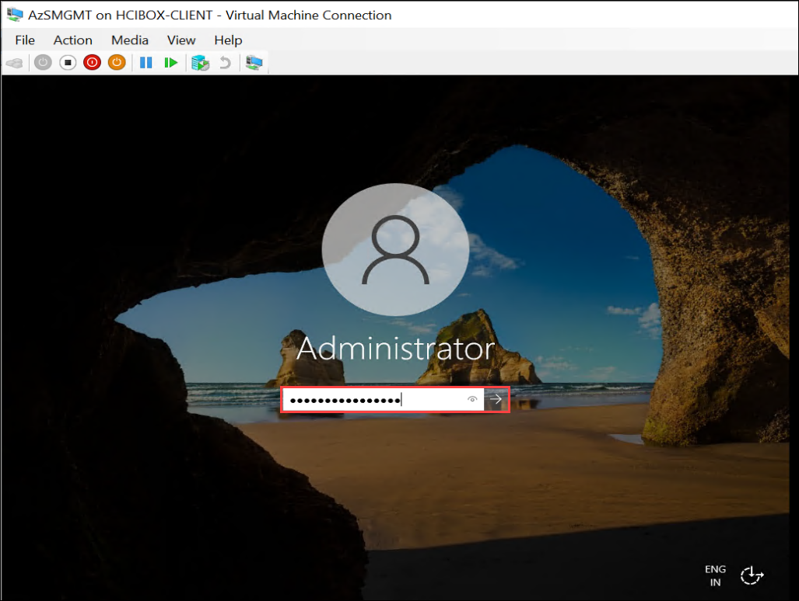
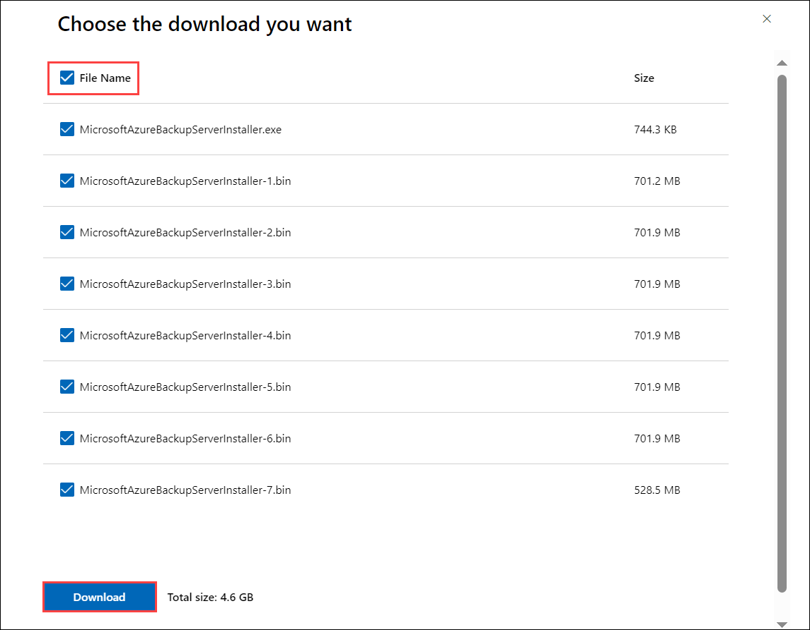
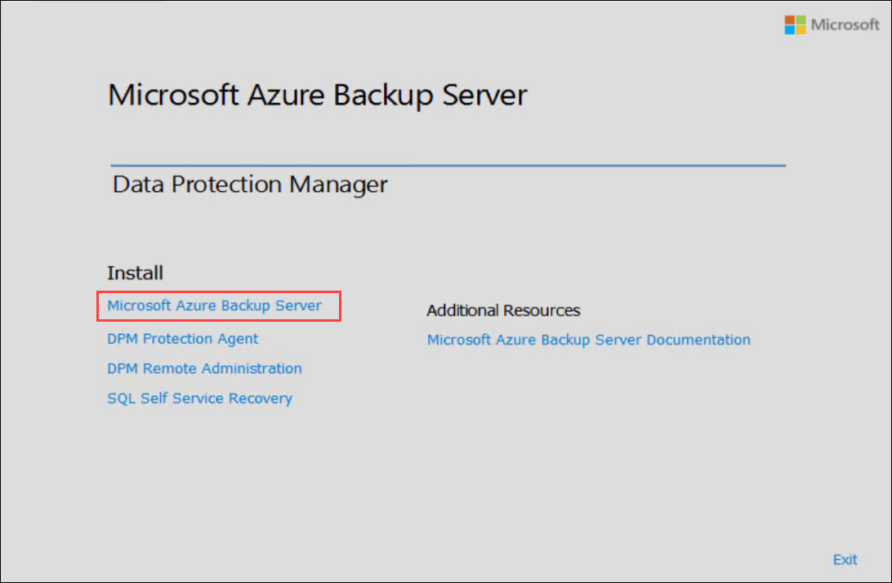
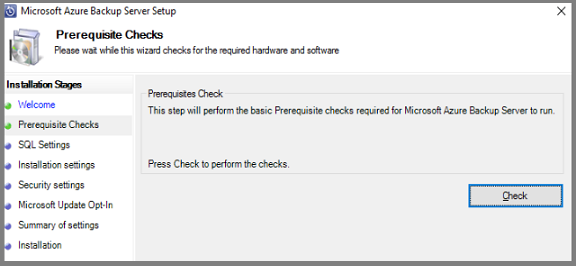
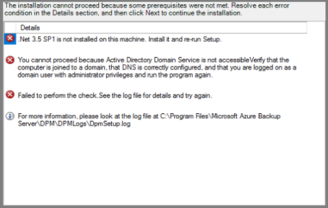
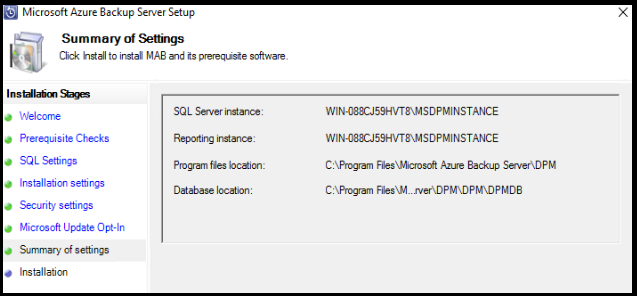
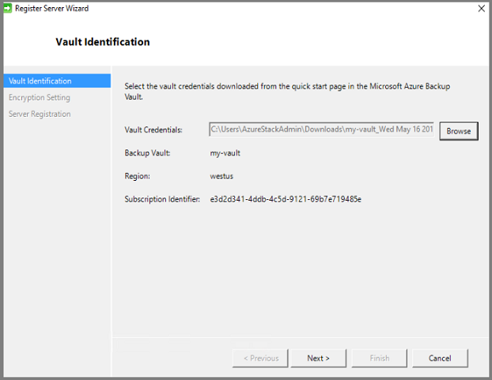

# Exercise 2: Azure Backup Server on Azure Stack

In this exercise, you will learn how to install Azure Backup Server on Azure Stack, which enables backup and recovery capabilities for files and applications within the Azure environment. This exercise focuses on deploying and configuring Azure Backup Server to safeguard critical data and applications hosted on Azure Stack, ensuring robust protection and restore capabilities in the cloud environment.

### Task 1: Create a Recovery Service Vault

A Recovery Services vault is a management entity that stores recovery points that are created over time, and it provides an interface to perform backup-related operations. These operations include taking on-demand backups, performing restores, and creating backup policies.

1. In the Azure portal, search for **Backup center** and then navigate to the **Backup center** dashboard.

   

2. On the Overview pane, select Vault.

   

3. Select Recovery Services vault > Continue.

   

4. On the Recovery Services vault pane, enter the following values:

    - Subscription: Select the available subscription to use
    - Resource group: Use an existing resource group named **AzureStackHCI**
    - Vault name: **hci-backup-vault** 
    - Region: select the same region where Azure Satck HCI is deployed i.e, **East US**

   

5. After providing the values, select Review + create.

   

6. To finish creating the Recovery Services vault, select Create.

   

   It can take a while to create the Recovery Services vault. Monitor the status notifications in the Notifications area at the upper right. After the vault is created, it appears in the list of Recovery Services vaults. If the vault doesn't appear, select Refresh.

### Task 2: Connect to On-Premises Hyper-V Virtual Machine

1. On the **HCIBox-Client** virtual machine, click on search button search for **Hyper-V** and select **Hyper-V Manager**.

   

2. On the **Hyper-V Manager**, select **HCIBOX-CLIENT** from the left menu under the Hyper-V Manager list, and  double-click on **AzSMGMT** node.

   

3. Connect to **AzSMGMT** box, and then click on the Connect button.

   

4. On the **login** window, enter the password as **ArcPassword123!!** and hit **Enter** to login. 

   

### Task 3: Download and Install Azure Backup Server

1. Open **Microsoft Edge** from **AzSMGMT** node, and navigate to the download page of the Azure Backup Server installer from the Microsoft Download Center.

   ```
   https://www.microsoft.com/download/details.aspx?id=55269
   ```

2. In the Microsoft Azure Backup Server download page, choose a language, and select **Download**.

   

3. The Azure Backup Server installer is composed of eight files - an installer and seven .bin files. Check **File Name** to select all required files and select **Download** to Download all files to the same folder. You will see a pop-up to Download multiple files, click **Allow**.

    

4. Once you've downloaded all files to your Azure Stack Hub virtual machine, go to the download location in the File Explorer. To start the installation, from the list of downloaded files, double-click on **MicrosoftAzureBackupserverInstaller.exe**.

    

5. In the Azure Backup Server wizard, select **Next** to continue.

    

6. Choose the path for the Azure Backup Server files, and select **Next**.

    

7. Verify the extraction location, and select **Extract**.

    

8. The wizard extracts the files and readies the installation process.

    

9. Once the extraction process completes, select **Finish**. By default, **Execute setup.exe** is selected. When you select **Finish**, Setup.exe installs Microsoft Azure Backup Server to the specified location.

    

### Task 4: Install the software package

In the previous task, you select **Finish** to exit the extraction phase, and start the Azure Backup Server setup wizard.

1. To launch the setup wizard, select **Microsoft Azure Backup Server**.

    

2. On the **Welcome** screen, select **Next**.

    

3. On the **Prerequisite Checks** screen, select **Check** to determine if the hardware and software prerequisites for Azure Backup Server have been met.

    

    If your environment has the necessary prerequisites, you'll see a message indicating that the machine meets the requirements. Select **Next**.  

    

    If your environment doesn't meet the necessary prerequisites, the issues will be specified. The prerequisites that weren't met are also listed in the DpmSetup.log. Resolve the prerequisite errors, and then run **Check Again**. Installation can't continue until all prerequisites are met.

    

4. Microsoft Azure Backup Server requires SQL Server. The Azure Backup Server installation package comes bundled with the appropriate SQL Server binaries. If you want to use your own SQL installation, you can. However, the recommended choice is let the installer add a new instance of SQL Server. To ensure your choice works with your environment, select **Check and Install**.

   >**NOTE**: Azure Backup Server won't work with a remote SQL Server instance. The instance used by Azure Backup Server must be local.
   
    After checking, if the virtual machine has the necessary prerequisites to install Azure Backup Server, select **Next**.

    If a failure occurs with a recommendation to restart the machine, then restart the machine. After restarting the machine, restart the installer, and when you get to the **SQL Settings** screen, select **Check Again**.

5. In the **Installation Settings**, provide a location for the installation of Microsoft Azure Backup server files and select **Next**.

    

    The scratch location is required to back up to Azure. Ensure the size of the scratch location is equivalent to at least 5% of the data planned to be backed up to Azure. For disk protection, separate disks need to be configured once the installation completes. For more information about storage pools, see [Prepare data storage](/system-center/dpm/plan-long-and-short-term-data-storage).

6. On the **Security Settings** screen, provide a strong password for restricted local user accounts and select **Next**.

7. On the **Microsoft Update Opt-In** screen, select whether you want to use *Microsoft Update* to check for updates and select **Next**.

   >**NOTE**: We recommend having Windows Update redirect to Microsoft Update, which offers security and important updates for Windows and other products like Microsoft Azure Backup Server.

    

8. Review the *Summary of Settings* and select **Install**.

    

    When Azure Backup Server finishes installing, the installer immediately launches the Microsoft Azure Recovery Services agent installer.

9. The Microsoft Azure Recovery Services Agent installer opens, and checks for Internet connectivity. If Internet connectivity is available, continue with the installation. If there's no connectivity, provide proxy details to connect to the Internet. Once you've specified your proxy settings, select **Next**.

    

10. To install the Microsoft Azure Recovery Services Agent, select **Install**.

    

    The Microsoft Azure Recovery Services agent, also called the Azure Backup agent, configures the Azure Backup Server to the Recovery Services vault. Once configured, Azure Backup Server will always back up data to the same Recovery Services vault.

11. Once the Microsoft Azure Recovery Services agent finishes installing, select **Next** to start the next phase: registering Azure Backup Server with the Recovery Services vault.

    

    The installer launches the **Register Server Wizard**.

12. Switch to your Azure subscription and your Recovery Services vault. In the **Prepare Infrastructure** menu, select **Download** to download vault credentials. If the **Download** button in step 2 isn't active, select **Already downloaded or using the latest Azure Backup Server installation** to activate the button. The vault credentials download to the location where your downloads are stored. Be aware of this location because you'll need it for the next step.

    

13. In the **Vault Identification** menu, select **Browse** to find the Recovery Services vault credentials.

    

    In the **Select Vault Credentials** dialog, go to the download location, select your vault credentials, and select **Open**.

    The path to the credentials appears in the Vault Identification menu. Select **Next** to advance to the **Encryption Settings**.

14. In the **Encryption Setting** dialog, provide a passphrase for the backup encryption, and a location to store the passphrase, and select **Next**.

    

    You can provide your own passphrase, or use the passphrase generator to create one for you. The passphrase is yours, and Microsoft doesn't save or manage this passphrase. To prepare for a disaster, save your passphrase in an accessible location.

    Once you select **Next**, the Azure Backup Server is registered with the Recovery Services vault. The installer continues installing SQL Server and the Azure Backup Server.

    

15. When the installer completes, the **Status** shows that all software has been successfully installed.

    When installation completes, the Azure Backup Server console and the Azure Backup Server PowerShell icons are created on the server desktop.
