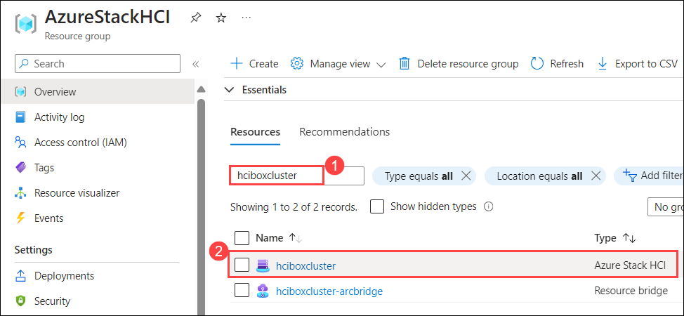
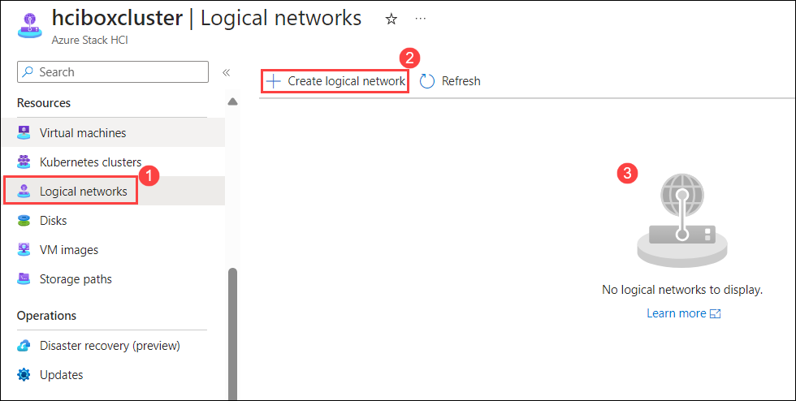
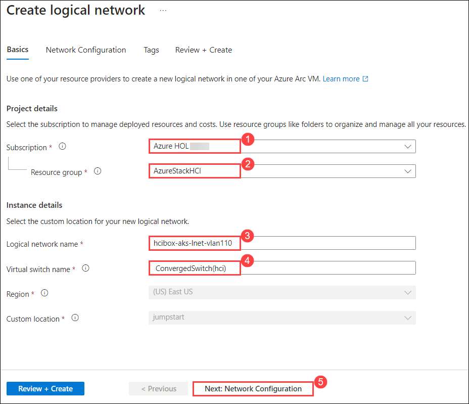
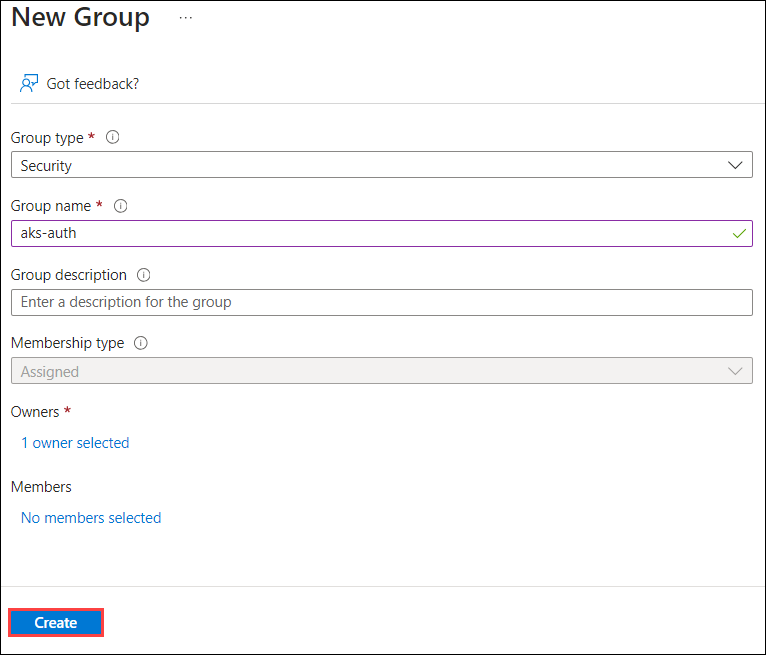
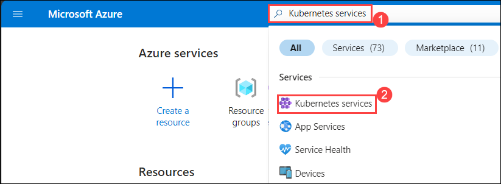
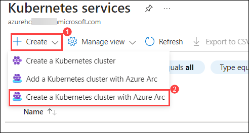
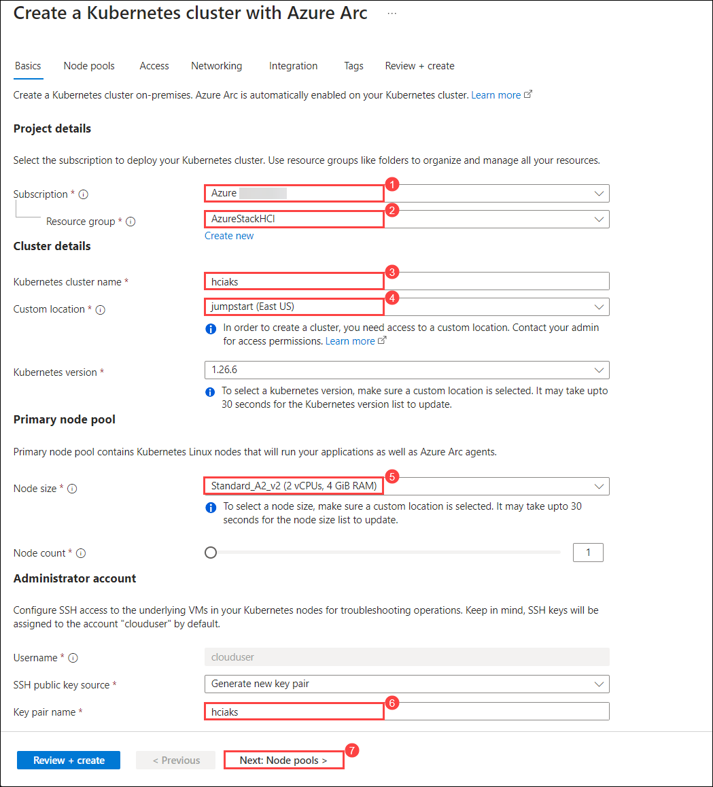
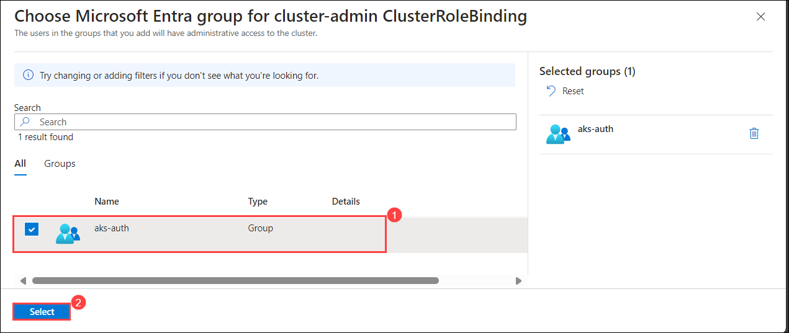
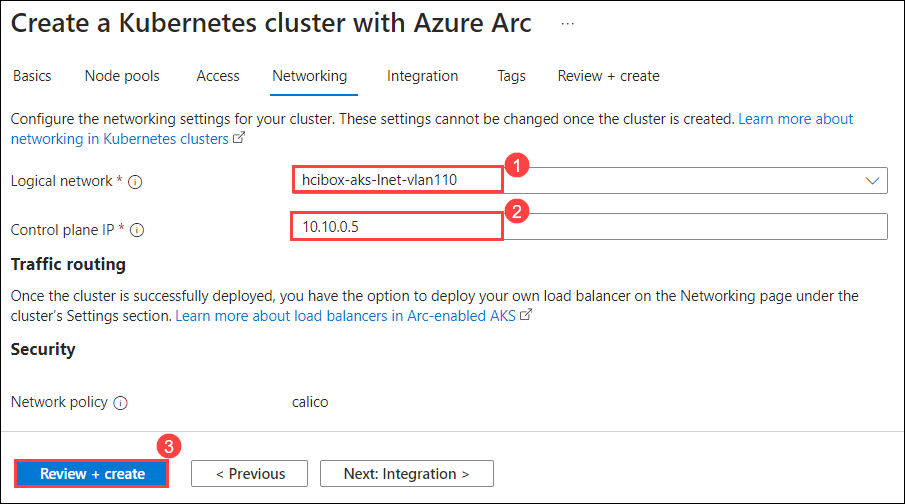

# Exercise 3: Managing AKS on Azure Stack HCI 

  In this exercise you will be creating an AKS on Azure Stack HCI.


### Task 1: Create a Logical Network for Azure Stack HCI for AKS

1. Navigate to the Resource Group in the Azure portal navigation section.

   

2. From the Resource groups pane, click on **AzureStakHCI** resource group and verify the resources present in it.

   

3. In the  **AzureStakHCI** resource group in the search bar search for **hciboxcluster** **(1)** and select **hciboxcluster** **(2)** Azure Stack HCI.

   

4. In the **hciboxcluster** Azure Stack HCI, from the left menu select **Logical networks** **(1)** under Resources, and click on **+ Create logical network** **(2)**.

   

5. In the **Create logical network** tab, under Basic fill the fallowing details and click on **Next: Network Configuartion** **(5)**.

    - Subscription : Default subscription **(1)**
    - Resource group : **AzureStackHCI** **(2)**
    - Logical network name: **hcibox-aks-lnet-vlan110** **(3)**
    - Virtual switch name: **ConvergedSwitch(hci)** **(4)**

   

6. In the **Network Configuation** tab, under the fallowing deatils and click on **Next: Tags** **(9)**.

    | **Variables**                | **Values**                                                    |
    | ---------------------------- |---------------------------------------------------------------|
    | IP address assignment | **Static** **(1)** |
    | IPv4 address space    | **10.10.0.0** **(2)** from the drop down  address prefix select **\24** **(3)** |
    | IP pools              | Enter Start IP **10.10.0.101** **(4)** and End IP **10.10.0.199** **(5)** |
    | Default Gateway       | Enter Default Gateway address as **10.10.0.1** **(6)** |
    | DNS Servers           | Enter DNS Servers **192.168.1.254** **(7)** |
    | VLAN ID               | Enter **110** **(8)** | 

   

7. In the **Tag** tab, leave it as default and click **Next: Review + Create**.

8. In the **Review + Create** tab, click on on **Create** button.

   

### Create an Entra Group for AKS Acces.

1. In the Azure portal, click on the search blade at the top and search for **Microsoft Entra id** and select **Microsoft Entra id**.

   

10. In the **Microsoft Entra id** tab, from the left menu select **Groups** under Manage. 

    

11. In the **Groups | All groups** tab, select **All groups** **(1)**,  and click on **New Group** **(2)**.

    

12. In the **New Group** tab, enter the **Group name** as **aks-auth** **(1)**, click on the **No Owner Selected** **(2)** under **Owners**, from the search **(3)** and select **(4)** for user **ODL_User <inject key="DeploymentID"></inject>**, and click on **Select** **(5)**.

    

13. In the **New Group** tab, click on **Create** button.

    


# Create AKS on Azure Stack HCI using Azure Portal.

1. In the Azure portal, click on the search blade at the top and search for **Kubernetes services** and select **Kubernetes services**.

    

1. In the **Kubernetes services** tab, click on **+ Create** **(1)** and from the drop-down select **Create a Kubernetes cluster with Azure Arc** **(2)**.

    

16. In the **Create a Kubernetes cluster with Azure Arc​** tab, fill the fallowing deatils in the Basic and click on **Next: Node Pool** **(7)**.

     | **Variables**                | **Values**                                                    |
     | ---------------------------- |---------------------------------------------------------------|
     | Subscription | Default subscription **(1)** |
     | Resource group | From the drop-down Select **AzureStackHCI** **(2)**  |
     | Kubernetes cluster name | Enter the cluster name as **hciaks** **(3)** |
     | Custom location | From the drop-down Select **jumpstart(EastUS)** **(4)** |
     | Node size | From the drop down select **Standard_A2_v2** **(5)** |
     | Key pair name | Enter the Key pair name as **hciaks** **(6)** |

    

17. In the **Node Pool** tab, leave it default and click in **Next: Access**.

18. In the **Access** tab, select **Authentication and Authorization** method as **Microsoft Entra authentication with Kubernetes RBAC** **(1)**, and Click on **Choose Microsoft Entra group** **(2)**. 

    

19. In the **Choose Microsoft Entra group for cluster-admin ClusterRoleBinding** pop-up select **aks-auth** group and click on **Select**.

    

20. In the **Access** tab, click on **Next: Networking**.

21. In the **Networking** tab, select **Local network** as **hcibox-aks-lnet-vlan110** **(1)**, enter **Control plane IP** as **10.10.0.5** **(2)**, and click on **Review + Create** **(3)** .

    

22. In the **Review + Create** tab, click on **Review**.

    

23. Click on the AKS cluster to view details such as Kubernetes version. "Status" may show connecting for some time while the cluster fully connects to Azure.

     
    
### Connecting to the Azure Stack HCI AKS

1. From your jumpVM, open Powershel and run the following command, using the name of your HCIBox resource group.

   >Note: Powershell ISE will not work as it may need some inputs while executing the command. 

    ```
    az connectedk8s proxy -n hciaks -g AzureStackHCI
    ```
    
  >Note: If you get any option to install any extension, please enter **Y**.    

2. From JumpVM,Open a new powershell session and then in the new shell you will have kubectl access to your cluster. Try running some kubectl commands for yourself.

    
