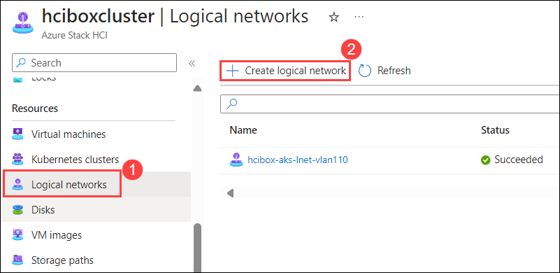
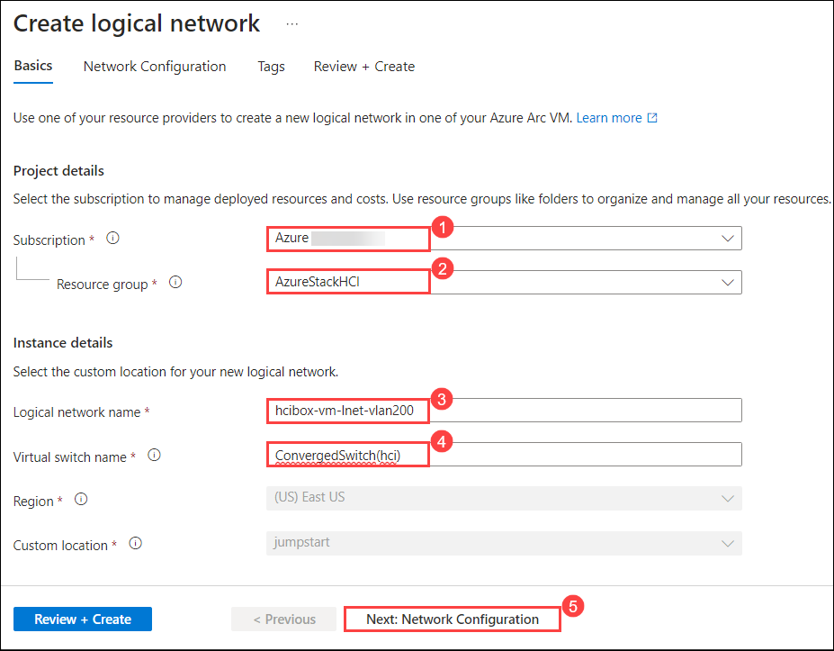
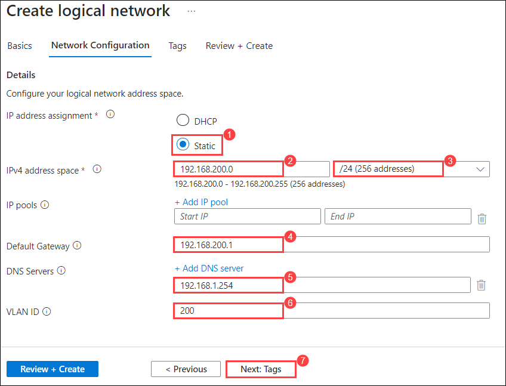
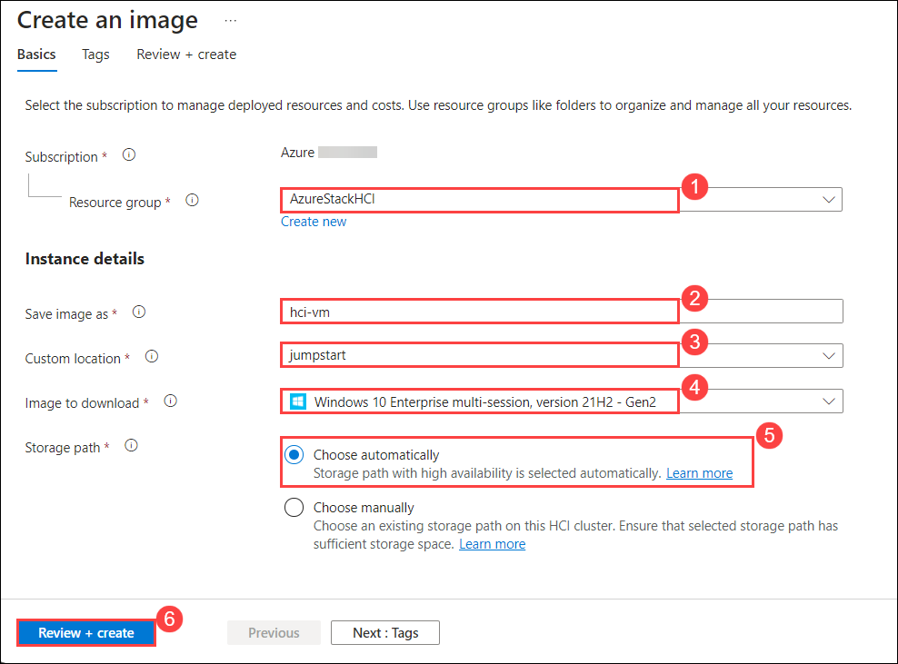
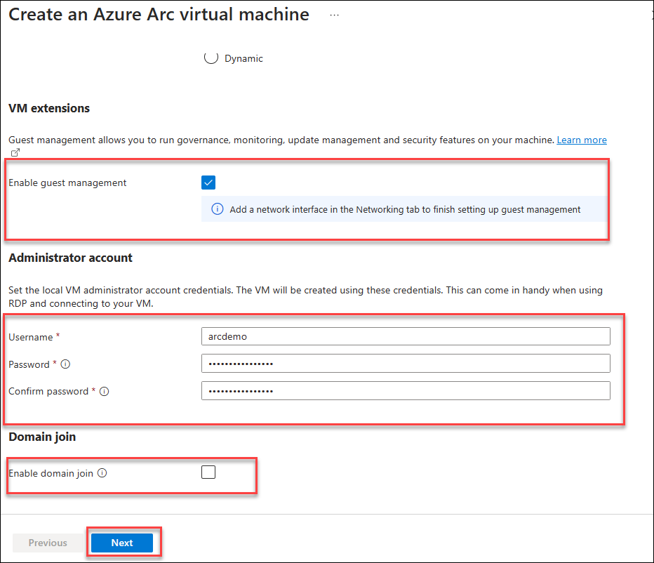
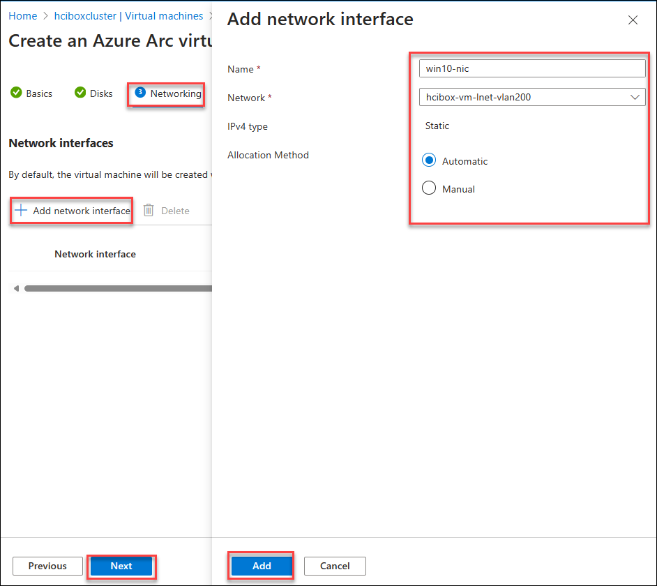
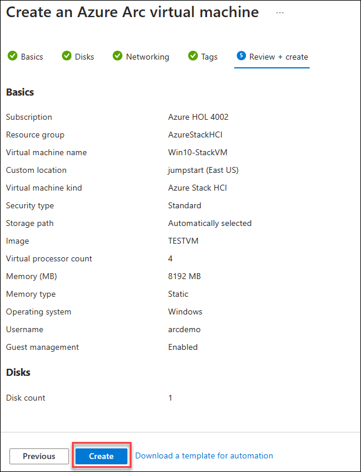
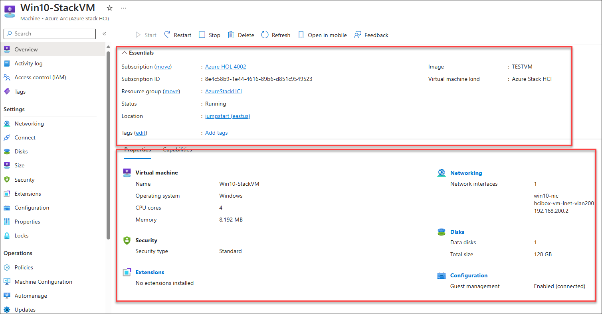

# Exercise 7: Azure Stack HCI VM Provisioning

### Estimated Duration: 90 minutes

In this exercise, you will learn how to provision virtual machines (VMs) on Azure Stack HCI. The process involves setting up a logical network, uploading a VM image to Azure Stack HCI storage, and then creating a new virtual machine using this image within the Azure Stack HCI environment. This practical exercise provides a step-by-step walkthrough of deploying VMs on Azure Stack HCI infrastructure.

## Task 1: Create a Logical Network for Azure Stack HCI VM

1. Navigate to the Resource Group in the Azure portal navigation section.

   

2. From the Resource groups pane, click on **AzureStakHCI** resource group and verify the resources present in it.

   

3. In the  **AzureStakHCI** resource group in the search bar search for **hciboxcluster** **(1)** and select **hciboxcluster** **(2)** Azure Stack HCI.

   

4. In the **hciboxcluster** Azure Stack HCI, from the left menu select **Logical networks** **(1)** under Resources, and click on **+ Create logical network** **(2)**.

   

5. In the **Create logical network** tab, under Basic fill the fallowing details and click on **Next: Network Configuartion** **(5)**.

    - Subscription : Default subscription **(1)**
    - Resource group : **AzureStackHCI** **(2)**
    - Logical network name: **hcibox-vm-lnet-vlan200** **(3)**
    - Virtual switch name: **ConvergedSwitch(hci)** **(4)**

      

6. In the **Network Configuation** tab, under the fallowing deatils and click on **Next: Tags** **(7)**.

    | **Variables**                | **Values**                                                    |
    | ---------------------------- |---------------------------------------------------------------|
    | IP address assignment | **Static** **(1)** |
    | IPv4 address space    | **192.168.200.0** **(2)** from the drop down  address prefix select **\24** **(3)** |
    | Default Gateway       | Enter Default Gateway address as **192.168.200.1** **(4)** |
    | DNS Servers           | Enter DNS Servers **192.168.1.254** **(5)** |
    | VLAN ID               | Enter **200** **(6)** | 

      

7. In the **Tag** tab, leave it as default and click **Next: Review + Create**.

8. In the **Review + Create** tab, click on on **Create** button.

   

## Task 2: Download and Add the VM image to Azure Stack HCI Storage

1. In the **hciboxcluster** Azure Stack HCI, from the left menu select **VM Image** **(1)** under **Resources**, click on **+ Add VM Image** **(2)**, and click on **From Azure Marketplace** **(3)**.

   

1. In the **Create an image** tab, enter the fallowing details and click on **Review + Create** **(6)** button.

   - Resource group : **AzureStackHCI** **(1)**
   - Save image as: Enter Image name as **hci-vm** **(2)**
   - Custom location: From the drop-down select **jumpstart** **(3)**
   - Image to download: Select **select Windows 10 Enterprise multi-session, version 21H2 - Gen2** **(4)** VM image.
   - Storage path: select **Choose automatically** **(5)**

   

1. In the **Review + Create** tab, click on **Create** button.

   

   > **Note**: VM images download may take upto 1 hour.
    
1. You can monitor the download Progress by Selecting the **VM images** tab from the lab side menu. Once the VM image download in completed, you can move to the next task of creating the Virtual Machine on Azure Stack HCI.

   

## Task 3: Create a Virtual Machine on Azure Stack HCI

1. Navigate to **Virtual Machine** tab from the left side and click on **Create Virtual Machine**.

   

2. On the VM Creation page, enter the following details and click on next. 

   - Subscription : Default subscription **(1)**
   - Resource group : **AzureStackHCI** **(2)**
   - Virtual Machine name: **Win10-StackVM** **(3)**
   - Security type: **Standard** **(4)**
   - Storage path: **Choose Automatically**
   - Image: **Select the VM image that you downloaded in previous step**
   - Virtual Processor count: **4**
   - Memory (MB): **8192**
   - Memory Type: **Static**
   - VM Extension: **Keep it checked**
      
   
      
   Administrator account
   
    - Username: **arcdemo**
    - Password: **ArcPassword123!!**
    - Keep unchecked the **Domain Join**
  
      

      

3. On the **Disks** tab, Click on **Add New disk** and enter the following details, after adding the details click on **Add** and **Next**. 

   - Name : **wind10-disk** **(1)**
   - Size (GB) : **128** **(2)**
   - Provisioning type: **dynamic** **(3)**
   - Storage path: **Choose Automatically**
    
  

4. On the **Networking** tab, Click on **Add network interface** and enter the following details, after adding the details click on **Add** and **Next**.

   - Name : **win10-nic** **(1)**
   - Network : **hcibox-vm-lnet-vlan200** **(2)**
   - IPv4 type: **Static** **(3)**
   - Allocation Methon: **Automatic**

   

5. Click on **Next** and **Create** to start the VM deployment.

   

6. Once the VM is created, click on the **Go to resource** button and review the VM configuration.

   
