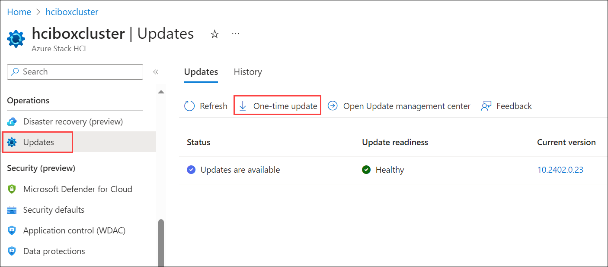
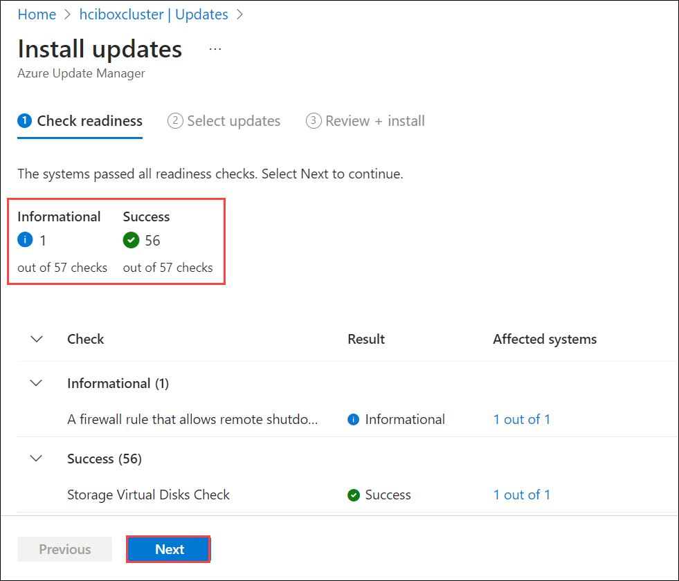
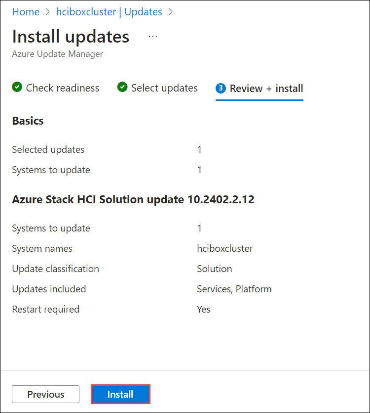
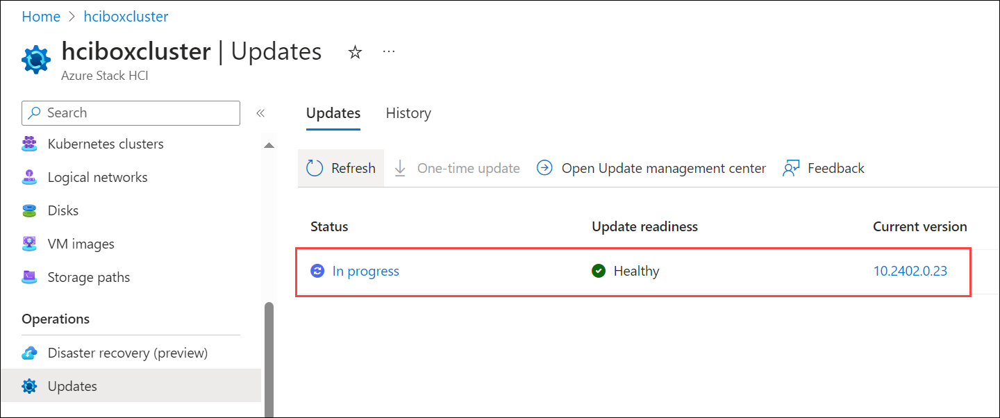
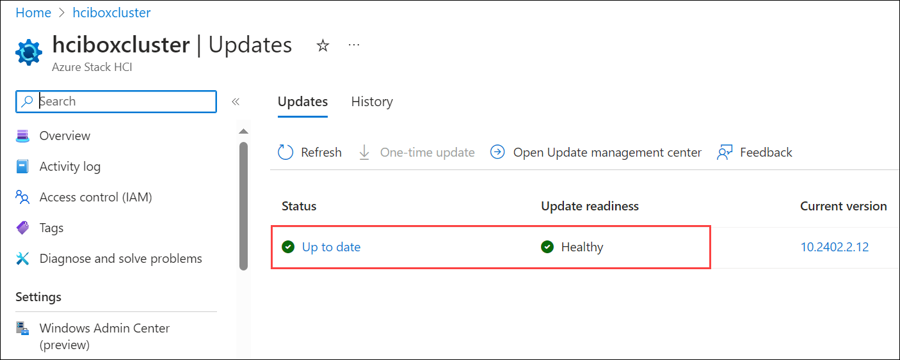

# Exercise 5: Azure Stack HCI Update management using Azure Portal  

In this exercise, you'll be checking for updates in Azure Stack HCI via the Azure portal, which involves leveraging Azure Arc for centralized management and update assessment. Administrators can deploy updates seamlessly across clusters, scheduling and monitoring the process for minimal disruption and optimal infrastructure performance. This integration streamlines hybrid cloud operations, enhancing agility and security across on-premises and Azure environments.

### Task 1: Update Azure Stack HCI  

1. Navigate to the Azure Stack HCI resource named **hciboxcluster** from the **AzureStackHCI resource group**.

2. On the **Azure Stack HCI** page, select **Updates** under **Operations** from the left menu.

   

3. From the **Updates** pane, click on **One-time update**.

   

4. In the **Install updates** pane from the **Azure Update manager**, verify the available updates and click on **Next**.

   
  
5. Select the available updates to install and click on **Next**.

   

6. From the **Review + Install** pane, review the selected updates and click on **Install**.

   

7. You'll see a notification that **Installation started on 1 Azure Stack HCI systems**. Also, you'll be able to see the **In-progress** status from the **Updates** pane.

   

8. Updating the Azure Stack HCI Cluster will take around 2 hours. Once it's updated successfully, you'll be able to see the status as **Up-to-date** and the update readiness as **Healthy** as shown in the below screenshot.

   

