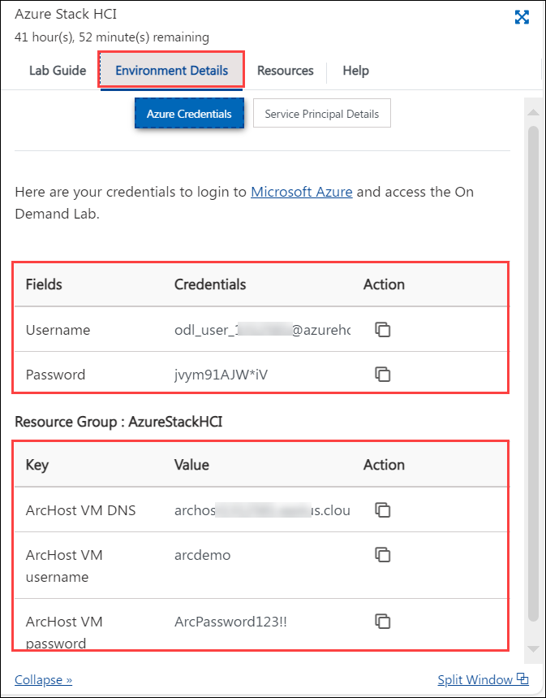

# Hybrid Cloud Solution - Azure Stack HCI

### Overall Estimated Duration: 8 hours

## Overview

HCIBox is a turnkey solution that provides a complete sandbox for exploring Azure Stack HCI capabilities and hybrid cloud integration in a virtualized environment. HCIBox is designed to be completely self-contained within a single Azure subscription and resource group, which will make it easy for a user to get hands-on with Azure Stack HCI and Azure Arc technology without the need for physical hardware.

Azure Stack HCI 23H2 is now generally available. 23H2 simplifies the configuration and deployment of HCI clusters and related workloads, like VM management for VM self-service management in the Azure portal. HCIBox has also been updated and now offers clusters built on the new 23H2 OS, and prior Azure Stack HCI releases are no longer part of HCIBox or supported by the Jumpstart team. If you've used earlier versions of HCIBox, you should read this guide thoroughly to understand the new HCIBox deployment process.

### Azure Stack HCI capabilities are available in HCIBox

**2-node Azure Stack HCI cluster**

HCIBox automatically creates and configures a two-node Azure Stack HCI cluster using nested virtualization with Hyper-V running on an Azure Virtual Machine. This Hyper-V host creates three guest virtual machines: two Azure Stack HCI nodes (AzSHost1, AzSHost2), and one nested Hyper-V host (AzSMGMT). AzSMGMT itself hosts two guest VMs: an Active Directory domain controller and a Routing and Remote Access Server acting as a virtual router.

  

**Virtual machine management**: HCIBox comes with guest VM management in the Azure portal. The HCIBox documentation will walk you through how to use this feature, including configuring VM images from Azure Marketplace and creating VMs on your cluster.

**Azure Kubernetes Service on Azure Stack HCI**: Azure Stack HCI includes Azure Kubernetes Services on Azure Stack HCI (AKS hybrid) as part of the default configuration. A user script is provided that can be used to create a workload cluster.

## Objective

## Prerequisites

Participants should have:

## Architechture

## Architechture Diagram

## Explanation of Components

The architecture for this lab involves the following key components:

## Getting Started with the Lab
 
Welcome to your Hybrid Cloud Solution - Azure Stack HCI Workshop! We've prepared a seamless environment for you to explore and learn about Azure services. Let's begin by making the most of this experience:
 
## Accessing Your Lab Environment

Once you're ready to dive in, your virtual machine and lab guide will be right at your fingertips within your web browser.

  

### Virtual Machine & Lab Guide
 
Your virtual machine is your workhorse throughout the workshop. The lab guide is your roadmap to success.
 
## Exploring Your Lab Resources
 
To get a better understanding of your lab resources and credentials, navigate to the **Environment** tab.
 
  
 
## Utilizing the Split Window Feature
 
For convenience, you can open the lab guide in a separate window by selecting the **Split Window** button from the Top right corner.
 
  
 
## Managing Your Virtual Machine
 
Feel free to start, stop, or restart your virtual machine as needed from the **Resources** tab. Your experience is in your hands!

  

## Login to the Azure portal

1. In the **HCIBox-Client** virtual machine, double-click on the Microsoft Edge browser shortcut that is provided on the desktop.
  
   
    
1. Navigate to Azure Portal using the URL provided here: `https://portal.azure.com/`. On the **Sign into Microsoft Azure** tab, you will see the login prompt. Enter the following **Email/Username**, and then click on **Next**. 
      
   * Email/Username: **<inject key="AzureAdUserEmail"></inject>**
   
1. Now, enter the **password** that you have already received for the above account.
      
   * Password: **<inject key="AzureAdUserPassword"></inject>**

1. On the **Action Required** pop-up click on **Ask later**.     

1. If you see the pop-up **Stay signed in?** Click **No**.

1. If you see the pop-up, **You have free Azure Advisor recommendations!** close the window to continue the lab.

1. If the **Welcome to Microsoft Azure** popup window appears, click **Cancel** to skip the tour.

1. Navigate to the Resource Group in the Azure portal navigation section.

   

1. From the **Resource** groups pane, click on the **AzureStakHCI** resource group and verify the resources present in it.

   

## Support Contact
 
The CloudLabs support team is available 24/7, 365 days a year, via email and live chat to ensure seamless assistance at any time. We offer dedicated support channels tailored specifically for both learners and instructors, ensuring that all your needs are promptly and efficiently addressed.

Learner Support Contacts:
- Email Support: labs-support@spektrasystems.com
- Live Chat Support: https://cloudlabs.ai/labs-support

Now, click on **Next** from the lower right corner to move on to the next page.

### Happy Learning!!
