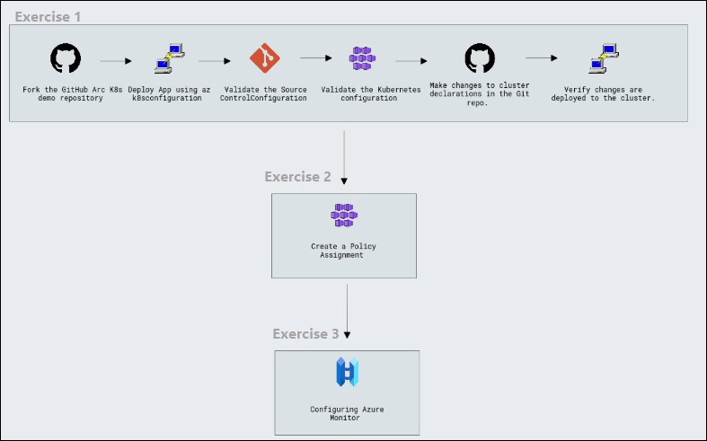
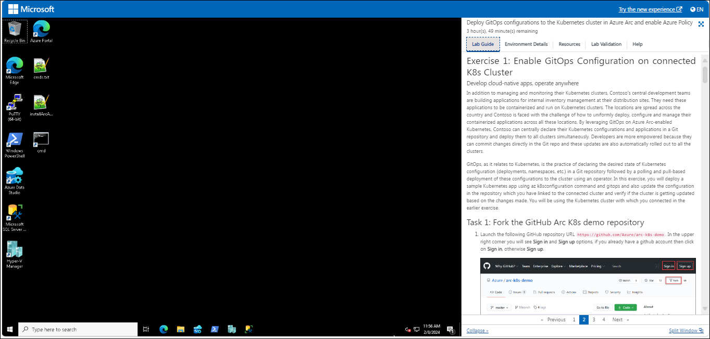
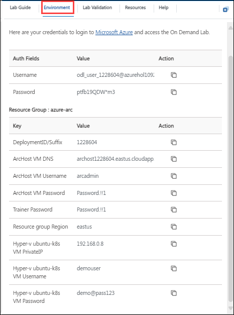
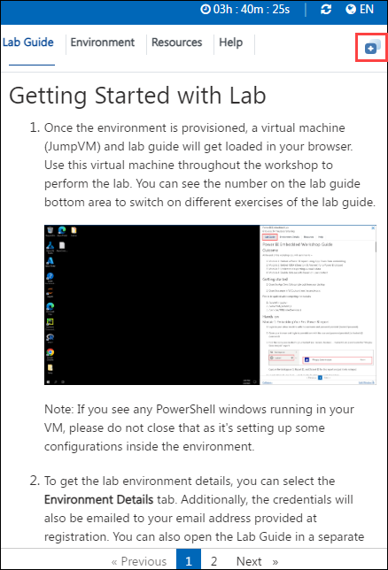
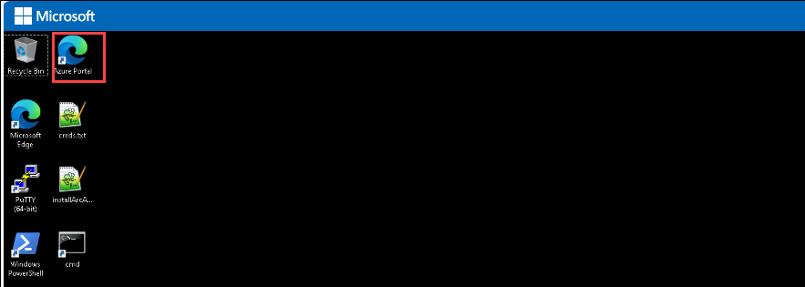
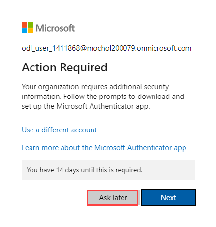

# Getting Started with Deploy GitOps configurations to the Kubernetes cluster in Azure Arc and enable Azure Policy

### Overall Estimated Duration: 4 Hours

## Overview

Azure Arc is a solution that extends Azure's capabilities to manage and run applications and services across diverse environments such as datacenters, edge locations, and multicloud platforms. It provides a unified approach for developing, operating, and securing both new and existing applications using the same tools, security measures, and governance mechanisms available within the Azure ecosystem. Azure Arc enables you to utilize Azure services such as application management, data, and AI—on existing hardware, virtualization platforms, Kubernetes clusters, IoT devices, and integrated systems.

## Objectives

Azure Arc provides unified management and governance solution for applications and services across diverse environments, enabling organizations to extend Azure's tools, security, and AI capabilities to their on-premises, edge, and multicloud infrastructures. This empowers consistent control and enhanced operational efficiency across all environments.

- **Enable GitOps Configuration on connected K8s Cluster:** Use GitOps to deploy and manage containerized applications on Azure Arc-enabled Kubernetes clusters. You'll configure a Git repository to store the desired state of your Kubernetes applications, and then use an operator to automatically deploy and update these configurations across multiple clusters. This approach centralizes management and empowers developers to contribute directly to the Git repository.

- **Enforce GitOps using Azure Policy for Azure Arc-enabled Kubernetes:** Use Azure Policy to enforce that each Azure Arc-enabled Kubernetes cluster has specific GitOps configurations applied to it.

- **Onboard Azure Monitor for containers with Azure Arc-enabled Kubernetes cluster:** Configure Azure Monitor for containers and view insights for Kubernetes - Azure Arc resource.

## Prerequisites

Participants should have basic knowledge and understanding of the following:

- Experience with Azure cloud services, including how to navigate the Azure portal.

- Basic knowledge Azure Arc.

- Knowledge of Microsoft Sentinel for threat detection and security monitoring.

- Basic knowledge of GitOps.

## Architecture

In the Azure Arc architecture, Azure Arc enables unified management for Contoso's on-premises Windows and Linux VMs and Kubernetes clusters. Azure Policy ensures governance and compliance, while Microsoft Defender for Cloud provides comprehensive security. Azure Monitor tracks performance and metrics, with Azure Monitor for Containers offering observability for Kubernetes clusters. GitOps manages Kubernetes configurations, and Azure Data Controller facilitates the deployment and management of data services. This setup simplifies operations and extends Azure’s capabilities across Contoso's diverse IT environments.

## Architecture Diagram

## Explanation of Components

The architecture for this lab involves the following key components:

- **Azure Kubernetes Service (AKS):** A managed Kubernetes service for running and managing containerized applications in the cloud.

- **Azure Monitor:** A unified monitoring service to track application and infrastructure performance.

- **GitOps for Kubernetes:** An operational model that uses Git repositories as the source of truth for automated Kubernetes deployments.

## Getting Started with the Lab

## **Accessing Your Lab Environment**
 
1. You can see a virtual machine desktop 💻 (LabVM/ARCHOST) is loaded on the left side of your browser. Use this virtual machine throughout the workshop to perform the lab.

    

### **Virtual Machine & Lab Guide**
 
Your virtual machine is your workhorse throughout the workshop. The lab guide is your roadmap to success.
 
## **Exploring Your Lab Resources**
 
To get a better understanding of your lab resources and credentials, navigate to the **Environment Details** tab.

   
 
## **Utilizing the Split Window Feature**
 
For convenience, you can open the lab guide in a separate window by selecting the **Split Window** button from the Top right corner.
 
   
 
## **Managing Your Virtual Machine**
 
Feel free to start, stop, or restart your virtual machine as needed from the **Resources** tab. Your experience is in your hands!
 
  

## **Let's Get Started with Azure Portal**
 
1. In the **LabVM/ARCHost VM**, double-click on the Azure portal shortcut of the Microsoft Edge browser provided on the desktop.
 
    

   >**Note**:If you don't find the browser shortcut for the **Azure portal**, open Microsoft Edge and search for **"portal.azure.com"**. Then, log in to the Azure 
      portal.
 
3. You'll see the **Sign into Microsoft Azure** tab. Here, enter your credentials:
 
   - **Email/Username:** <inject key="AzureAdUserEmail"></inject>
 
      
 
4. Next, provide your password:
 
   - **Password:** <inject key="AzureAdUserPassword"></inject>
 
      

5. If **Action required** pop-up window appears, click on **Ask later**.

    
 
4. If you see the pop-up **Stay Signed in?**, click **No**.

   

5. If you see the pop-up **You have free Azure Advisor recommendations!**, close the window to continue the lab.

6. If a **Welcome to Microsoft Azure** popup window appears, click **Maybe Later** to skip the tour.

## Support Contact

The CloudLabs support team is available 24/7, 365 days a year, via email and live chat to ensure seamless assistance at any time. We offer dedicated support channels tailored specifically for both learners and instructors, ensuring that all your needs are promptly and efficiently addressed.

Learner Support Contacts:

- Email Support: cloudlabs-support@spektrasystems.com

- Live Chat Support: https://cloudlabs.ai/labs-support

   
7. Now, click on the **Next** from the lower right corner to move to the next page.

   
 
Now you're all set to explore the powerful world of technology. Feel free to reach out if you have any questions along the way. Enjoy your workshop!
   
